# QA 디버그 키 참조표

플레이 검증용으로 코드에 박아 둔 **디버그 입력 전체**를 한자리에 모은 as-built 표다. 정규 플레이
조작(이동·핫바·E·좌클릭 등)은 여기 없다 — 여기 있는 것은 **QA가 아니면 누르지 않는 키**뿐이다.



> 그림이 작으면 클릭해 원본 크기로 연다. 키가 늘거나 바뀌면
> `node docs/guide/assets/qa-keyboard-map.gen.js docs/guide/assets/qa-keyboard-map.svg`로 다시 뽑는다
> (스크립트 상단의 `numpad`·`frow`·`cards` 배열만 고치면 좌표는 자동으로 다시 계산된다).

## 0. 배치 규칙 — 한 행이 한 그룹이다

키는 **숫자패드의 물리적 행**과 기능 그룹을 맞춰 두었다. 개별 키를 외우는 대신 **손이 행을 기억한다**.

```
┌─────┬──────────┬──────────┬─────────┐
│ Num │ / 보스소환 │ * 몬스터1기│ − 웨이브 │  ← 몬스터·보스
├─────┼──────────┼──────────┼─────────┤
│  7  │    8     │    9     │    +    │  ← 편성·건축
│연결부 │  칸 건설  │  부위 피해 │  재시작  │
├─────┼──────────┼──────────┤         │
│  4  │    5     │    6     │         │  ← 자원·피해
│자원지급│ 피해 실측 │ 창고 경합 │         │
├─────┼──────────┼──────────┼─────────┤
│1 낮 │  2 밤    │3 다음Day │    ↵    │  ← 사이클
├─────┴──────────┼──────────┤         │
│  0  동시 그랩   │ . 보스처치│         │
└────────────────┴──────────┴─────────┘

F2 열차 높이 · F4 거치 무기 │ F3 시간 배속 · F5 지역 점프 │ F8 연출 모드 · F9 구속 · F10 시점
 └ 편성·건축   └ 사이클 2키                  └────── 연출·플레이어 3연속 ──────┘
```

넘치는 두 키만 아래 행으로 내려간다 — `0`은 자원·피해의 네 번째, `.`은 몬스터·보스의 네 번째다.
**`0`과 `.`은 각자 자기 그룹 열(列)의 연장선**이라고 보면 된다.

키는 **다섯 곳**에 흩어져 있고, **끄는 스위치는 그중 넷에만** 있다.

| 소유 컴포넌트 | 키 | 끄는 곳 | 배선된 씬 |
|---|---|---|---|
| `QaDebugHotkeys` (Train) | 숫자패드 12종 · F2 · F4 | `_enableQaKeys` (인스펙터) | Game_ArtTest |
| `DayCycleController` | 숫자패드 1·2·3 · F3 · **F5** | `_enableDebugPhaseKeys` (인스펙터) | Game · Game_ArtTest |
| `DayCycleVisualController` | F8 | `_enableModeToggleKey` (인스펙터) | **Game_ArtTest 전용** |
| `NetworkPlayerController` | F9 | **없음** (상시) | 플레이어 프리팹 |
| `PlayerViewModeController` | F10 | `PlayerViewSettings.DebugToggleEnabled` (SO) | 플레이어 프리팹 |

> **릴리스 전에는 위 스위치를 전부 끈다.** F9만 스위치가 없으므로 코드에서 걷어내야 한다.

---

## 1. 한눈에 보는 표

**권위** 열의 뜻 — `호스트 확정`은 클라이언트에서 눌러도 ServerRpc로 호스트가 처리해 **전 피어에 반영**된다.
`로컬`은 누른 클라이언트 화면에만 적용된다. 표는 **숫자패드 물리 배치 순**(위 행부터)이다.

| 키 | 그룹 | 하는 일 | 권위 | 결과 확인 |
|---|---|---|---|---|
| 숫자패드 `/` | 몬스터·보스 | **지역 보스 즉시 소환** | 호스트 확정 | 화면 |
| 숫자패드 `*` | 몬스터·보스 | **몬스터 단건 스폰** — 요청자 전방 10 m 지상 | 호스트 확정 | 화면 |
| 숫자패드 `-` | 몬스터·보스 | 몬스터 **웨이브 스폰 토글** | 호스트 확정 | 호스트 콘솔 |
| 숫자패드 `7` | 편성·건축 | 표적 가능한(후미) **연결부 1개 파괴** | 호스트 확정 | 화면 |
| 숫자패드 `8` | 편성·건축 | **칸 1칸 무료 건설** (빈 슬롯 재건 우선) | 호스트 확정 | 화면 |
| 숫자패드 `9` | 편성·건축 | 샘플 데미지 **30** — 망치로 겨눈 부위 우선 | 호스트 확정 | 화면 |
| 숫자패드 `+` | 편성·건축 | 게임 재시작 — **지금 돌고 있는** 인게임 씬 재로드 | 호스트 확정 | 화면 |
| 숫자패드 `4` | 자원·피해 | 요청자에게 **자원 지급** (9종 일괄) | 호스트 확정 | 인벤토리 |
| 숫자패드 `5` | 자원·피해 | **자기 피해 20** — 물리 경로(장비 감산 적용) | 호스트 확정 | 호스트 콘솔 |
| 숫자패드 `6` | 자원·피해 | 공유 창고 **동시 경합** 재현 (전 피어 동시 요청) | 호스트 확정 | 호스트 콘솔 |
| 숫자패드 `1` | 사이클 | 현재 Day의 **낮(아침) 시작**으로 점프 | 호스트 확정 | HUD |
| 숫자패드 `2` | 사이클 | 현재 Day의 **밤(저녁) 시작**으로 점프 | 호스트 확정 | HUD |
| 숫자패드 `3` | 사이클 | **다음 Day 아침**으로 점프 (지역 전환 검증용) | 호스트 확정 | HUD |
| 숫자패드 `0` | 자원·피해 | **동시 그랩 경합** 재현 (전 피어 동시 요청) | 호스트 확정 | 호스트 콘솔 |
| 숫자패드 `.` | 몬스터·보스 | **지역 보스 즉시 처치** | 호스트 확정 | 화면 |
| `F2` | 편성·건축 | **열차·궤도 높이 단계** 순환 | 호스트 확정 | 화면 |
| `F4` | 편성·건축 | **겨눈 자리에 거치 무기 설치**(무료) + 소총탄 60 (Shift = 터렛) | 호스트 확정 | 화면 |
| `F3` | 사이클 | **시간 배속** 순환 (×1 → ×4 → ×16) | 호스트 확정 | 콘솔 `[DayCycle]` |
| `F5` | 사이클 | **다음 지역 첫날 아침**으로 점프 (Day 1에서 4회 = 북극) | 호스트 확정 | HUD · 콘솔 `[DayCycle]` |
| `F8` | 연출·플레이어 | 낮/밤 **연출 모드** 순환 (Off → A → B) | 로컬 | 콘솔 `[DayVisual]` |
| `F9` | 연출·플레이어 | 자기 **구속(Grabbed) 상태** 토글 | 소유자 → 호스트 | 화면 |
| `F10` | 연출·플레이어 | **시점 모드** 전환 (1인칭 통합 ↔ 분리 FP/TP) | 로컬 | 화면 |

> **숫자패드 15키는 만석이다.** 새 QA 키가 필요하면 F 계열에 붙인다 — **F6·F7이 비어 있다**
> (F4는 거치 무기, F5는 지역 점프가 가져갔다).
> (F1은 에디터에서 Unity 문서를 여는 키라 피한다.)

---

## 2. 편성·건축 — 숫자패드 `7` `8` `9` `+` · `F2` `F4`

### 숫자패드 `7` — 연결부 파괴
살아 있는 연결부 중 **가장 후미**를 즉사시킨다(순차 파괴 규칙 그대로). 후방 연쇄 이탈이 따라오는지
보는 용도다.

### 숫자패드 `8` — 칸 1칸 무료 건설
**빈 슬롯(파괴·소실) 재건이 우선**이고, 빈 슬롯이 없으면 후미에 증설한다. 비용을 지불하지 않으므로
**비용 경로 검증에는 쓸 수 없다** — 그쪽은 망치 건설 포트로 따로 본다.

### 숫자패드 `9` — 샘플 데미지 30
1. **망치로 겨눈 부위가 있으면 그 부위**에 넣는다 → 앞 칸의 화덕처럼 **특정 건축물을 골라** 손상·파괴할 수 있다.
2. 겨눈 부위가 없으면 폴백: 표적 연결부 → 최후미 칸 → 살아 있는 마지막 건축물 (각 1회).

부위 식별은 망치 RPC와 같은 `(종류, 인덱스)` 규약을 쓴다.

### 숫자패드 `+` — 게임 재시작
호스트가 인게임 씬을 단일 모드로 재로드해 편성·웨이브·사이클을 전부 초기화한다. **호스트가 고른 씬이
아니라 지금 활성인 씬**을 다시 올린다 — 아트 검증 씬에서 재시작했는데 기본 씬으로 튀지 않는다.

### `F2` — 열차·궤도 높이 단계
현재 → 아래 → 더 아래 → 현재 순환. 편성·손잡이·설비·궤도 타일·갑판 기준선이 **같은 오프셋으로 함께**
움직이므로 건설·콜라이더 판정이 어긋나지 않는다. 호스트가 단계를 확정·복제하므로 후발 접속도 같은 높이를 받는다.

> ⚠ **`TrainElevationController`가 배선된 씬에서만 동작한다 — 현재는 `Game_ArtTest`뿐이다.**
> `Game.unity`에서 누르면 `[QaDebugHotkeys] 높이 단계 무효: … 이 씬에는 배선되지 않았다` 로그만 찍힌다.
> 스펙: [`docs/specs/world/train-art-layout.md`](../specs/world/train-art-layout.md)

### `F4` — 거치 무기 즉시 설치 + 소총탄 지급
**망치로 겨눈 자리**(설치 프리뷰가 떠 있는 셀)에 거치 무기 1개를 **무료로** 세우고, 요청자에게
소총탄 60을 지급한다. 그냥 누르면 **거치 기관총**, `Shift`와 함께 누르면 **자동 터렛**이다.

- 자리 규칙(그리드 내부·비점유·칸 생존)은 일반 설치와 **같은 함수**가 다시 본다 — 건너뛰는 것은 비용뿐이다.
- 겨눈 자리가 없으면(망치를 들지 않았거나 갑판을 겨누지 않았으면) 아무 일도 하지 않는다.
- 탄은 설치 성공 여부와 무관하게 준다 — 이미 세워 둔 무기를 채우는 데도 같은 키를 쓴다.

> 노린 검증: 점유(`E`) → 사각 안 조준 → 사격 → 재장전(`R`) → 내리기(`E`/`Esc`)를 **채집·건설 비용**
> 없이 반복한다. 계획서: [`docs/plans/M7/M7-4차-구현-계획.md`](../plans/M7/M7-4차-구현-계획.md)

---

## 3. 자원·피해 — 숫자패드 `4` `5` `6` `0`

### 숫자패드 `4` — 자원 지급
요청자 인벤토리에 아래를 한 번에 넣는다. 건설·제작·요리·정수·방한 루프를 **채집 없이** 돌리기 위한 구성이다.

| 자원 | 수량 | 노린 검증 |
|---|---|---|
| 목재 (Wood) | 4 | 증설·연료 |
| 돌 (Stone) | 2 | 건설 |
| 고철 (Scrap) | 2 | 제작 |
| 화약 원료 (Niter) | 2 | 탄약 제작 |
| 식재료 (RawFood) | 4 | 스튜 1회 또는 구운 식사 2회 |
| 벼 (Rice) | 4 | 밥(벼 2) |
| 소금 (Salt) | 2 | 보존식(식재료 2 + 소금 1) |
| 얼음 (Ice) | 6 | 정수 2회 (북극) |
| 희귀 금속 (RareMetal) | 5 | 방한 세트 4부위 정확히 한 벌 |

### 숫자패드 `5` — 피해 실측
요청자에게 고정 피해 **20**을 `PlayerHealth.ApplyDamage`(물리 경로)로 넣는다. **장비 감산이 적용되므로**
맨몸 20 vs 가죽 옷 17처럼 착용 전후를 같은 기준으로 실측할 수 있다. 결과는 호스트 콘솔에
`기준 → 체력 전/후 (적용 n)` 형식으로 찍힌다. 죽어 있으면 무효 로그만 남는다.

### 숫자패드 `6` — 창고 동시 경합
호스트가 전 피어에 트리거를 뿌리고, 각 피어가 **수신 프레임에** 같은 이동(창고 0 → 개인 0)을 요청한다 —
서버 도착이 붙어 경합이 재현된다. 총량 보존 여부가 호스트 콘솔에 (요청 전 / 확정 후) 두 줄로 찍힌다.

### 숫자패드 `0` — 동시 그랩 경합
호스트가 **요청자 최근접 그랩 가능 자원**을 골라 전 피어에 브로드캐스트하고, 각 피어가 수신 프레임에
자기 집게로 그랩을 요청한다. "한쪽 승인 + 한쪽 거부(다른 사람이 잡고 있다)"가 재현된다. 승인·거부는
집게의 호스트 콘솔 로그로 확인한다. 대상이 없으면 **시작 단계에서 무효 로그**를 찍고 끝난다(무효 통과 방지).

---

## 4. 몬스터·보스 — 숫자패드 `/` `*` `-` `.`

### 숫자패드 `/` — 지역 보스 즉시 소환
현재 Day의 지역 보스를 1기 세운다. 밤·웨이브와 무관하다.

- **새벽 보류에 등록되지 않는다** → 낮에도 시간이 정상 진행한다. 패턴·페이즈·드랍만 격리해서 볼 수 있고,
  "밤이 지속된다"는 규칙 자체는 마지막 밤에서 봐야 한다.
- 이미 보스가 있으면 **후퇴시킨 뒤 재소환**한다.
- 지역 서비스나 보스 정의가 없으면 무효 로그.

### 숫자패드 `*` — 몬스터 단건 스폰
요청자가 **보고 있는 방향의 수평 전방 10 m 지상**에 기본 변종 1마리. 웨이브를 기다리거나 여러 마리에
시달리지 않고 파지·투척·즉사 존을 1마리로 통제한다.

### 숫자패드 `-` — 웨이브 스폰 토글
끄면 **진행 중인 웨이브를 회수하고 다음 밤 웨이브도 시작하지 않는다.** 밤 노숙·체온·연출처럼
몬스터 간섭 없이 봐야 하는 검증의 선결 수단이다. 상태는 스포너 콘솔 로그로 확인한다.

### 숫자패드 `.` — 지역 보스 즉시 처치
보스전을 끝까지 치르지 않고 **처치 이후**를 검증한다 — 보스 핵 드랍·새벽 보류 해제·HUD 종료·처치 배너.
정상 사망 경로(`ApplyDamage(float.MaxValue)`)를 그대로 타므로 결과가 실제 처치와 같다. 살아 있는 보스가
없으면 무효 로그.

---

## 5. 사이클 — 숫자패드 `1` `2` `3` · `F3` `F5`

### 숫자패드 `1` `2` `3` — 국면 점프
현재 Day를 유지한 채 낮(1)/밤(2)의 **시작 경계**로 누적 시간을 옮기거나, 다음 Day 아침(3)으로 건너뛴다.
지역 전환은 Day 단위로 일어나므로 **한 지역 안의** 검증에는 `3`을 쓴다.

### `F5` — 다음 지역 첫날 아침 (북극 계획 결정 ⑨)
지역 경계까지 한 번에 건너뛴다. 지역 경계는 Day 번호의 순수 함수이므로
`IRegionService.NextRegionFirstDay`가 목적지를 계산하고, 점프 자체는 숫자패드 `3`과 **같은 누적 시간 축**을
쓴다 — 새 경로가 아니라 같은 축 위의 다른 지점이라 지형 경계·웨이브·날씨가 종전 규약대로 따라온다.

as-built 순환(숲 5 · 사막 4 · 바다 3 · 대초원 4 · 북극 3)에서 **Day 1부터 네 번**이면 북극(Day 17)이다.

| 누른 횟수 | 도착 | 지역 |
|---:|---:|---|
| 1 | Day 6 | 사막 |
| 2 | Day 10 | 바다 |
| 3 | Day 13 | 대초원 |
| **4** | **Day 17** | **북극** |

> 이 키가 생기기 전에는 북극까지 **숫자패드 `3`을 16번** 눌러야 했고, 지역이 하나 늘 때마다 그 횟수가
> 바뀌어 검증 문서의 재현 수단이 낡았다(M7 3차 검증 문서는 아직 "Day 14 · 13회"로 적혀 있었다).

### `F3` — 시간 배속 (×1 → ×4 → ×16)
점프가 아니라 **가속**이므로 국면이 흐르는 과정을 그대로 볼 수 있다 — 연출이 국면 내내 변하는지는
점프로는 확인할 수 없다. 빨라지는 것은 **시간축뿐**이라 이동·물리·전투 속도는 그대로다
(`Time.timeScale`과 달리 판정이 왜곡되지 않는다). 대신 밤이 자주 오므로 웨이브가 잦아진다 —
격리 관찰이 필요하면 숫자패드 `-`와 함께 쓴다.

---

## 6. 연출·플레이어 — `F8` `F9` `F10`

### `F8` — 낮/밤 연출 모드 (Off → A → B → Off)
로컬 전용이며 콘솔에 `[DayVisual] 모드 → X`가 찍힌다.
**`DayCycleVisualController`가 배선된 `Game_ArtTest`에서만 동작한다.**

### `F9` — 구속 상태 토글
자기 자신을 `Normal` ↔ `Grabbed`로 뒤집는다(소유자 입력 → ServerRpc). 구속형 상태 전환의 RPC 경로를
직접 확인하는 키다. **끄는 스위치가 없으므로 릴리스 전 코드에서 걷어내야 한다.**

### `F10` — 시점 모드 전환
1인칭 통합 ↔ 분리 FP/TP를 로컬에서 뒤집는다. `PlayerViewSettings.DebugToggleEnabled`를 끄면 막힌다.

---

## 7. 에디터 메뉴

| 메뉴 | 하는 일 |
|---|---|
| `Game / QA / Steam Lobby Spike` | Steam 로비 스파이크 창 |
| `Game / Steam Transport (Editor)` | 체크하면 **이 에디터의 다음 플레이**가 Steam 릴레이 모드로 뜬다. `EditorPrefs`라 에디터 인스턴스별 — MPPM 가상 플레이어에는 영향이 없다 |

---

## 8. 씬별 가용 범위

| 씬 | 쓸 수 있는 키 |
|---|---|
| `Game.unity` | 숫자패드 12종 + 사이클 5종(1·2·3·F3·F5) + F9 · F10 |
| `Game_ArtTest.unity` | 위 전부 **+ F2(열차 높이) + F8(연출 모드)** |

F2·F8이 `Game.unity`에서 안 먹는 것은 버그가 아니라 **컨트롤러가 그 씬에 배선되어 있지 않기 때문**이다.

---

## 9. 자주 쓰는 조합

| 보고 싶은 것 | 누르는 순서 |
|---|---|
| 보스 단독 격리 | `-`(웨이브 끄기) → `/`(보스 소환) — **윗줄 안에서 손이 안 움직인다** |
| 보스 처치 이후만 | `/`(소환) → `.`(즉시 처치) |
| 밤 노숙·체온 | `-`(웨이브 끄기) → `2`(밤으로) |
| 낮/밤 연출이 국면 내내 변하는가 | `-`(웨이브 끄기) → `F3`(×16) → `F8`(모드 A/B 비교) |
| 장비 감산 실측 | `5`(맨몸) → 장비 착용 → `5`(착용 후), 콘솔 두 줄 비교 |
| 수리 루프 | `9`(부위 손상) → 망치 수리 → `7`(연결부 파괴) → 재결합 — **7·8·9 한 행 안에서 끝난다** |
| 건축물 골라 부수기 | 망치로 대상 조준 → `9` (조준이 폴백보다 우선) |
| 요리·정수·방한 한 바퀴 | `4`(자원 지급) → 화덕/제작대 |
| 상태 꼬였을 때 | `+`(현재 씬 재시작) |

---

## 10. 키 재배치 이력 (2026-08-22)

기능이 늘면서 같은 그룹의 키가 네 행에 흩어져 있었다 — 자원·피해 4키가 `-`·`9`·`4`·`0`으로,
몬스터·보스 4키가 `/`·`*`·`5`·`.`으로 갈라져 있어 **조합을 누를 때마다 손이 숫자패드를 가로질렀다.**
§0의 행 단위 규칙으로 다시 묶으면서 아래 6 + 2키가 이동했다. **M7 이전 차수의 검증 항목 문서에 적힌
키는 아래 표의 "옛 키"다** — 옛 문서를 그대로 따라 누르면 다른 기능이 나간다.

| 기능 | 옛 키 | 새 키 | 왜 |
|---|---|---|---|
| 자원 지급 | 숫자패드 `9` | 숫자패드 `4` | 자원·피해를 4·5·6 행으로 |
| 피해 실측 | 숫자패드 `0` | 숫자패드 `5` | 〃 |
| 창고 동시 경합 | 숫자패드 `4` | 숫자패드 `6` | 〃 |
| 동시 그랩 경합 | 숫자패드 `-` | 숫자패드 `0` | 자원·피해의 네 번째 (4 아래 열) |
| 부위 샘플 데미지 | 숫자패드 `6` | 숫자패드 `9` | 편성·건축을 7·8·9 행으로 |
| 웨이브 스폰 토글 | 숫자패드 `5` | 숫자패드 `-` | 몬스터·보스를 윗줄로 |
| 시간 배속 | `F8` | `F3` | 사이클을 F 앞쪽으로 (F8·F9·F10 = 연출·플레이어 연속) |
| 낮/밤 연출 모드 | `F7` | `F8` | 〃 |

**그대로인 키** — `7`(연결부 파괴) · `8`(칸 건설) · `+`(재시작) · `/`(보스 소환) · `*`(몬스터 1기) ·
`.`(보스 처치) · `1` `2` `3`(국면 점프) · `F2`(열차 높이) · `F9`(구속) · `F10`(시점).

---

## 11. 새 QA 키를 추가할 때

- **숫자패드 15키는 만석이다** — F 계열(**F4·F5·F6·F7**이 비어 있다)에 붙인다. F1은 에디터 문서 열기라 피한다.
- **먼저 §0의 그룹을 정하고, 그 그룹이 이미 쓰는 자리 옆에 붙인다.** 그룹이 흩어지면 이 문서를 다시 짜야 한다.
- 전 피어에 반영돼야 하는 조작은 **`[Rpc(SendTo.Server, RequireOwnership = false)]`** 로 받아 호스트가 확정한다
  (클라이언트에서 눌러도 되게 하려면 이 형태여야 한다).
- **전제가 없으면 시작 단계에서 무효 로그를 찍고 끝낸다** — 창고 경합에서 얻은 교훈이다. 조용히 아무 일도
  안 일어나면 "재현이 안 된 것"과 "재현했는데 버그가 없는 것"을 구분할 수 없다.
- 켜고 끄는 `[SerializeField] bool`을 반드시 같이 둔다.
- 추가하면 **이 문서와 XML 주석, 그리고 `assets/qa-keyboard-map.gen.js`를 같이 갱신한다.**

---

**관련 문서** — [개발 가이드](Train-Survival-개발-가이드.md) · [열차 아트 배치(QA 참조표)](../specs/world/train-art-layout.md) · [계획 지도](../plans/README.md)
