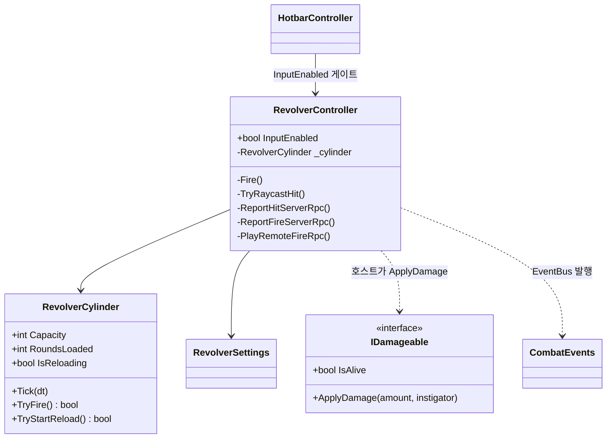
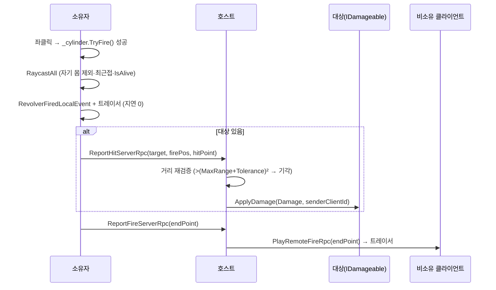

# 리볼버 사격 (로컬 판정 → 호스트 확정)

> **종류**: 아키텍처 명세 · **상태**: 구현중
> **최종 갱신**: 2026-07-24 · **관련 기획서**: [Train-Survival-기획서](../../design/Train-Survival-기획서.md) · [네트워크 아키텍처 §4](../../design/Train-Survival-네트워크-아키텍처.md) · [개발 가이드 §5 M2](../../guide/Train-Survival-개발-가이드.md)

## 1. 개요·목적

M2 기본 총기(리볼버) 1종. **명중 판정은 쏜 클라이언트(지연 0), 데미지·사망 확정은 호스트**라는 권위
분담을 그대로 구현한다. 발사 연출·탄약 표시는 입력 즉시 로컬 발행하고, 실제 피해는 호스트가 거리
재검증 후 대상의 `IDamageable`에 적용한다. 손맛(집게)과 같은 "로컬 선반영 + 호스트 권위" 패턴의 재사용이다.

## 2. 범위 (Scope)

**포함**: 사격 입력·로컬 레이캐스트·연출(`RevolverController`), 실린더/재장전 순수 로직
(`RevolverCylinder`), 밸런스 데이터(`RevolverSettings`), 로컬 표현 이벤트(`CombatEvents`), 피격 계약
(`IDamageable`), 핫바 선택에 따른 입력 게이트.

**미포함**: 데미지 수신·사망 확정의 구현체(대상 도메인 소관 — 몬스터는 [monsters](../monsters/wave-and-steering.md)의
`MonsterHealth`), 무기 3축 확장·탄약 제작(M5), 예비 탄약 개념(현재 무한).

## 3. 요구사항 → 설계 해석

| 요구사항 | 출처 | 설계적 해석 |
|---|---|---|
| 명중 판정 = 쏜 클라이언트 | 권위 분담표 | 소유자가 로컬 `Physics.RaycastAll`로 대상 선택, 자기 몸 제외·최근접 선택 |
| 데미지·사망 확정 = 호스트 | 권위 분담표 | 대상 있으면 `ReportHitServerRpc`로 보고, 호스트가 거리 재검증 후 `IDamageable.ApplyDamage` |
| 발사 연출 지연 0 | 손맛 원칙(집게 재사용) | 입력 즉시 `RevolverFiredLocalEvent` + 트레이서, 판정 성공과 무관하게 매 발사 |
| 비소유 클라이언트에도 발사가 보인다 | 표현 일관성 | `ReportFireServerRpc` → `PlayRemoteFireRpc(SendTo.NotOwner)`로 트레이서 브로드캐스트 |
| 무기 전환은 핫바 선택 | 기획서 v0.4 통합 핫바 | `HotbarController`가 선택 슬롯이 Revolver·패널 닫힘일 때만 `InputEnabled=true` |

## 4. 시스템 구조

| 구성요소 | 역할 | 계층 |
|---|---|---|
| `RevolverController` | 입력·로컬 레이캐스트·연출·호스트 보고 RPC | `NetworkBehaviour` |
| `RevolverCylinder` | 장탄·발사 간격·재장전 순수 상태 머신 | 순수 C# |
| `RevolverSettings` | 데미지·사거리·실린더 밸런스 | `ScriptableObject` |
| `CombatEvents` | 발사·탄약 변경 로컬 표현 이벤트 | 순수 C# struct |
| `IDamageable` | 피격 계약(데미지·사망은 호스트) | 인터페이스 |

## 5. 데이터 구조

### `RevolverSettings`

| 필드 | 기본값 | 의미 |
|---|---|---|
| `Damage` | 34 | 명중 데미지 |
| `MaxRange` | 45 | 최대 사거리 |
| `RangeTolerance` | 5 | 호스트 명중 검증 거리 허용 오차 |
| `CylinderCapacity` | 6 | 장탄 수 |
| `FireInterval` | 0.4 s | 최소 발사 간격 |
| `ReloadDuration` | 2.2 s | 재장전 시간 |

예비 탄약 개념 없음(무한). 실린더만 소모·재장전한다.

### `RevolverCylinder` 상태

| 멤버 | 의미 |
|---|---|
| `Capacity` / `RoundsLoaded` | 최대·현재 장탄(생성 시 만탄) |
| `IsReloading` | `_reloadRemaining > 0` |

## 6. 상세 로직·상태

### 6.1 발사 파이프라인

- **로컬 판정**: `TryRaycastHit`이 `Physics.RaycastAll(ray, MaxRange, ~0, Ignore Trigger)`로 자기
  `transform.root` 히트를 제외하고 최근접을 고른다. 콜라이더의 부모 `NetworkObject` → `IDamageable`,
  `IsAlive`인 경우만 유효 대상.
- **호스트 검증**: `ReportHitServerRpc`(SendTo.Server)가 `TryGet` 실패·`IDamageable` null·사망·거리 초과를
  모두 기각한 뒤에만 `ApplyDamage`. 치터/지연으로 인한 원거리 명중을 `RangeTolerance`로 방어.
- **연출 분리**: 발사 트레이서·히트마커는 판정 성공과 독립적으로 매 발사 발행(로컬은 즉시, 원격은
  `PlayRemoteFireRpc`). 명중 이벤트가 아니라 "쐈다"는 사실만 표현.

### 6.2 실린더·재장전 (`RevolverCylinder`, 순수)

- `TryFire()` — 재장전 중/무탄/쿨다운이면 false, 성공 시 장탄 −1·쿨다운 = `FireInterval`.
- `TryStartReload()` — 재장전 중이거나 만탄이면 false, 성공 시 `_reloadRemaining = ReloadDuration`.
- `Tick(dt)` — 쿨다운·재장전 진행, 재장전 완료 시 만탄 복귀.
- 생성자에서 인자를 `Max`로 클램프(capacity≥1 등), 만탄으로 시작.

### 6.3 탄약 표시

`PublishAmmoIfChanged`가 장탄·재장전 상태 변화 시에만 `RevolverAmmoChangedLocalEvent`를 발행 — 매
프레임이 아니라 값 변화 시에만. HUD가 이를 구독해 표시.

## 7. 인터페이스·의존성 (경계)

- **`IDamageable`** — 데미지·사망 확정은 구현체(대상 도메인) 소관. `RevolverController`는 대상 구현을
  모르고 계약으로만 피해를 넣는다. **주의**: 호스트가 명중/사망 결과를 되돌려주는 권위 이벤트는 이
  도메인이 아니라 `ApplyDamage` 구현체(예: `MonsterHealth`의 `MonsterDiedEvent`)가 발행한다.
- **로컬 표현 이벤트만 이 도메인 소유**: `RevolverFiredLocalEvent`(명중 여부 포함), `RevolverAmmoChangedLocalEvent`.
  둘 다 소유자 로컬 예측 표현용 — 상태를 소유하지 않는다.
- **입력 게이트는 [inventory](../inventory/hotbar.md)가 구동**: `HotbarController`가 선택 슬롯 종류로
  `RevolverController.InputEnabled`를 매 프레임 갱신. 컨트롤러는 `IsOwner && InputEnabled`에서만 입력 처리.

## 8. 설계 포인트 (SOLID)

| 원칙 | 적용 |
|---|---|
| **SRP** | 실린더 규칙(`RevolverCylinder`)과 입력·네트워크·연출(`RevolverController`) 분리 |
| **DIP** | 대상을 `IDamageable`로만 참조 — 몬스터·파괴 가능 오브젝트 어느 것이든 무수정 피격 |
| **강조 패턴 — 로컬 선반영 + 호스트 권위** | 집게 파이프라인과 동일 구조(판정=소유자, 확정=호스트)로 손맛과 치터 방어를 양립 |

## 9. Unity 특화

- **생명주기**: `Player.prefab`에 병렬 부착(집게와 함께). `IsOwner && InputEnabled` 게이트로 비소유·비선택 시 무동작.
- **풀링**: 트레이서 연출은 도메인 내 처리(전용 풀 여부는 프리팹 구성에 따름). 대상 스폰/소멸은 대상 도메인 소관.
- **성능 예산**: 발사 시에만 `RaycastAll` 1회. 탄약 이벤트는 변화 시에만 발행.
- **에디터 툴 필요 여부**: 없음. 밸런스는 `RevolverSettings.asset`.

## 10. 테스트 케이스

| 테스트 파일 | 검증 항목 |
|---|---|
| `RevolverCylinderTests` (7개) | 만탄 시작, 발사 시 1발 소모, 발사 간격 내 연사 거부, 무탄 시 발사 거부, 재장전 완료 후 만탄 복귀, 만탄 시 재장전 거부, 재장전 중 재장전 거부 |

컨트롤러·RPC·레이캐스트는 EditMode 대상 밖 — 실린더 순수 상태 머신만 검증.

## 11. 리스크·미결정 (TBD)

| 항목 | 내용 |
|---|---|
| 명중/사망 피드백 이벤트 | 현재 호스트→소유자 명중 확정 이벤트는 이 도메인에 없음. 히트마커는 로컬 예측 표시 — 원거리·고지연에서 예측/확정 불일치가 드러나면 확정 피드백 추가 검토 |
| 무기 3축 확장 | 샷건·볼트액션·근접 등은 M5 — 현재는 리볼버 1종 |
| 예비 탄약·제작 | 현재 무한 — 탄약 3종 제작은 M5 |

## 12. 확장 여지

- 무기 추가는 `RevolverCylinder`류 순수 상태 머신 + `IDamageable` 재사용으로 얹힘 — 권위 파이프라인 동일.
- `IDamageable`은 몬스터뿐 아니라 파괴 가능한 열차 건축물(M3)에도 그대로 적용 가능.

## 13. 파일 위치

| 구분 | 파일 | 경로 |
|---|---|---|
| 컨트롤러 | `RevolverController.cs` | `Assets/_Project/Scripts/Gameplay/Combat/` |
| 순수 로직 | `RevolverCylinder.cs` | 〃 |
| 이벤트·계약 | `CombatEvents.cs`, `IDamageable.cs` | 〃 |
| 데이터 | `RevolverSettings.cs` (+ `.asset`) | 〃 (+ `Assets/_Project/Data/`) |
| 테스트 | `RevolverCylinderTests.cs` | `Assets/_Project/Tests/EditMode/` |
