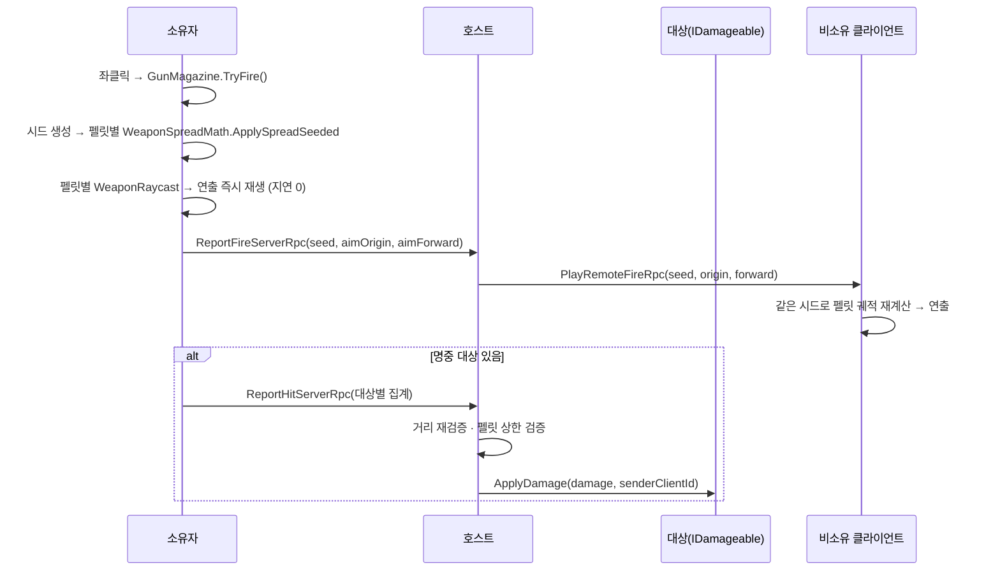

# 무기 전투 — 총기 공통 사격·근접·탄약

> **종류**: 아키텍처 명세 · **상태**: 구현 완료 (M2 리볼버 → M5 2차 공통화 → M5 8차 연출 →
> **M7 4차 거치 무기**)
> **최종 갱신**: 2026-08-28 · **관련 문서**: [기획서 §6.2](../../design/Train-Survival-기획서.md) ·
> [네트워크 아키텍처 §4](../../design/Train-Survival-네트워크-아키텍처.md) ·
> [개발 가이드 §5 M2·M5](../../guide/Train-Survival-개발-가이드.md) ·
> [상호작용 중재](../player/interaction-arbitration.md) — 좌석에 붙는 E키를 상자·작업대와 겨루는 축
>
> **이전 파일명**: `revolver-fire.md` — M5 2차에서 리볼버 전용 3종이 총기 공통으로 일반화되면서
> 문서도 무기 전체를 다루게 됐다.

## 1. 개요·목적

전투의 권위 규약은 하나다 — **소유자가 로컬로 판정하고(지연 0), 호스트가 재검증해 확정한다.**

M2에서 리볼버 하나로 세운 이 파이프라인이 M5 2차에서 **총기 공통**으로 일반화됐다.
그 결과 샷건·볼트액션이 **`GunSettings` 에셋 2개로 성립했다 — 컴포넌트 코드 0줄.**
이것이 이 도메인의 가장 중요한 사실이다.

## 2. 범위 (Scope)

**포함**: 총기 사격 파이프라인(`GunController`), 탄창·재장전(`GunMagazine`), 무기 데이터(`GunSettings`),
근접 무기(`MeleeWeaponController`·`MeleeSettings`), 공통 조준 레이캐스트(`WeaponRaycast`),
산탄 계산(`WeaponSpreadMath`), 전투 연출(트레이서·탄착·스윙 호), 피격 계약(`IDamageable`).

**미포함**: 데미지 수신·사망 확정의 구현체(→ [monsters](../monsters/wave-and-steering.md)의 `MonsterHealth`) ·
탄약 제작(→ [crafting](../crafting/crafting-pipeline.md)) · 슬롯·예비 탄약 보관
(→ [inventory/hotbar.md](../inventory/hotbar.md)) · 집게(→ [harpoon](../harpoon/grapple-pipeline.md)) ·
거치 무기(M5 미구현).

## 3. 요구사항 → 설계 해석

| 요구사항 | 출처 | 설계적 해석 |
|---|---|---|
| 쏘는 느낌에 지연이 없어야 한다 | 네트워크 §4 | **소유자 로컬 레이캐스트 + 즉시 연출**. 호스트 확정을 기다리지 않는다 |
| 치터·지연으로 원거리 명중이 통과하면 안 된다 | 〃 | 호스트가 **거리 재검증** — `MaxRange + RangeTolerance` 초과면 기각 |
| 무기 종류가 늘어도 코드가 늘면 안 된다 | [SOLID §O](../../conventions/solid-principles.md) | 무기 차이를 **전부 데이터로** — 펠릿 수·산탄 각·발사 간격·탄약 종류 |
| 산탄 궤적이 피어마다 같아야 한다 | M5 8차 | **발사 시드 1개만 중계** — 좌표 배열이 아니라 시드로 각 피어가 같은 패턴 재계산 |
| 조준 레이캐스트가 3벌 복붙돼 있었다 | M5 2차 | `WeaponRaycast` 공통 유틸로 통합 (총기·수리 망치·집게 조준점) |
| 재장전이 예비 탄약을 소모한다 | M5 1차 | 로컬 선반영 시작 → 호스트 차감 확정 (**시간 AND 확정**) |

## 4. 시스템 구조

| 구성요소 | 역할 | 계층 |
|---|---|---|
| `GunController` | 총기 공통 — 입력·로컬 판정·RPC·연출 | `NetworkBehaviour` |
| `GunMagazine` | 장탄·쿨다운·재장전 진행 (순수) | 순수 C# |
| `GunSettings` | 무기 정의 — **무기 차이의 전부** | ScriptableObject |
| `MeleeWeaponController` | 근접 — 스피어캐스트 판정 → 호스트 리치 검증 | `NetworkBehaviour` |
| `MeleeSettings` | 근접 정의 | ScriptableObject |
| `WeaponRaycast` | 공통 조준 — 최근접 히트·스피어 히트·조준점 수렴 | 순수 C# static |
| `WeaponSpreadMath` | 산탄 각 적용 · **시드 결정적 난수** | 순수 C# static |
| `IDamageable` | 피격 계약 | 인터페이스 |
| `GunView` / `MeleeSwingView` | 1인칭 뷰모델 · 스윙 호 | `MonoBehaviour` |
| `TracerView` / `ImpactEffectView` | 트레이서 · 탄착 (풀링) | `MonoBehaviour` + `IPoolable` |



## 5. 데이터 구조

### `GunSettings` — 무기 차이의 전부

| 필드 | 리볼버 | 샷건 | 볼트액션 |
|---|---|---|---|
| `Damage` | 34 | (펠릿당) | 110 |
| `MaxRange` | 45 | — | 120 |
| `PelletCount` | 1 | **7** | 1 |
| `SpreadAngle` | 0 | > 0 | 0 |
| `MagazineCapacity` | 6 | — | — |
| `FireInterval` | 0.4 s | — | — |
| `ReloadDuration` | 2.2 s | — | — |
| `AmmoType` | `RevolverAmmo` | 산탄 | 소총탄 |
| `RangeTolerance` | 5 | — | 3 |
| `WeaponItem` | 핫바 아이템 종류 — 슬롯 선택과 연결 |

> **`PelletCount`와 `SpreadAngle`만으로 샷건이 성립한다.** 새 무기 = 에셋 1개.

### `MeleeSettings`

`Damage` 45 · `MaxRange` 2.6 m · `HitRadius` 0.6 m(스피어캐스트) · `SwingInterval` 0.7 s · `RangeTolerance` 3

**탄약이 없다** — 근접은 탄창·재장전 축이 통째로 빠진 최소형 파이프라인이다.

## 6. 상세 로직·상태

### 6.1 사격 파이프라인

1. **로컬 판정** — `GunMagazine.TryFire()` 통과 시 시드를 뽑고, 펠릿마다
   `WeaponSpreadMath.ApplySpreadSeeded`로 방향을 흩은 뒤 `WeaponRaycast.TryGetClosestHit`.
   자기 `transform.root`는 제외하고 최근접 유효 대상(`IDamageable` + `IsAlive`)만 고른다.
2. **연출 즉시 재생** — 판정 성공과 **독립적으로** 매 발사마다. "쐈다"는 사실의 표현이지 명중 통지가 아니다.
3. **대상별 집계 보고** — 샷건은 펠릿 여러 개가 같은 대상을 맞출 수 있으므로 **대상별로 합산**해
   보고한다. RPC 수 = 맞은 대상 수.
4. **호스트 재검증** — 대상 존재 · `IDamageable` null 아님 · 생존 · **거리** ·
   **펠릿 상한**(보고된 펠릿 수가 `PelletCount`를 넘지 않는가)을 전부 통과해야 `ApplyDamage`.

### 6.2 시드 중계 — 대역폭을 늘리지 않고 산탄을 보여주는 법

원격 피어에 산탄 궤적을 보여주려면 펠릿 좌표 배열(7개 × Vector3)을 보내야 할 것 같지만 —

> **시드 하나(uint)만 보낸다.** `WeaponSpreadMath.ApplySpreadSeeded`가 결정적이므로
> 각 피어가 같은 시드로 같은 궤적을 재계산한다. **대역폭 불변 · 판정 무변 · 표시 전용.**

원격 조준은 원점·방향을 함께 보낸다(원격 피어는 소유자의 조준을 모르므로).

### 6.3 탄창·재장전 (`GunMagazine`, 순수)

| 메서드 | 규칙 |
|---|---|
| `TryFire()` | 재장전 중·무탄·쿨다운이면 false. 성공 시 장탄 −1, 쿨다운 = `FireInterval` |
| `TryStartReload()` | 재장전 중이거나 만탄이면 false |
| `Tick(dt)` | 쿨다운·재장전 진행 |

**예비 탄약 소모** (M5 1차) — 재장전은 **로컬 선반영으로 시작**하고, 호스트가
`RequestReloadServerRpc`로 인벤토리 차감을 확정한 뒤 `ConfirmReloadOwnerRpc`로 실제 장전 수를 준다.

> **시간 AND 확정**: 재장전 완료 조건은 "시간 경과 **그리고** 호스트 확정"이다.
> 재장전 시간(2.2 s) > RTT라 확정 대기가 체감되지 않는다.

### 6.4 근접

스피어캐스트(`WeaponRaycast.TryGetClosestSphereHit`, 반경 0.6 m) → 호스트 리치 검증.
탄약·재장전이 없어 파이프라인이 짧다. 스윙 호(0.25 s)는 **원격 중계**된다(M5 8차 신설).

### 6.5 연출 (M5 8차 — "전투가 눈에 보이게 된다")

| 연출 | 내용 |
|---|---|
| 펠릿별 트레이서 | 시드 재계산 궤적 (§6.2) |
| 탄착 파티클 버스트 | `ImpactEffectView` — 풀링 |
| 근접 스윙 호 | 0.25 s · 원격 중계 |
| 사망·분쇄 버스트 | 20발 / 45발 |
| 변종 구분 | 색·스케일 (검붉음/주황/보라/청록) |

이 연출이 들어오면서 **M5 2차의 "육안 검증 불가" 9건이 재검증 가능해졌다.**

### 6.6 탄약 표시

`PublishAmmoIfChanged`가 장탄·재장전 상태 **변화 시에만** `WeaponAmmoChangedLocalEvent`를 발행한다 —
매 프레임이 아니다. HUD가 구독한다.

### 6.7 거치 무기 — 소유가 아니라 점유 (M7 4차)

열차에 설치되는 첫 무기다. **판정 파이프라인은 그대로 재사용했다** — `GunSettings` ·
`WeaponSpreadMath` · `WeaponRaycast` · `GunMagazine` · `TracerView`/`ImpactEffectView` ·
`IDamageable`이 한 줄도 안 바뀌었다. 새로 선 축은 셋뿐이다.

| 축 | 신설 | 왜 |
|---|---|---|
| **점유** | `MountedWeaponHost`의 전용 `NetworkList<MountOccupancy>` + 순수 `MountOccupancyLogic` | 점유는 드물게 바뀌고 조준각은 매 프레임 바뀐다. **주기가 다른 두 값을 `StructureEntry` 리스트에 함께 싣지 않는다** — 실으면 포신을 돌릴 때마다 건축물 20개가 함께 흐른다 |
| **기준점** | 좌석 앵커 (`MountedAimMath`) | `GunController`와 다른 점은 이것 하나다 — 기준이 플레이어가 아니라 **좌석**이다. 서버는 점유 리스트로 그 사람이 그 자리에 있음을 이미 알므로 **사거리 재검증이 더 강하다** |
| **급탄** | 서버 내부 `MountedMagazineStore` (`Dictionary<ushort,int>`) | 남은 탄은 **무기에 남고** 교대해도 이어진다. 복제 리스트에 싣지 않는다. 파괴 시 소실 |

조준각은 점유자 → 서버 → `NotOwner` **10 Hz Unreliable**로 중계하고 **판정에 쓰지 않는다** —
유실돼도 그림만 잠깐 늦는다. 요크가 열차 프레임에 고정이라 관찰자 이동과 위상차가 안 생긴다.

**자동 터렛은 조작자만 AI로 바꾼 것**이다. 서버 전용 구동(예측할 입력이 없다)이고, 선정 규칙은
순수 함수 `TurretTargetingMath`가 소유하며 물리 조회(`OverlapSphere` 35 m)는 호출부가 한다.
사각(yaw ±110°)은 **사람과 같은 제한**을 받는다 — 뒤로는 못 쏜다.

> 탄종은 둘 다 **소총탄**(`RifleAmmo`)으로 볼트액션과 공유한다. 밤에 거치 무기를 돌리면 저격 탄이
> 준다는 **경쟁 관계**가 그대로 압박이 되게 한 선택이다.

## 7. 인터페이스·의존성 (경계)

- **`IDamageable`** — 사격은 대상의 구체 타입을 모른다. 몬스터·보스·(향후) 열차 부위가 구현.
- **`InputEnabled`** — `HotbarController`가 선택 슬롯 기준으로 무기 입력을 켜고 끈다
  (→ [inventory/hotbar.md](../inventory/hotbar.md)).
- **`WeaponRaycast`** — 총기·수리 망치·집게 조준점이 공유. M5 2차 이전에는 3벌 복붙이었다.

## 8. 설계 포인트 (SOLID)

| 원칙 | 적용 |
|---|---|
| **S** | 판정=`GunController` / 장탄=`GunMagazine`(순수) / 산탄=`WeaponSpreadMath`(순수) / 조준=`WeaponRaycast`(순수) |
| **O** | **새 총기 = `GunSettings` 에셋 1개.** M5 2차에서 샷건·볼트액션이 컴포넌트 코드 0줄로 성립 |
| **D** | 대상은 `IDamageable`로만 참조 |

## 9. Unity 특화

- `Physics.RaycastAll` + Ignore Trigger, 자기 `transform.root` 제외.
- 트레이서·탄착은 `IPoolable` — `PoolManager.Spawn/Despawn` 경유([아키텍처 규칙](../../conventions/architecture-rules.md)).
- `GunView`는 `FirstPersonViewModel` 기반 클래스를 상속 — 화면 전용 뷰모델의 공통 규약(그림자 차단 등)이 거기 있다.

## 10. 테스트 케이스 (EditMode)

`GunMagazine` — 무탄 발사 거부 · 쿨다운 · 재장전 중 발사 거부 · 만탄 재장전 거부 · 부분 장전.
`WeaponSpreadMath` — 시드 결정성(같은 시드 → 같은 방향열) · 산탄 각 0일 때 정방향 · 분포 경계.
`WeaponRaycast` — 최근접 선택 · 자기 제외 · 무효 대상 배제.

거치 무기(M7 4차) — `MountOccupancyLogic`(승인·거부 사유 · 강제 하차) ·
`MountedAimMath`(좌석 기준 각 제한·설치 회전) · `MountedMagazineStore`(교대 시 잔탄 유지) ·
`TurretTargetingMath`(사각·거리·생존 필터 → 선정).

## 11. 리스크·미결정 (TBD)

| # | 항목 | 상태 |
|---|---|---|
| 1 | ~~터렛·거치 기관총 미구현~~ | **해소 (2026-08-25, M7 4차)** — 건축물로 편입하고 점유 축을 따로 세웠다 (§6.7) |
| 2 | 변종 시각 구분 검증(E 구역 6건) | M5 8차 이월 |
| 3 | 무기별 반동·조준 확산 | 없음 — 도입 시 `GunSettings` 필드 추가로 가능 |
| 4 | **거치 무기 2종 모델 미반입** | 형상이 프리미티브이고 **둘이 완전히 같다** — `Base`·`Body`·`Barrel`의 치수가 한 값도 다르지 않다(2026-08-27 실측). 디자인 미정, 생성 지시 시트도 아직 없다. 판정에는 영향 없음 |

## 12. 확장 여지

- **새 총기**는 에셋 추가만으로 성립한다(실증됨).
- 연사(자동 사격)는 `FireInterval` + 입력 홀드로 데이터 범위 안 — **거치 기관총이 실증했다**
  (`_fireInterval: 0.11` ≈ 545 RPM, 컴포넌트 코드 0줄).
- ~~거치 무기는 조작권 점유 축만 새로 필요하고, 판정 파이프라인은 재사용된다.~~
  **실증됨 (M7 4차)** — 판정 파이프라인은 그대로 재사용됐고, 새로 선 것은 점유·조준·급탄 셋뿐이다.

## 13. 파일 위치

```
Assets/_Project/Scripts/Gameplay/Combat/
├─ GunController.cs        총기 공통 — 입력·판정·RPC·연출
├─ GunMagazine.cs          순수 — 장탄·쿨다운·재장전
├─ GunSettings.cs          SO — 무기 차이의 전부
├─ MeleeWeaponController.cs / MeleeSettings.cs
├─ WeaponRaycast.cs        순수 — 공통 조준 (3벌 복붙 통합)
├─ WeaponSpreadMath.cs     순수 — 산탄·시드 결정 난수
├─ IDamageable.cs          피격 계약
├─ MountedWeaponOperator.cs  거치 무기 — 붙기·조준·발사·재장전 (M7 4차)
├─ MountedAimMath.cs         순수 — 좌석 기준 각 제한·설치 회전
├─ TurretTargetingMath.cs    순수 — 자동 터렛 대상 선정
├─ GunView.cs / MeleeSwingView.cs
├─ TracerView.cs / ImpactEffectView.cs   풀링 연출
└─ CombatEvents.cs
```

거치 무기의 **열차 쪽 절반**은 `Gameplay/Train/`에 있다 — `MountedWeaponHost.cs`(점유 권위) ·
`MountOccupancy.cs` · `MountOccupancyLogic.cs`(순수) · `MountedMagazineStore.cs` ·
`MountedWeaponSettings.cs`(SO) · `MountedWeaponView.cs` · `IMountedWeapons.cs`.
설치·철거·피해·파괴·이탈 추종은 건축물 경로가 그대로 가진다
(→ [train/construction.md](../train/construction.md)).
