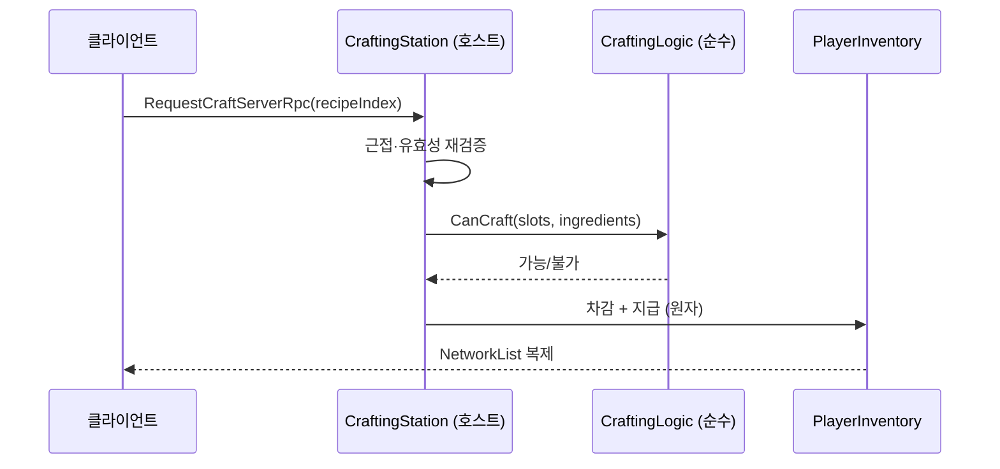

# 제작 파이프라인 — 레시피·재료 차감·산출

> **종류**: 아키텍처 명세 · **상태**: 구현 완료 (M5 1차 골격 → 2차 무기 산출 → M7 요리 확장)
> **최종 갱신**: 2026-08-20 · **관련 문서**: [기획서 §7.3](../../design/Train-Survival-기획서.md) ·
> [개발 가이드 §5 M5](../../guide/Train-Survival-개발-가이드.md)

## 1. 개요·목적

제작은 **"자원을 소모해 다른 것을 얻는" 단일 경로**다. 탄약·무기·요리·집게 승급이 전부 이 한
파이프라인을 지나며, 종류별 특수 처리가 없다.

핵심 설계는 두 가지다 —

1. **레시피 인덱스 = RPC 식별자.** 문자열이나 GUID를 보내지 않고 카탈로그 순서를 보낸다.
2. **차감과 지급이 원자적**이다. 호스트가 `CraftingLogic`으로 한 번에 확정한다.

## 2. 범위 (Scope)

**포함**: 레시피 정의(SO), 카탈로그 인덱싱, 제작 지점(건축물)과 근접 판정, 재료 보유 검사,
호스트 권위 차감·지급, 제작 창 토글 이벤트.

**미포함**: 슬롯 구조·스택 규칙(→ [inventory/hotbar.md](../inventory/hotbar.md)) ·
제작대 건축물의 배치(→ [train/construction.md](../train/construction.md)) ·
요리의 허기·버프 효과(→ inventory) · 집게 등급의 게임플레이 효과(→ [harpoon/](../harpoon/grapple-pipeline.md)).

## 3. 요구사항 → 설계 해석

| 요구사항 | 출처 | 설계적 해석 |
|---|---|---|
| 제작 결과가 클라이언트와 어긋나면 안 된다 | 네트워크 §2 | **호스트 권위** — 클라이언트는 요청만, 확정은 호스트. 차감·지급이 한 호출 안에서 |
| 새 레시피 추가에 코드 수정이 없어야 한다 | [SOLID §O](../../conventions/solid-principles.md) | 레시피 = `ScriptableObject`, 카탈로그에 append |
| RPC 대역폭 최소화 | 네트워크 §6 | 레시피 식별자 = **카탈로그 인덱스**(int) |
| 무기도 제작으로 얻는다 | M5 2차 | `CraftingRecipe.OutputItem` — 자원 산출과 아이템 산출이 같은 레시피 타입 |
| 제작대 종류마다 만들 수 있는 것이 다르다 | 기획서 §7.3 | `CraftStationKind` + 제작 지점별 레시피 목록 |

## 4. 시스템 구조

| 구성요소 | 역할 | 계층 |
|---|---|---|
| `CraftingLogic` | 재료 보유 검사 · 차감 계획 (순수) | 순수 C# static |
| `CraftingRecipe` | 재료·산출·제작대 종류 정의 | ScriptableObject |
| `RecipeCatalog` | **순서 = RPC 식별자** | ScriptableObject |
| `ICraftingStation` / `CraftingStation` | 제작 지점 계약 / 구현 (근접 판정 · `ServerRpc`) | 인터페이스 / `NetworkBehaviour` |
| `CraftStationKind` | 제작대 종류 enum | 데이터 |
| `IHarpoonTierHolder` | 집게 등급 승급 대상 계약 | 인터페이스 |
| `CraftingHud` | 레시피 목록·보유/필요 표시 | `MonoBehaviour` (UI) |



## 5. 데이터 구조

### `CraftingRecipe` (SO)

| 필드 | 의미 |
|---|---|
| `_displayName` | 표시명 |
| `_ingredients` | `Ingredient[]` — `{ ResourceType Type, int Count }` |
| `_stationKind` | 어느 제작대에서 만드는가 |
| 산출 | **자원**(`ResourceType` + 수량) 또는 **아이템**(`OutputItem` — 무기·도구) |

### `RecipeCatalog` (SO)

`CraftingRecipe[]` 배열. **인덱스가 곧 네트워크 식별자**이므로 —

> **중간 삽입·순서 변경 금지.** 새 레시피는 반드시 **끝에 append**한다.
> 순서가 바뀌면 구버전 클라이언트가 다른 레시피를 만든다. 이는 몬스터 변종 카탈로그·
> 자원 카탈로그와 **같은 규약**이다.

## 6. 상세 로직·상태

### 6.1 제작 확정 순서

```
① 클라이언트: 제작대 근접 확인(로컬) → RequestCraftServerRpc(recipeIndex)
② 호스트:    송신자 생존·근접 재검증
③ 호스트:    CraftingLogic.CanCraft(slots, ingredients)
④ 호스트:    차감 + 지급을 한 호출 안에서 확정
⑤ 복제:      NetworkList 변경이 각 피어에 반영
```

**②의 재검증이 필수인 이유** — 클라이언트의 근접 판정은 표시용이다. 지연 중에 멀어졌거나
제작대가 파괴됐을 수 있으므로 호스트가 다시 본다. 리볼버 사격·수리 망치와 **같은 규약**이다.

### 6.2 원자성

`CraftingLogic`이 차감과 지급을 **계획으로 만들고** 호스트가 한 번에 적용한다. 중간에 실패하면
아무것도 바뀌지 않는다 — 재료만 사라지는 상태가 존재하지 않는다.

### 6.3 제작 지점

제작대는 **건축물**(`StructureKind.Workbench` · `Campfire` · `Furnace`)이다.
`ITrainState.TryGetNearestStructure(kind, from)`로 가장 가까운 것을 찾는다 —
건축 개편으로 "칸당 1개" 전제가 사라져 **"가장 가까운 그것"**이 판정 기준이 됐다.

## 7. 인터페이스·의존성 (경계)

- UI는 `ICraftingStation`(레시피 조회·근접 여부)과 `ILocalHotbar`(보유량)만 본다 — 확정 API는 안 보인다.
- 인벤토리 차감은 `IResourceInventory` 경유 — 제작이 슬롯 구조를 직접 알지 않는다.
- 집게 승급은 `IHarpoonTierHolder`로 역전 — 제작이 집게 구현을 참조하지 않는다.

## 8. 설계 포인트 (SOLID)

| 원칙 | 적용 |
|---|---|
| **S** | 판정 = `CraftingLogic`(순수) / 네트워크·근접 = `CraftingStation` / 표시 = `CraftingHud` |
| **O** | 새 레시피 = SO 추가 + 카탈로그 append. **M5 2차에서 샷건·볼트액션이 컴포넌트 코드 0줄로 성립** |
| **D** | 산출 대상을 인터페이스로 (`IResourceInventory` · `IHarpoonTierHolder`) |

## 9. Unity 특화

- 레시피·카탈로그가 SO라 **밸런싱이 에디터 작업**이다.
- 제작 창은 인벤토리 창과 **나란히** 떠야 해서 치수를 `HudLayout`에서 공유한다(M7 3차 검증 W3-b).

## 10. 테스트 케이스 (EditMode)

`CraftingLogic`이 순수 static이라 — 재료 부족 · 정확히 충족 · 초과 보유 · 여러 슬롯에 분산된 재료 ·
스택 경계 · 산출 슬롯 부족을 고정한다.

## 11. 리스크·미결정 (TBD)

| # | 항목 |
|---|---|
| 1 | 카탈로그 순서 규약이 **코드로 강제되지 않는다** — 중간 삽입 시 조용히 깨진다. 검증 테스트 추가 여지 |
| 2 | 제작 시간(캐스팅) 없음 — 즉시 확정. 도입 시 상태 축이 필요 |

## 12. 확장 여지

- 제작대 등급 · 제작 시간 · 대량 제작(shift) 모두 현재 구조 위에 데이터/필드 추가로 가능하다.

## 13. 파일 위치

```
Assets/_Project/Scripts/Gameplay/Crafting/
├─ CraftingLogic.cs        순수 — 보유 검사·차감 계획
├─ CraftingRecipe.cs       SO — 재료·산출·제작대 종류
├─ RecipeCatalog.cs        SO — 순서 = RPC 식별자
├─ CraftingStation.cs      NetworkBehaviour — 근접·ServerRpc
├─ ICraftingStation.cs / IHarpoonTierHolder.cs
├─ CraftStationKind.cs / CraftingEvents.cs
└─ (UI는 Scripts/UI/CraftingHud.cs)
```
