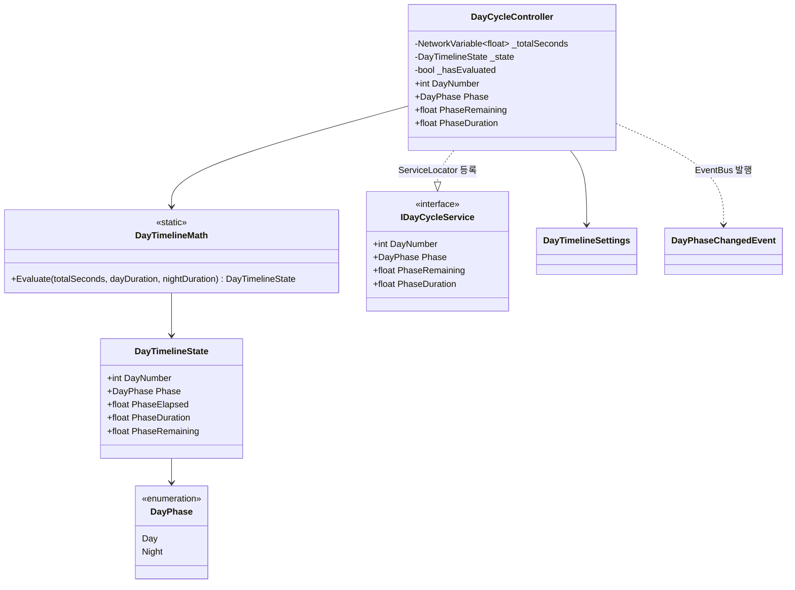
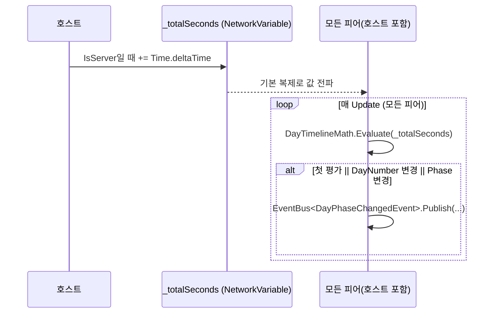

# 낮/밤 사이클 (호스트 권위 누적 시간 + 순수 파생)

> **종류**: 아키텍처 명세 · **상태**: 구현중
> **최종 갱신**: 2026-07-24 · **관련 기획서**: [Train-Survival-기획서](../../design/Train-Survival-기획서.md) · [개발 가이드 §5 M2](../../Train-Survival-개발-가이드.md)

## 1. 개요·목적

M2 코어 루프의 시간축이다. **낮 → 밤 → Day+1**을 반복하는 타임라인을, 호스트가 소유하는
단일 누적 시간(`_totalSeconds`)에서 모든 피어가 동일하게 파생하도록 구현했다. 국면 전환·Day 증가
같은 이산 사건만 이벤트로 발행하고, 나머지 상태(현재 국면·남은 시간)는 매 프레임 순수 계산으로 유도한다.

## 2. 범위 (Scope)

**포함**: 호스트 권위 타임라인 구동(`DayCycleController`), 누적 시간 → (Day·국면·경과·남은 시간) 순수
파생(`DayTimelineMath`), 국면 전환 권위 이벤트(`DayPhaseChangedEvent`), 조회 서비스(`IDayCycleService`),
낮/밤 길이 밸런스 데이터(`DayTimelineSettings`).

**미포함**: 밤 진입에 연동되는 몬스터 웨이브 트리거(→ [monsters](../monsters/wave-and-steering.md)가
`IDayCycleService`/이벤트를 소비), 조명·스카이박스 등 시각 연출, Day 비례 난이도(M4).

## 3. 요구사항 → 설계 해석

| 요구사항 | 출처 | 설계적 해석 |
|---|---|---|
| Day 타임라인은 호스트 권위 | 네트워크 문서 §4, 가이드 M2 | 시간 누적은 `IsServer`만 수행, `NetworkVariable<float> _totalSeconds` 기본 복제로 전파 |
| 모든 피어가 같은 국면을 본다 | 코어 루프 정합성 | 국면 판단을 각 피어가 같은 `_totalSeconds`에 `DayTimelineMath.Evaluate`를 돌려 유도 — 전이 판단이 갈라지지 않음 |
| 밸런싱은 코드 수정 없이 | 가이드(밸런스 데이터 분리) | 낮/밤 길이를 `DayTimelineSettings`(ScriptableObject)로 분리, `Min(10f)` 제약 |
| UI는 상태를 소유하지 않는다 | 아키텍처 규칙 §3 | 전환은 `DayPhaseChangedEvent`로 발행, 연속값은 `IDayCycleService` 조회로만 노출(setter 없음) |

## 4. 시스템 구조

| 구성요소 | 역할 | 계층 |
|---|---|---|
| `DayCycleController` | 호스트 시간 누적 + 매 프레임 파생·이벤트 발행, `IDayCycleService` 구현 | `NetworkBehaviour` |
| `DayTimelineMath` | 누적 시간 하나에서 전체 상태를 유도하는 순수 평가 | 순수 C# static |
| `DayTimelineState` | 평가 결과 (Day 번호·국면·경과·국면 길이) | 순수 C# struct |
| `DayPhase` | Day/Night 열거 (`byte` 기반) | 순수 C# enum |
| `DayPhaseChangedEvent` | 국면 전환 권위 이벤트 | 순수 C# struct |
| `IDayCycleService` | Day·국면·남은 시간 조회 계약 | 인터페이스 |
| `DayTimelineSettings` | 낮/밤 국면 길이 밸런스 데이터 | `ScriptableObject` |



## 5. 데이터 구조

### `DayTimelineSettings`

| 필드 | 기본값 | 의미 |
|---|---|---|
| `DayDurationSeconds` | 240 s | 낮 국면 길이 (`Min(10)`) |
| `NightDurationSeconds` | 150 s | 밤 국면 길이 (`Min(10)`) |

### `DayTimelineState` (파생 struct)

| 멤버 | 의미 |
|---|---|
| `DayNumber` | 1부터 시작하는 현재 Day 번호 |
| `Phase` | 현재 국면(Day/Night) |
| `PhaseElapsed` / `PhaseDuration` | 현재 국면 내 경과·국면 총 길이 |
| `PhaseRemaining`(파생) | `max(0, PhaseDuration - PhaseElapsed)` |

## 6. 상세 로직·상태

### 6.1 누적 시간 → 상태 파생 (`DayTimelineMath.Evaluate`)

`Evaluate(totalSeconds, dayDuration, nightDuration)` — 순수 함수, 부작용 없음.

```
cycleDuration = dayDuration + nightDuration
clamped       = max(0, totalSeconds)          // 음수 시간은 시작(0)으로 고정
cycleIndex    = (int)(clamped / cycleDuration)
timeInCycle   = clamped - cycleIndex * cycleDuration
DayNumber     = cycleIndex + 1                 // 1부터 시작

timeInCycle < dayDuration
  → Phase = Day,   Elapsed = timeInCycle,             Duration = dayDuration
  → 그 외 Night,   Elapsed = timeInCycle - dayDuration, Duration = nightDuration
```

### 6.2 구동·발행 루프 (`DayCycleController.Update`)



- **왜 RPC가 없나**: 상태 전이는 시간의 함수이므로, 하나의 값(`_totalSeconds`)만 복제하면 각 피어가
  같은 국면을 독립 유도할 수 있다. 전용 전환 RPC를 두지 않아 대역폭과 순서 문제를 회피한다.
- **엣지 케이스 — 첫 평가 강제 발행**: `_hasEvaluated` 플래그로 첫 `Update`에서는 무조건
  `DayPhaseChangedEvent`를 발행해 구독자(HUD 등)가 초기 국면을 즉시 받도록 한다.
- **엣지 케이스 — 설정 누락 방어**: `_settings == null`이면 `Update`/`EvaluateAndPublish`가 조기 반환한다.
- **엣지 케이스 — 음수 시간 고정**: `Evaluate`가 `max(0, …)`로 클램프해 어떤 경우에도 Day1 낮 이전으로 가지 않는다.

## 7. 인터페이스·의존성 (경계)

- **`IDayCycleService`** — `OnNetworkSpawn`에서 미등록일 때만 `ServiceLocator.Register`, `OnNetworkDespawn`에서
  자기 자신이 등록된 인스턴스일 때만 `Unregister`. 소비자(HUD·웨이브 스포너)는 구현을 모르고 조회만 한다.
- **권위 이벤트 vs 조회**: 이산 전환은 `DayPhaseChangedEvent`(권위 이벤트), 연속값(남은 시간 카운트다운
  등)은 `IDayCycleService` 폴링 조회로 분리 — 매 프레임 이벤트를 쏘지 않는다.
- 이 도메인은 어떤 다른 도메인도 참조하지 않는다(시간축 원천). 밤 웨이브·연출이 역으로 이 도메인을 소비한다.

## 8. 설계 포인트 (SOLID)

| 원칙 | 적용 |
|---|---|
| **SRP** | 시간 누적·네트워크(`DayCycleController`)와 상태 파생 수식(`DayTimelineMath`)을 분리 |
| **DIP** | 소비자는 `IDayCycleService`로만 시간을 읽어 컨트롤러 구현에 결합되지 않음 |
| **강조 패턴 — 순수 로직의 조기 분리** | 국면 전이 전 로직을 static 순수 함수로 빼 물리·네트워크 없이 EditMode에서 전 경계 검증 |

## 9. Unity 특화

- **생명주기**: `Game` 씬에 1개 배치 의도. `OnNetworkSpawn`에서 서비스 등록, `OnNetworkDespawn`에서 해제.
- **풀링**: 대상 없음(단일 상시 오브젝트).
- **성능 예산**: 매 프레임 순수 산술 1회 + 조건 비교. 할당 없음.
- **에디터 툴 필요 여부**: 없음. 밸런스는 `DayTimelineSettings.asset` 수정으로 조정.

## 10. 테스트 케이스

| 테스트 파일 | 검증 항목 |
|---|---|
| `DayTimelineMathTests` (6개) | ① 시작=Day1 낮 ② 낮 길이 경과 후 밤 전환 ③ 한 사이클 후 Day+1 낮 ④ 남은 시간=길이−경과 ⑤ 음수 시간 시작 고정 ⑥ 다중 사이클 후 정확한 Day 번호 |

컨트롤러/네트워크 복제는 EditMode 대상 밖 — 파생 수식(전이 경계·클램프·Day 번호)만 순수 함수로 검증한다.

## 11. 리스크·미결정 (TBD)

| 항목 | 내용 |
|---|---|
| 낮/밤 길이 밸런스 | 현재 240/150 s는 초기값 — 코어 루프 반복 밸런싱(가이드 §2)에서 데이터로 조정 예정 |
| Day 비례 난이도 연동 | 밤 국면·Day 번호를 소비하는 난이도 곡선은 M4 범위 |

## 12. 확장 여지

- `DayPhase`에 값을 추가하고(예: 황혼) `DayTimelineMath`의 구간 판단만 확장하면 국면 세분화가 가능 —
  소비자는 이벤트/서비스 경계 그대로 유지.
- Day 번호가 M4 지역 전환·난이도 곡선의 입력으로 그대로 재사용된다.

## 13. 파일 위치

| 구분 | 파일 | 경로 |
|---|---|---|
| 컨트롤러 | `DayCycleController.cs` | `Assets/_Project/Scripts/Gameplay/Cycle/` |
| 순수 로직 | `DayTimelineMath.cs`, `DayPhase.cs` | 〃 |
| 이벤트 | `CycleEvents.cs` | 〃 |
| 인터페이스 | `IDayCycleService.cs` | 〃 |
| 데이터 | `DayTimelineSettings.cs` (+ `.asset`) | 〃 (+ `Assets/_Project/Data/`) |
| 테스트 | `DayTimelineMathTests.cs` | `Assets/_Project/Tests/EditMode/` |
