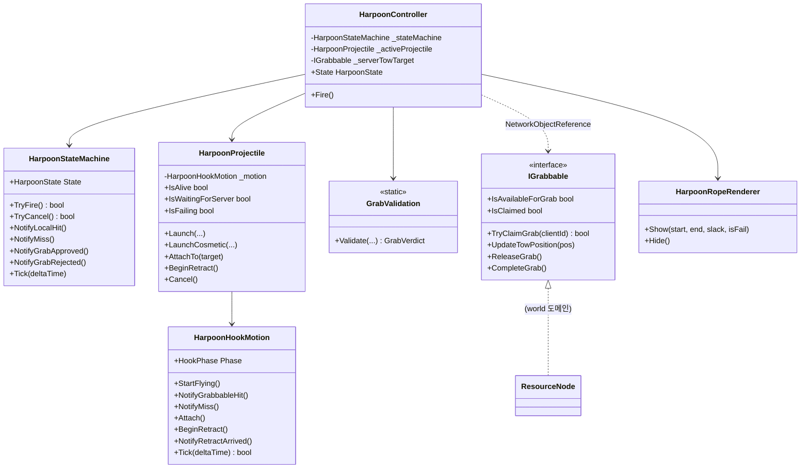
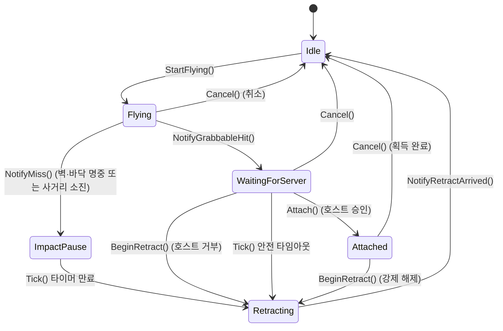
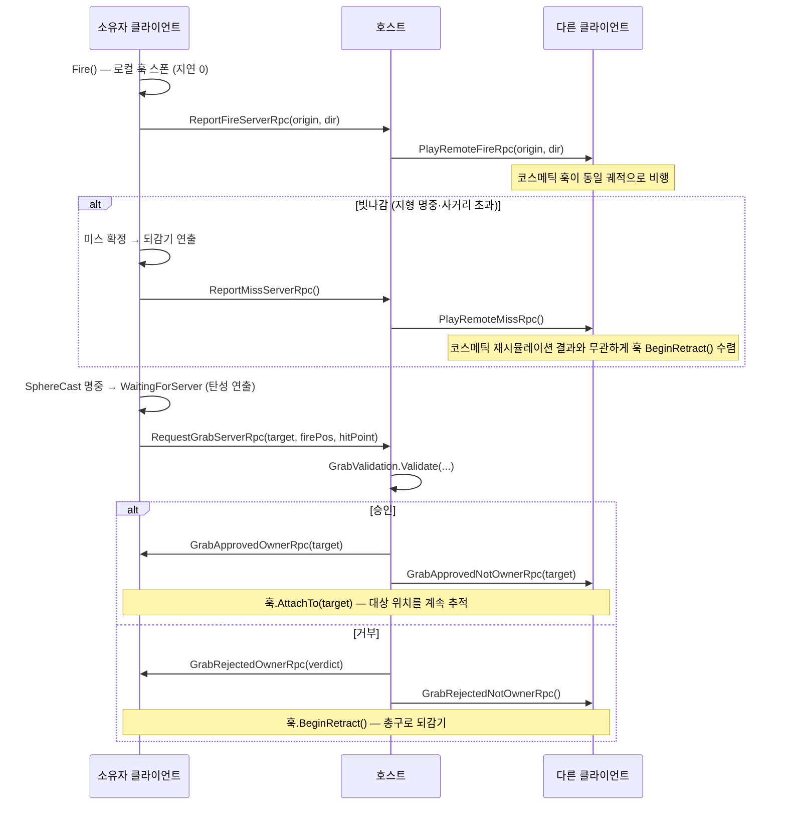

# 집게(하푼) 그랩 파이프라인

> **종류**: 아키텍처 명세 · **상태**: 구현중
> **최종 갱신**: 2026-07-21 · **관련 기획서**: [Train-Survival-기획서](../../design/Train-Survival-기획서.md) · [수직 슬라이스 스펙](../../design/Train-Survival-수직슬라이스-스펙.md)

## 1. 개요·목적

집게 발사 → 로컬 명중 판정 → 호스트 그랩 검증 → 견인 → 획득으로 이어지는 파이프라인의 실제 구현을 기록한다.
슬라이스 스펙 §2가 정의한 "로컬 선반영 + 호스트 권위" 구조를 그대로 따르되, 구현 중 두 가지가 스펙 원안 대비 확장됐다:
① 실패(빗나감·거부) 시 훅이 즉시 사라지지 않고 총구로 되돌아가는 연출, ② 발사·견인 모습을 다른 클라이언트에도 브로드캐스트.

## 2. 범위 (Scope)

**포함**: 발사 입력 게이트(`HarpoonStateMachine`), 훅 비행·충돌·되감기(`HarpoonProjectile` + `HarpoonHookMotion`), 호스트 검증 규칙(`GrabValidation`), 견인 시뮬레이션, 로프 연출(`HarpoonRopeRenderer`), 발사·미스·견인의 비소유 클라이언트 브로드캐스트, 그랩 대상 공용 계약(`IGrabbable`), 손맛 검증 계측(`HarpoonSliceMetrics` + `TowMotionAnalyzer` — 에디터·개발 빌드 전용, 릴리스에서는 `[Conditional]`로 호출 제거).

**미포함**:
- 그랩 대상 자체 구현 — 자원(`ResourceNode`)은 [world 도메인](../world/scroll-and-streaming.md) 소관, 몬스터 그랩은 `IGrabbable` 인터페이스만 준비된 상태로 미구현 (M5 확장 대상).
- 2·3단계 집게(무게 등급별 릴 속도, 다중 대상 등) — 슬라이스 범위 밖.
- 발사음·팔 애니메이션 등 실제 리소스 — 로컬 표현 이벤트(`HarpoonFiredLocalEvent`)만 발행하고 구독 측(연출·오디오)은 이 문서 밖.
- 정성 블라인드 테스트 — §11 리스크에서 추적 (정량 검증은 프로파일 ②·③ 실측 완료, Q1~Q5 종결).

## 3. 요구사항 → 설계 해석

| 요구사항 | 출처 | 설계적 해석 |
|---|---|---|
| 발사 즉시 로컬 연출 (지연 0) | 슬라이스 스펙 §2.4 | 입력 → `EventBus<HarpoonFiredLocalEvent>` 발행과 로컬 훅 스폰을 같은 프레임에서 동기 수행 |
| 명중 판정 = 쏜 클라이언트, 확정 = 호스트 | 권위 분담표 | `HarpoonProjectile`이 로컬 SphereCast로 판정 → `RequestGrabServerRpc`로 보고 → `GrabValidation`이 서버에서 확정 |
| 취소는 릴 감기 중에만, 페널티 없이 쿨다운만 | 슬라이스 스펙 §2.1 | `HarpoonStateMachine.TryCancel()`이 `Reeling` 상태만 허용, 성공 시 `Cancel()`(즉시 소멸 = "로프 절단") |
| 거부 시 "로프가 미끄러져 빠지는" 연출 | 슬라이스 스펙 §2.4 | (사용자 추가 요구로 구체화) `BeginRetract()` — 피격 정지 없이 즉시 되감기 시작 |
| **실패해도 사라지지 않고 총구로 돌아옴** | 사용자 요청 (2026-07-20) | `HarpoonHookMotion`에 `ImpactPause`/`Retracting` 단계 추가, 훅이 총구 Transform을 매 프레임 추적하며 되감김 |
| **다른 플레이어도 발사·견인을 볼 수 있어야 함** | 사용자 요청 (2026-07-20) | 기존 `SendTo.Owner` RPC마다 대응하는 `SendTo.NotOwner` RPC로 코스메틱 훅 브로드캐스트 |

## 4. 시스템 구조

| 구성요소 | 역할 | 계층 |
|---|---|---|
| `HarpoonController` | 입력 게이트 호출, RPC 송수신, 호스트 견인 시뮬레이션 | `NetworkBehaviour` (Gameplay) |
| `HarpoonStateMachine` | 조작 상태(`Ready`~`Cooldown`) 순수 전이 | 순수 C# |
| `HarpoonHookMotion` | 훅 비행 단계(`Idle`~`Retracting`) 순수 전이 | 순수 C# |
| `HarpoonProjectile` | Transform 이동·SphereCast·훅 시각 구동 (소유자 권위 겸 비소유 코스메틱 겸용) | `MonoBehaviour` + `IPoolable` |
| `GrabValidation` | 호스트 승인/거부 판정 순수 함수 | 순수 C# static |
| `HarpoonRopeRenderer` | 로프 `LineRenderer` 연출 (탄성·실패 색상) | `MonoBehaviour` |
| `HarpoonSettings` | 발사·릴·되감기 밸런스 수치 | `ScriptableObject` |
| `IGrabbable` | 그랩 대상 공용 계약 (자원/몬스터) | 인터페이스 (Gameplay) |

## 5. 데이터 구조 — `HarpoonSettings`

기획자가 코드 수정 없이 조정하는 값 전부. 에셋: `Assets/_Project/Data/HarpoonSettings.asset`.

| 필드 | 기본값 | 의미 |
|---|---|---|
| `MaxRange` | 20 m | 사거리 (슬라이스 스펙 §2.2) |
| `ProjectileSpeed` | 40 m/s | 투사체 비행 속도 |
| `ProjectileRadius` | 0.15 m | SphereCast 반경 |
| `ReelSpeed` | 8 m/s | 견인(릴) 속도 |
| `FireCooldown` | 0.5 s | 명중·취소 후 재발사 대기 |
| `MissRecoveryDuration` | 2.5 s | 빗나감 페널티 |
| `ArriveRadius` | 1.2 m | 이 거리 안으로 끌려오면 획득 완료 |
| `RangeTolerance` | 2 m | 호스트 거리 검증 여유분 |
| `TowInterpolationRate` | 20 | 견인 스냅샷 보간 계수 |
| `RetractSpeed` | 14 m/s | 실패 시 총구로 되돌아가는 속도 |
| `ImpactPauseDuration` | 0.12 s | 피격 직후 되감기 전 정지 시간 |
| `WaitingForServerTimeout` | 1.5 s | 호스트 응답이 끝내 오지 않을 때의 안전 폴백 |

## 6. 상세 로직·상태

### 6.1 훅 비행 단계 (`HarpoonHookMotion`)

- **엣지 케이스 — 취소는 "로프 절단"**: 릴 감기(`Attached`) 중 우클릭 취소는 `BeginRetract()`가 아니라 `Cancel()`을 호출한다 — 슬라이스 스펙 §2.1이 취소를 "되감기"가 아닌 "절단"으로 명시했기 때문. 실패(빗나감·거부)만 되감기 연출을 탄다.
- **엣지 케이스 — 안전 타임아웃**: `WaitingForServer`는 정상적으로 항상 서버 응답(`Attach`/`BeginRetract`)을 받지만, 대상이 이미 소멸된 채 늦게 도착하는 등의 상황을 대비해 `WaitingForServerTimeout` 초과 시 자동으로 `Retracting`으로 폴백한다.
- **엣지 케이스 — 코스메틱 사본의 독립 판정**: 비소유 클라이언트의 훅(`LaunchCosmetic`)도 동일한 SphereCast로 `Flying → WaitingForServer/ImpactPause`를 스스로 판단하지만, 실제 결과는 뒤이어 도착하는 RPC가 항상 덮어쓴다 — 승인/거부는 `GrabApproved/RejectedNotOwnerRpc`, **빗나감은 `PlayRemoteMissRpc`**(각 클라이언트의 자원 위치가 스크롤 외삽으로 미세하게 달라 경계 사례에서 코스메틱이 "명중"으로 재현하면, 소유자 미스를 전파받지 못할 경우 `WaitingForServerTimeout` 1.5 s 동안 대상에 붙어 있는 화면 불일치가 생긴다 — 2026-07-21 플레이테스트에서 발견되어 미스 브로드캐스트 추가). 코스메틱 판정은 시각적 근사치일 뿐 권위가 아니다.

### 6.2 그랩 요청 시퀀스

## 7. 인터페이스·의존성 (경계)

- **`IGrabbable`** — Harpoon → World 방향 경계. `ResourceNode`(world 도메인)가 구현하며, Harpoon은 구체 타입을 모른 채 인터페이스로만 그랩·견인·해제를 호출한다. 몬스터 그랩(M5)도 같은 계약을 구현하면 `HarpoonController` 무수정으로 확장된다.
- **`ISharedResourceCounter`** (world 도메인) — 획득 확정 시 `ServiceLocator.TryGet`으로 조회해 카운터를 증가시킨다. 직접 참조가 아니라 서비스 조회이므로 Harpoon 어셈블리가 world의 구체 구현을 참조하지 않는다.
- **`EventBus<HarpoonFiredLocalEvent>` / `<HarpoonMissLocalEvent>`** — UI·오디오 등 로컬 표현 구독자에게 발행하는 출력 경계. 게임 상태를 바꾸지 않는 순수 알림이므로 권위 이벤트가 아니다 (아키텍처 규칙 §3).
- **네트워크 경계** — 소유자 전용 RPC(`SendTo.Owner`)와 브로드캐스트 RPC(`SendTo.NotOwner`)를 항상 짝으로 유지한다. 새 권위 확정 지점을 추가할 때는 두 RPC를 함께 추가해야 시각 동기화가 깨지지 않는다.

## 8. 설계 포인트 (SOLID)

| 원칙 | 적용 |
|---|---|
| **SRP** | `HarpoonHookMotion`(순수 단계 전이)과 `HarpoonProjectile`(Transform·Physics 구동)을 분리 — 전이 규칙을 엔진 의존 없이 단위 테스트 가능 |
| **OCP** | `IGrabbable` 확장만으로 그랩 대상 종류(자원→몬스터)를 늘릴 수 있음 — `HarpoonController`는 무수정 |
| **DIP** | `ISharedResourceCounter`/`IWorldScrollService`를 `ServiceLocator` 경유로만 참조 — Harpoon 어셈블리가 World 구현체에 역방향 의존하지 않음 |
| **강조 패턴 — 상태 머신 이원화** | 조작 게이트(`HarpoonStateMachine`, 언제 입력을 받을지)와 시각 단계(`HarpoonHookMotion`, 훅이 어디 있는지)를 별개 상태 기계로 분리해, "취소=절단 vs 실패=되감기"처럼 서로 다른 규칙을 가진 두 축을 독립적으로 바꿀 수 있게 했다 |

## 9. Unity 특화

- **생명주기**: `OnNetworkSpawn`에서 `HarpoonStateMachine` 생성, `OnNetworkDespawn`에서 서버 견인 해제(`ServerReleaseTow`) + 활성 훅 정리(`DiscardActiveProjectile`). `Update` 순서: 서버 견인 시뮬레이션 → (소유자면) 상태 틱·입력 → 로프 시각화(소유자·비소유 공통).
- **풀링**: `HarpoonProjectile`은 항상 `PoolManager.Spawn`/`Despawn` 경유. `OnDespawned`에서 `_motion.Cancel()` + 콜백·타깃 참조 정리로 재사용 시 상태 오염을 막는다. 네트워크 오브젝트가 아니므로 NGO 스폰 핸들러와 무관 — 클라이언트마다 로컬로 독립 풀링된다.
- **성능 예산**: `Flying` 단계에서만 프레임당 SphereCast 1회. `Attached`/`Retracting`은 `Vector3.MoveTowards` 등 값형 연산만 사용해 GC 할당 없음. 동시 그랩 상한은 플레이어 수(최대 4)로 자연 제한된다.
- **에디터 툴 필요 여부**: 없음 — 모든 수치는 `HarpoonSettings` 에셋 인스펙터로 조정.

## 10. 테스트 케이스

| 테스트 파일 | 검증 항목 |
|---|---|
| `HarpoonStateMachineTests` (9개) | Ready→Firing 전이, 비행 중 취소 무효, 미스 페널티 동안 재발사 불가, 취소는 쿨다운만 적용, 강제 해제 처리 |
| `GrabValidationTests` (5개) | 정상 승인, 대상 소멸/점유 거부, 사거리 상한 초과 거부, 여유 구간 내 승인 |
| `HarpoonHookMotionTests` (12개) | 전체 6단계 전이 경로, ImpactPause 자동 만료, WaitingForServer 안전 타임아웃, Idle에서의 무시 동작, Cancel의 전역성 |
| `TowMotionAnalyzerTests` (10개) | Q3 견인 계측 순수 로직 — 워프·역행 검출, 되밀림 1회 집계, 시작 유예(0.2 s) 중 이상 미집계 |
| `HarpoonAimMathTests` (4개) | 조준점 수렴 발사 방향 — 원거리 평행 수렴·총구 뒤/총구 겹침 조준점 폴백 |

수동 검증: 호스트 단독 Play 스모크(벽 명중→되감기 37프레임, Attach→Retract 위치 추적)와 실제 호스트+클라이언트 2인 연결(MPPM 가상 플레이어)로 `ReportFireServerRpc`→`PlayRemoteFireRpc` 도달을 진단 로그로 확인.

## 11. 리스크·미결정 (TBD)

| 항목 | 내용 |
|---|---|
| ~~손맛 정량 실측 미완료~~ → **정량 검증 종결 (Q1~Q5)** (2026-07-21) | **프로파일 ② (RTT 60 ms ± 10, 클라이언트 측)**: **Q1** 전 발사 Δ0 프레임 통과 · **Q2** 평균 67~72 ms (57~85) ≪ 250 ms 통과 · **Q3** 전 견인 워프/역행 0 통과 · **Q4** 101발사 · 거부 0 = 불일치율 0 % (표본 100회+ 충족) 통과. **Q5**: 호스트 측 100발사 계측에서 Δ0 · 워프/역행 0 · 거부 0 — 로컬 체감과 동일 (호스트 표본은 `LocalSendRpcTarget` 경유·Q2 0 ms라 프로파일 ② 표본과 분리 집계). **프로파일 ③ 참고 계측 완료** — 역행 소수 감지는 아래 별도 행. Boot 씬 시뮬레이터 중복 부착 제거(467a08f) 후 프로파일 ② 재계측 Q2 평균 66 ms (57~76, n=23)로 동일 대역 — 기존 수치 유효성 교차 확인. 남은 것: 정성 블라인드 테스트 |
| **프로파일 ③ 견인 역행** (2026-07-21 발견, 연출 처방 후보) | RTT 120 ms ± 20 + 로스 2 % 참고 계측(Q2 평균 125 ms로 적용 검증)에서 견인 5회 중 **초반 2회에 역행 총 3프레임** (최대 프레임 이동 0.16~0.19 m, 워프 0, 이후 3회 정상). 로스 시 30 Hz 견인 스냅샷 유실을 짧은 보간 버퍼가 흡수하지 못한 것으로 추정 — 세션 초반 보간 워밍업 가설도 미배제 (표본 5회). Q3 기준("③에서도 역행 없음") 엄격 적용 시 미달이나 비연속·미세 규모라 참고 기록으로 종결, 처방 시 견인 보간 버퍼 확대부터. **주의**: 이 계측은 Boot 씬 `NetworkSimulator` 중복 부착(지연 비정상 적용 유발, 467a08f로 제거) 상태에서 수행 — 연출 처방 판단 전 정상 환경 재계측 권장. 예측 고정 구현(2026-07-21, 아래 게스트 순간이동 행)이 견인 표시에 영향을 주므로 재계측은 수정 반영 상태로 수행할 것 |
| ~~세션 종료 시 `t.GetParent() == nullptr` 어설션~~ → **원인 확정·워크어라운드 적용** (2026-07-21) | 에디터 재현·이분법으로 원인 확정: **Multiplayer Tools 2.2.9의 `RuntimeUpdater`가 만드는 숨김 `[RuntimeUpdaterBehaviour]` 오브젝트** (HideAndDontSave + DontDestroyOnLoad로 생성 후, 플레이 종료 시 GameObject가 아닌 컴포넌트만 파괴 → 잔류 오브젝트당 1회 어설션). **`PoolManager` 반환 경로는 무관 실증** — 풀 재부모화 32건이 그대로 있어도 해당 오브젝트만 제거하면 어설션 0회. 재현 조건은 "플레이 중 세션 Shutdown 후 플레이 종료" (Shutdown 없이 종료하면 미발생). 에디터 전용 정리 스크립트 `MultiplayerToolsHiddenUpdaterCleanup`(ExitingPlayMode에서 잔류 오브젝트 파괴)로 해소, 재현 시나리오에서 0회 확인. 패키지가 수정되면 스크립트 제거 |
| ~~명중 판정 시차·관통~~ → **해소** (2026-07-21) | ① 총구 시차: **조준점 수렴 발사**로 해소 (사용자 결정) — `Fire()`가 카메라 중심 레이(사수 자신 제외)로 조준점을 구해 총구→조준점 방향으로 발사 (`HarpoonAimMath.ResolveFireDirection`, 조준점이 총구 뒤이면 카메라 전방 폴백). 판정은 기존대로 훅 경로 SphereCast — 초근접에서만 미세 각도 차 잔존. ② 관통: `UpdateFlying`이 SphereCast 전 `OverlapSphere` 겹침 검사로 프레임 사이에 겹친 콜라이더를 잡는다 (사수 루트 제외 — 총구 인접 자기 콜라이더 오탐 방지, 비볼록 MeshCollider는 AABB 근사) |
| ~~게스트 그랩 확정 순간이동~~ → **수정안 A 구현 완료 · B는 롤백** (2026-07-21 구현, 2026-07-22 B 롤백, 실플레이 재검증 대기) | 원인 3중: ① **RTT 간극(주범)** — 서버는 `TryClaimGrab` 즉시 대상을 컨베이어에서 제외·고정하지만, 게스트는 `_isTowed` 스냅샷 도착까지 계속 스크롤 유도를 적용 → 도착 순간 `scrollSpeed × (편도 지연+틱 간격)`만큼 스냅. ② **훅 중심 스냅** — `UpdateAttached`가 대상 pivot을 그대로 대입. ③ 게스트 표시 거리 외삽 오차 상시 오프셋. **구현**: **A — 클라이언트 예측 고정**: `IGrabbable.BeginPredictedTow/CancelPredictedTow` 추가, 쏜 클라이언트가 로컬 명중 시점에 대상을 예측 고정(호스트는 제외), `_isTowed` 수신 시 자동 해제 후 `_towPosition` 보간 수렴, 거부·강제 해제·타임아웃(컨트롤러 Update 안전장치) 시 컨베이어 복귀 (`ResourceNode` 측 변경은 [world 스펙 §11](../world/scroll-and-streaming.md) 참조). **B — 부착점 오프셋 유지는 구현 후 롤백** (사용자 결정, 2026-07-22) — `AttachTo`는 기존대로 대상 중심(pivot) 부착. 주범 ①은 A로 제거됐고 ②(중심 스냅)·③은 잔존 — 실플레이(호스트+게스트)에서 잔여 체감을 재검증 후 ② 재처방 여부 판단 |
| 코스메틱 사본과 실제 판정의 시각적 어긋남 | 비소유 독립 SphereCast가 실제 사수의 판정과 드물게 다른 지점에서 멈출 수 있음. 미스 브로드캐스트 추가로 실패 케이스의 수렴 시간이 1.5 s → 약 1 RTT로 단축됐으나, 수렴 전 잔여 스냅은 남음 — 권위는 항상 서버가 최종 확정하므로 게임플레이 영향은 없음 |
| ~~`WaitingForServerTimeout`(1.5 s) 근거 미검증~~ → **실측 확인** (2026-07-21) | 악조건 프로파일 ③(RTT 120 ms ± 20 + 로스 2 %) 실측에서 승인 수신 지연 최대 135 ms — 1.5 s 대비 10배 이상 여유 확인 |
| 비포커스 에디터에서의 프레임 압축 | MPPM 가상 클라이언트가 비포커스 상태일 때 `Time.deltaTime`이 크게 뭉개져 중간 프레임 관찰이 어려움 — 테스트 환경 한계, 실제 빌드 클라이언트로 재확인 권장. 계측 로그(스택 트레이스 포함)도 발사·승인 순간 프레임 스파이크를 유발할 수 있음 |

## 12. 확장 여지

- `IGrabbable`을 몬스터에 구현하면 그랩·처형이 동일 파이프라인으로 재사용된다 (개발 가이드 M5 지침).
- `HookPhase`에 `Charging`(홀드 조준) 등을 추가해도 `HarpoonStateMachine`과 독립이라 `HarpoonController`의 입력 게이트 로직을 거의 건드리지 않는다.
- 무게 등급별 릴 속도(2·3단계 집게)는 `HarpoonSettings`에 등급 테이블만 추가하면 되는 구조 — 현재는 하드코딩하지 않았을 뿐 막아두지도 않았다.

## 13. 파일 위치

| 구분 | 파일 | 경로 |
|---|---|---|
| 조작 게이트 | `HarpoonState.cs`, `HarpoonStateMachine.cs` | `Assets/_Project/Scripts/Gameplay/Harpoon/` |
| 훅 비행 | `HarpoonHookMotion.cs`, `HarpoonProjectile.cs` | 〃 |
| 조준 보정 | `HarpoonAimMath.cs` | 〃 |
| 호스트 검증 | `GrabValidation.cs`, `IGrabbable.cs` | 〃 |
| 컨트롤러 | `HarpoonController.cs` | 〃 |
| 연출 | `HarpoonRopeRenderer.cs`, `HarpoonEvents.cs` | 〃 |
| 데이터 | `HarpoonSettings.cs` (+ `HarpoonSettings.asset`) | 〃 (+ `Assets/_Project/Data/`) |
| 계측 | `HarpoonSliceMetrics.cs`, `TowMotionAnalyzer.cs` | 〃 |
| 프리팹 | `HarpoonProjectile.prefab` | `Assets/_Project/Prefabs/` |
| 테스트 | `HarpoonStateMachineTests.cs`, `GrabValidationTests.cs`, `HarpoonHookMotionTests.cs`, `TowMotionAnalyzerTests.cs`, `HarpoonAimMathTests.cs` | `Assets/_Project/Tests/EditMode/` |
| 에디터 워크어라운드 | `MultiplayerToolsHiddenUpdaterCleanup.cs` (세션 종료 어설션 — §11) | `Assets/_Project/Scripts/Editor/` |
