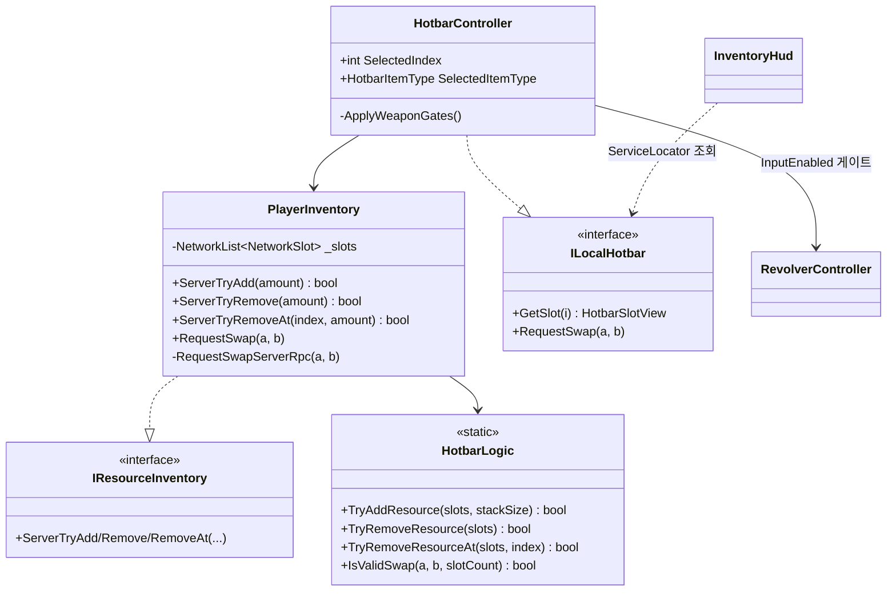
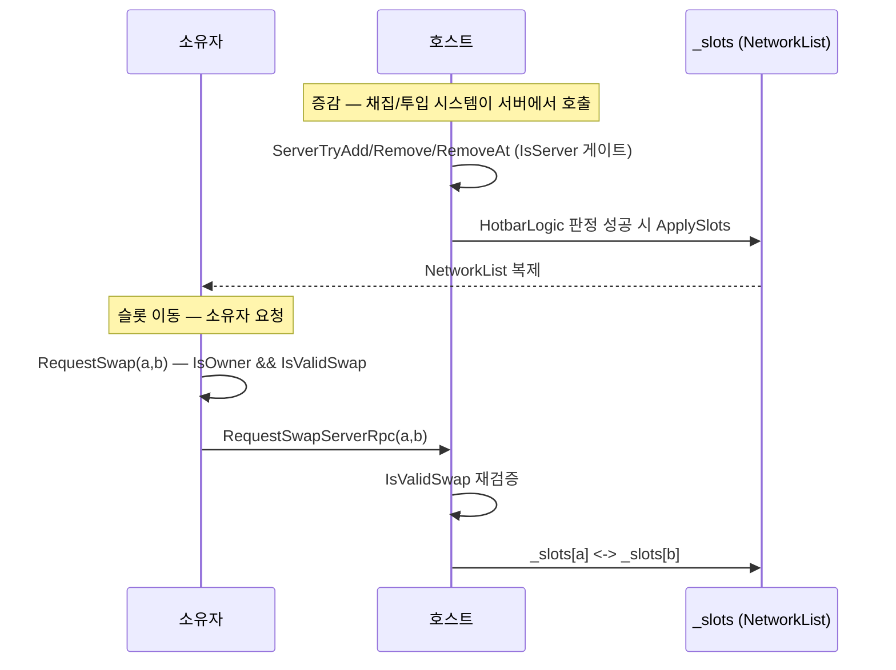

# 통합 핫바 인벤토리 (호스트 권위 개인 인벤토리)

> **종류**: 아키텍처 명세 · **상태**: 구현중
> **최종 갱신**: 2026-07-24 · **관련 기획서**: [Train-Survival-기획서 §3.4](../../design/Train-Survival-기획서.md) · [네트워크 아키텍처 §4](../../design/Train-Survival-네트워크-아키텍처.md) · [개발 가이드 §5 M2](../../guide/Train-Survival-개발-가이드.md)

## 1. 개요·목적

기획서 v0.4 통합 핫바를 구현한다. **무기와 자원이 하나의 핫바 5칸에 자유 배치**되고, 별도 가방 15칸이
뒤따른다. "채집 → 개인 인벤토리 → 엔진 투입"의 운반 루프에서 개인 인벤토리가 첫 단계이며, 개인
인벤토리도 **증감·슬롯 이동 전부 호스트 확정**(네트워크 §4)이다. 규칙 판정은 순수 로직으로 분리하고,
동기화는 슬롯 배열 전체를 `NetworkList`로 복제한다.

## 2. 범위 (Scope)

**포함**: 슬롯 규칙 순수 로직(`HotbarLogic`), 호스트 권위 인벤토리·동기화(`PlayerInventory`,
`IResourceInventory`), 소유자 로컬 선택·입력 게이트(`HotbarController`, `ILocalHotbar`), 아이템 종류
(`HotbarItemType`), 밸런스 데이터(`InventorySettings`), 로컬 표현 이벤트(`InventoryEvents`), HUD(`InventoryHud`).

**미포함**: 자원 채집 호출부(집게/자원 노드가 `IResourceInventory`로 주입), 엔진 투입 소비(→
[fuel](../world/fuel-loop.md)의 `EngineFuelPort`가 든 칸 소모), 공유 인벤토리·제작·요리(M3·M5), 아이템 드롭.

## 3. 요구사항 → 설계 해석

| 요구사항 | 출처 | 설계적 해석 |
|---|---|---|
| 무기+자원 통합 핫바 5칸, 자유 배치 | 기획서 v0.4 | 슬롯 배열에 종류 무관 아이템, 숫자키 1~5 선택, 임의 두 칸 swap |
| 개인 인벤토리도 호스트 확정 | 네트워크 §4 | 증감(`ServerTry*`)·슬롯 이동(`RequestSwapServerRpc`) 모두 `IsServer` 게이트, 서버 재검증 |
| 잔량 동기화 | 네트워크 §4 | 슬롯 전체를 `NetworkList<NetworkSlot>`로 복제(개별 값이 아니라 배열) |
| 엔진 투입 = 든 칸 소모 | 기획서 §3.4 | `ServerTryRemoveAt(선택 슬롯, 1)` — 든 칸이 자원 아니면 실패 |
| 슬롯당 스택, 전부 차면 낙하 | 기획서 §3.4 | `TryAddResource`가 `StackSize` 상한 적용, 만탄 시 false(호출자가 낙하 처리) |
| 무기는 버릴 수 없음 | 기획서 §3.4 | 제거 API가 `ItemType==Resource`에서만 동작 → 무기 칸은 구조적으로 차감 불가 |
| UI는 상태를 소유하지 않는다 | 아키텍처 규칙 §3 | HUD는 `ILocalHotbar` 읽기 + 이벤트 구독으로만 그림 |

## 4. 시스템 구조

| 구성요소 | 역할 | 계층 |
|---|---|---|
| `HotbarLogic` | 슬롯 배열 규칙 순수 static 함수 | 순수 C# static |
| `PlayerInventory` | 호스트 권위 인벤토리, `NetworkList` 동기화 | `NetworkBehaviour`, `IResourceInventory` |
| `HotbarController` | 소유자 로컬 선택·swap 요청·무기 입력 게이트 | `NetworkBehaviour`, `ILocalHotbar` |
| `HotbarItemType` / `HotbarSlotView` | 아이템 종류 enum + 읽기용 struct | 순수 C# |
| `InventorySettings` | 핫바/가방/스택 밸런스 | `ScriptableObject` |
| `IResourceInventory` / `ILocalHotbar` | 자원 수납 계약 / 로컬 조회 계약 | 인터페이스 |
| `InventoryEvents` | 선택 변경·I창 토글 로컬 이벤트 | 순수 C# struct |
| `InventoryHud` | 통합 핫바 HUD | `UI` |

## 5. 데이터 구조

### `InventorySettings`

| 필드 | 기본값 | 의미 |
|---|---|---|
| `HotbarSize` | 5 | 숫자키 1~5 핫바 칸 |
| `BagSize` | 15 | I창 전용 가방 칸 |
| `StackSize` | 5 | 슬롯당 스택 상한 |
| `SlotCount`(파생) | 20 | 핫바 + 가방 |
| `Capacity`(파생) | 100 | `SlotCount × StackSize` |

슬롯 순서는 `[핫바 5 | 가방 15]`. 선택(숫자키)은 앞 5칸으로 제한되지만, 자원 적재·차감·용량 계산은
전체 20칸 배열에 대해 동작한다.

### `HotbarItemType` / `NetworkSlot`

- `None=0`, `Harpoon=1`, `Revolver=2`, `Resource=3` (`byte` 기반). 시작 배치 슬롯0=집게, 슬롯1=리볼버, 나머지 빈 칸.
- `NetworkSlot`(`INetworkSerializable, IEquatable`) — `ItemType`, `byte Count`. 외부에는 읽기용 `HotbarSlotView`로만 노출.

## 6. 상세 로직·상태

### 6.1 슬롯 규칙 (`HotbarLogic`, 순수)

- `TryAddResource(slots, stackSize)` — 기존 자원 스택(앞→뒤) 우선 채움, 없으면 첫 빈 칸에 새 스택, 전부
  차면 false.
- `TryRemoveResource(slots)` — 뒤에서부터 자원 1개 차감, 0이면 빈 칸으로.
- `TryRemoveResourceAt(slots, index)` — 지정 칸이 자원 스택이 아니거나 범위 밖이면 false (엔진 투입 = 든 칸 소모).
- `CountResource` / `ResourceCapacity(slots, stackSize)` — 현재 배치 기준 총량·상한(자원+빈 칸 × stackSize).
- `IsValidSwap(a, b, slotCount)` — `a≠b`이고 둘 다 범위 안.

배열을 직접 수정하고, 권위 반영(NetworkList 쓰기)은 호출자(`PlayerInventory`) 책임.

### 6.2 호스트 권위·동기화 (`PlayerInventory`)

- **증감은 서버 전용**: `ServerTryAdd/Remove/RemoveAt` 모두 `if (!IsServer) return false`. 클라이언트
  호출은 항상 false(인터페이스 계약과 일치).
- **슬롯 이동도 호스트 확정**: 소유자가 `RequestSwap` → `RequestSwapServerRpc`(SendTo.Server), 서버가
  `IsValidSwap` **재검증** 후 교환.
- **초기 배치**: `OnNetworkSpawn`에서 `IsServer`일 때만 시작 슬롯 구성.
- **`NetworkList` 선택 이유**: 슬롯이 종류·수량이 함께 바뀌고 자유 배치되므로, 개별 `NetworkVariable`
  보다 배열 복제가 자연스럽다.

### 6.3 로컬 선택·게이트 (`HotbarController`)

- 숫자키 1~5 → `Select(0..4)`(핫바 범위 클램프). 선택은 소유자 로컬 결정, `HotbarSelectionChangedLocalEvent` 발행.
- `ApplyWeaponGates()`(소유자 매 프레임): 선택 슬롯 종류로 무기 `InputEnabled` 개폐 — I 패널이 열려
  있으면 무기 입력 차단. 리볼버·집게가 이 게이트로 활성/비활성된다.
- `SelectedIndex`/`SelectedItemType`이 엔진 투입의 "든 칸" 판정 근거([fuel](../world/fuel-loop.md)).

## 7. 인터페이스·의존성 (경계)

- **`IResourceInventory`** — 채집·투입 시스템이 구현을 모른 채 자원을 넣고 뺀다(DIP). 채집 호출부는 이
  도메인에 없고 외부에서 주입.
- **`ILocalHotbar`** — 소유자 스폰 시 `ServiceLocator.Register`, despawn 시 Unregister. HUD·엔진 투입구가
  읽기 창구로만 사용.
- **로컬 표현 이벤트**: `HotbarSelectionChangedLocalEvent`, `InventoryPanelToggledLocalEvent` — 상태를
  바꾸지 않는 표현/입력 신호. 패널 토글은 HUD가 발행, 컨트롤러가 구독해 무기 입력을 막는다.
- **`RevolverController`/`HarpoonController` 게이트** — 핫바가 선택 종류로 무기 입력을 켜고 끈다([combat](../combat/revolver-fire.md)).

## 8. 설계 포인트 (SOLID)

| 원칙 | 적용 |
|---|---|
| **SRP** | 규칙(`HotbarLogic`)·권위 동기화(`PlayerInventory`)·로컬 입력(`HotbarController`)을 분리 |
| **ISP** | 자원 수납(`IResourceInventory`)과 로컬 조회(`ILocalHotbar`)를 분리 — HUD는 조회만, 시스템은 증감만 본다 |
| **DIP** | 채집·투입이 인터페이스로만 인벤토리에 접근 — 내부 슬롯 표현(NetworkList) 무의존 |
| **강조 패턴 — 순수 규칙 + 권위 반영 분리** | 슬롯 규칙 전부를 static 함수로 빼 EditMode 검증, 권위 쓰기만 NetworkBehaviour가 담당 |

## 9. Unity 특화

- **생명주기**: `Player.prefab`에 부착. 소유자만 로컬 선택·서비스 등록. 서버만 초기 슬롯 구성·증감 확정.
- **풀링**: 대상 없음(플레이어 종속).
- **성능 예산**: `ApplyWeaponGates`가 매 프레임(드래그·증감으로 선택이 수시 변동) — 슬롯 조회 + 비교뿐.
- **에디터 툴 필요 여부**: 없음. 밸런스는 `InventorySettings.asset`.

## 10. 테스트 케이스

| 테스트 파일 | 검증 항목 |
|---|---|
| `HotbarLogicTests` (9개) | 빈 칸 새 스택 적재, 기존 스택 우선 채움, 만탄 시 적재 실패, 뒤에서부터 차감, 자원 없으면 차감 실패, 지정 칸 차감 격리, 비자원 칸 차감 실패, 현재 배치 기준 총량·상한, 유효 swap 범위 검증 |

`PlayerInventory`(NetworkList·RPC)·`HotbarController`(입력)·`InventoryHud`는 EditMode 대상 밖 — 순수
`HotbarLogic`만 검증.

## 11. 리스크·미결정 (TBD)

| 항목 | 내용 |
|---|---|
| 만탄 시 자원 낙하 처리 | `TryAddResource` 실패(false)까지가 이 도메인 — 실제 "그 자리 낙하"는 채집 호출부 책임, 연동 확인 필요 |
| 공유 인벤토리·제작·요리 | 개인 인벤토리만 M2 — 공유 인벤토리·제작은 M3·M5 |
| 아이템 드롭/버리기 | 현재 swap 재배치만 존재, 드롭 API 없음(집게·리볼버 버릴 수 없음 전제) |

## 12. 확장 여지

- `HotbarItemType`에 종류를 추가하고 `HotbarLogic` 규칙만 확장하면 제작 재료·완성품(M5)이 얹힘.
- `NetworkList<NetworkSlot>` 동기화 구조는 공유 인벤토리(M3)에 그대로 재사용 가능.

## 13. 파일 위치

| 구분 | 파일 | 경로 |
|---|---|---|
| 순수 로직 | `HotbarLogic.cs`, `HotbarItemType.cs` | `Assets/_Project/Scripts/Gameplay/Inventory/` |
| 권위·입력 | `PlayerInventory.cs`, `HotbarController.cs` | 〃 |
| 인터페이스 | `IResourceInventory.cs`, `ILocalHotbar.cs` | 〃 |
| 이벤트 | `InventoryEvents.cs` | 〃 |
| 데이터 | `InventorySettings.cs` (+ `.asset`) | 〃 (+ `Assets/_Project/Data/`) |
| HUD | `InventoryHud.cs` | `Assets/_Project/Scripts/UI/` |
| 테스트 | `HotbarLogicTests.cs` | `Assets/_Project/Tests/EditMode/` |
