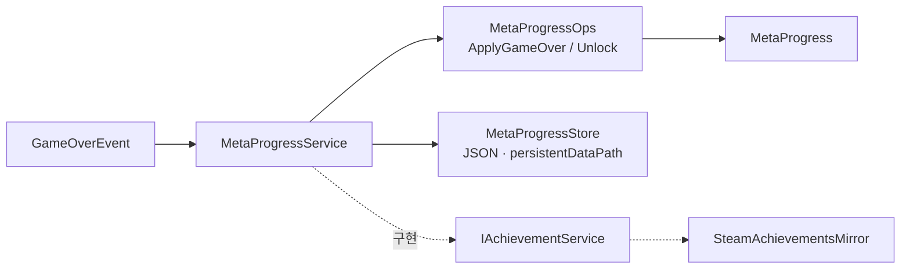

# 메타 진행·업적 — 런 사이에 남는 것

> **종류**: 아키텍처 명세 · **상태**: 구현 완료 (M6 3차)
> **최종 갱신**: 2026-08-20 · **관련 문서**: [기획서 §9.1](../../design/Train-Survival-기획서.md) ·
> [네트워크 아키텍처 §2.3](../../design/Train-Survival-네트워크-아키텍처.md) ·
> [개발 가이드 §5 M6](../../guide/Train-Survival-개발-가이드.md)

## 1. 개요·목적

**게임 중간 저장은 없다**(기획서 §9.1 확정). 런은 단일 세션으로 완주하고, 저장되는 것은
**런이 끝난 뒤 남는 기록**뿐이다 — 최고 도달 Day, 게임오버 횟수, 업적 플래그.

세이브/로드 시스템을 만들지 않는다는 결정이 이 도메인의 범위를 정한다. 스키마가 작고,
복원 순서 문제가 없으며, 네트워크 동기화 대상이 아니다.

## 2. 범위 (Scope)

**포함**: 로컬 JSON 저장, 런 기록 갱신, 업적 플래그 해금, Steam 업적 미러 계약.

**미포함**: 세이브/로드(설계상 없음) · 게임오버 판정(→ [session/lifecycle.md](../session/lifecycle.md)) ·
수집품·도감(기획 미정 — 스키마 확장 여지만).

## 3. 요구사항 → 설계 해석

| 요구사항 | 출처 | 설계적 해석 |
|---|---|---|
| 중간 저장 없음 | 기획서 §9.1 | 저장 대상이 **런 종료 시점의 결과값**뿐. 세션 상태를 직렬화하지 않는다 |
| 각자 로컬에 기록 | 네트워크 §2.3 | 게임오버 시 **각 피어가 자기 로컬에** 기록 — 호스트가 모아서 배포하지 않는다 |
| Steam 업적 연동 | 가이드 §5 M6 | `IAchievementService` 추상 뒤 미러 — Steam 없는 환경에서도 로컬 플래그는 동작 |
| 개발 AppID로 실 업적 불가 | 네트워크 §8 | Spacewar(480)에는 자체 업적을 정의할 수 없다 → **왕복 스모크만** 가능 |
| 저장 규칙을 테스트할 수 있어야 한다 | [SOLID §S](../../conventions/solid-principles.md) | 갱신·해금을 `MetaProgressOps`(순수 static)로 분리 |

## 4. 시스템 구조

| 구성요소 | 역할 | 계층 |
|---|---|---|
| `MetaProgress` | 저장 대상 데이터 | 순수 C# 클래스 |
| `MetaProgressOps` | 정규화 · 게임오버 반영 · 업적 해금/조회 (순수) | 순수 C# static |
| `MetaProgressStore` | JSON 직렬화 · `persistentDataPath` 입출력 | 순수 C# |
| `IMetaProgressService` / `MetaProgressService` | 서비스 계약 / 구현 | 인터페이스 / 순수 C# |
| `IAchievementService` | 업적 해금 계약 (별도 인터페이스) | 인터페이스 |
| `SteamAchievementsMirror` | Steam 업적 미러 구현 | `IAchievementService` |
| `AchievementIds` | 업적 문자열 상수 | static |



## 5. 데이터 구조

### `MetaProgress`

| 항목 | 의미 |
|---|---|
| 최고 도달 Day | 런 기록 |
| 게임오버 횟수 | 런 기록 |
| 업적 플래그 집합 | 해금된 업적 ID들 |

**JSON 1파일**, `Application.persistentDataPath` 아래. **인스턴스별로 분리**된다 —
같은 PC에서 MPPM 가상 플레이어를 띄워도 서로의 기록을 덮지 않는다.

### `AchievementIds`

업적 ID를 **문자열 상수**로 모은다. 파이프 검증용 최소 집합이며, 자체 AppID 발급 후 실제
업적 정의와 매핑된다.

## 6. 상세 로직·상태

### 6.1 저장 시점

```
GameOverEvent 수신
  → 각 피어가 로컬에서 MetaProgressOps.ApplyGameOver(progress, dayReached)
  → MetaProgressStore.Save()
```

**호스트가 모아서 나눠주지 않는 이유**: 메타 진행은 개인 기록이고, 네트워크로 옮기면
신뢰 경계(클라이언트가 조작한 값을 받아야 하는가) 문제가 생긴다. 각자 로컬이 단순하고 안전하다.

### 6.2 정규화

`MetaProgressOps.Normalize(progress)` — 파일이 손상됐거나 구버전 스키마일 때 안전한 기본값으로
맞춘다. 로드 직후 항상 통과시킨다.

> 저장 파일은 **사용자가 편집할 수 있다.** 값 범위를 신뢰하지 않고 정규화하는 것이 전제다.

### 6.3 업적 해금

```
MetaProgressOps.Unlock(progress, achievementId)  → 로컬 플래그
  → IAchievementService 구현이 있으면 미러 (Steam)
```

`Unlock`은 **이미 해금됐으면 false**를 돌려준다 — 중복 미러 호출을 막는다.

## 7. 인터페이스·의존성 (경계)

- **`IMetaProgressService`와 `IAchievementService`를 나눈 이유**: 진행 기록을 읽는 쪽(HUD·통계)과
  업적을 해금하는 쪽(게임플레이 이벤트)은 필요한 면이 다르다. 하나로 합치면 HUD가 해금 API를
  보게 된다 — [SOLID §I](../../conventions/solid-principles.md).
- `MetaProgressService`가 두 인터페이스를 모두 구현하지만, 소비자는 자기 면만 참조한다.
- Steam 미러는 **선택적**이다 — 없으면 로컬 플래그만 동작한다.

## 8. 설계 포인트 (SOLID)

| 원칙 | 적용 |
|---|---|
| **S** | 데이터 / 규칙(Ops) / 입출력(Store) / 서비스가 각각 분리 |
| **I** | 읽기(`IMetaProgressService`)와 해금(`IAchievementService`) 분리 |
| **D** | Steam 의존이 인터페이스 뒤 — `Game.Systems` 밖으로 새지 않는다 |

## 9. Unity 특화

- `Application.persistentDataPath` 사용 — 플랫폼별 경로 차이를 Unity가 흡수한다.
- **MPPM 가상 플레이어 분리**가 필요해 인스턴스별 파일을 쓴다. 같은 경로를 쓰면 검증 중 서로 덮는다.

## 10. 테스트 케이스 (EditMode)

`MetaProgressOps`가 순수 static이라 — 최고 Day 갱신(더 낮은 값은 무시) · 게임오버 횟수 누적 ·
업적 중복 해금 시 false · `Normalize`의 손상·누락 필드 복구를 고정한다.

## 11. 리스크·미결정 (TBD)

| # | 항목 | 상태 |
|---|---|---|
| 1 | **H8 업적 미러 스모크 미검** | M6 검증 잔여 |
| 2 | 자체 AppID 발급 · 실 업적 정의 | 릴리스 전 별도. Spacewar(480)로는 자체 업적 정의 불가 |
| 3 | 수집품(도감) | 기획에 목록 미정 — 스키마 확장 여지만 남김 |
| 4 | 저장 파일 위변조 | 로컬 단일 플레이어 기록이라 방어하지 않는다(정규화만) |

## 12. 확장 여지

- 통계(총 플레이 시간·처치 수·최다 사망 원인)를 `MetaProgress`에 필드로 추가 가능.
- 뉴게임+ 해금 조건을 업적 플래그로 표현하는 축 — M7 챌린지 순환과 연결된다.

## 13. 파일 위치

```
Assets/_Project/Scripts/Systems/Meta/
├─ MetaProgress.cs          저장 대상 데이터
├─ MetaProgressOps.cs       순수 — 정규화·게임오버 반영·해금
├─ MetaProgressStore.cs     JSON · persistentDataPath
├─ MetaProgressService.cs   IMetaProgressService + IAchievementService 구현
├─ IMetaProgressService.cs  (IAchievementService 동거)
└─ AchievementIds.cs        업적 ID 상수

Assets/_Project/Scripts/Systems/Networking/Steam/
└─ SteamAchievementsMirror.cs   IAchievementService — Steam 미러
```
