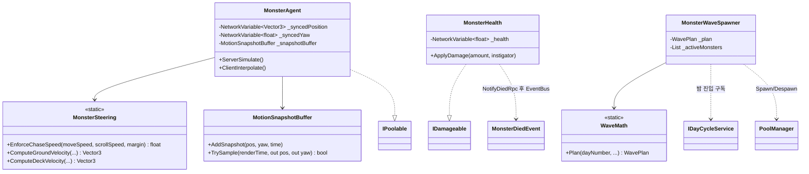
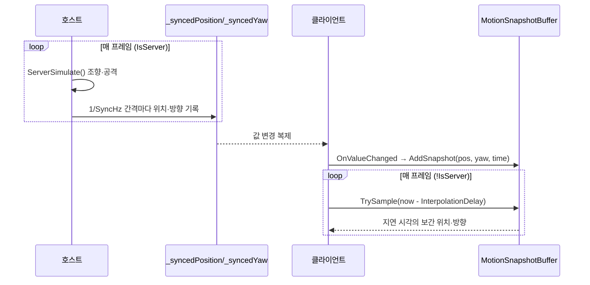

# 몬스터 웨이브·조향 (호스트 조향 AI + 저주기 스냅샷 보간)

> **종류**: 아키텍처 명세 · **상태**: 구현 완료 (M2 골격 → M4 변종 → M5 그랩 → M7 보스·스탬피드)
> **최종 갱신**: 2026-08-20 · **관련 기획서**: [Train-Survival-기획서](../../design/Train-Survival-기획서.md) · [네트워크 아키텍처 §4.3·§6.2](../../design/Train-Survival-네트워크-아키텍처.md) · [개발 가이드 §5 M2](../../guide/Train-Survival-개발-가이드.md)

## 1. 개요·목적

밤 국면의 위협을 담당한다. **NavMesh를 쓰지 않는 커스텀 조향**(네트워크 §4.3 확정)으로, 호스트가 단독
시뮬레이션하고 클라이언트는 저주기(기본 12Hz) 스냅샷을 보간해 표현한다. 웨이브 규모·동시 존재 상한은
전부 데이터로 분리해, "한 번에 대량"이 아닌 "지속 유입으로 체감 물량"을 밸런싱 없이 조정 가능하게 했다.

## 2. 범위 (Scope)

**포함**: 호스트 조향 시뮬레이션·클라이언트 보간(`MonsterAgent`), 조향 순수 계산(`MonsterSteering`),
호스트 권위 체력·사망(`MonsterHealth`), 밤 웨이브 스폰(`MonsterWaveSpawner`), 웨이브 규모 순수
계산(`WaveMath`), 스냅샷 보간 버퍼(`MotionSnapshotBuffer`), 몬스터·웨이브 밸런스 데이터.

**M4~M7에서 추가된 포함 범위**:
- **변종**(M4) — `MonsterVariantCatalog`·`MonsterVariantPicker`·`MonsterSettings`
- **집게 그랩**(M5 5·6차) — `MonsterGrabTarget`
- **지역 보스**(M7 2차) — `BossAgent`·`BossHealth`·`BossSpawner`·`BossDefinition`·`BossPhaseMath`·
  `BossChargeMath`·`BossProjectileMath`·`BossMinionSpawner`
- **스탬피드**(M7 1차) — `StampedeController`·`StampedeMath`·`StampedeSettings`

**미포함**: 처형(**설계 제거됨** — §6.6), 열차 위 웨이포인트 그래프의 정교화(현재는 갑판 직접 조향),
지역 난이도 배율의 산출(→ [region/region-timeline](../region/region-timeline.md)).

## 3. 요구사항 → 설계 해석

| 요구사항 | 출처 | 설계적 해석 |
|---|---|---|
| NavMesh 불사용·커스텀 조향 | 네트워크 §4.3 | 지상=열차 향 조향 + 국소 회피 + 컨베이어(-Z) 변위 가산, 갑판=목표 추격(컨베이어 미가산) |
| 이동속도 > 스크롤 속도(추격 성립) | 네트워크 §4.3 | `EnforceChaseSpeed`가 `scrollSpeed + ChaseSpeedMargin` 하한을 데이터로 강제 |
| 저주기 동기화 + 보간 | 네트워크 §6.2 | 위치·방향을 12Hz `NetworkVariable`로 복제, 클라이언트는 `InterpolationDelay`만큼 지연 샘플 |
| 지속 유입으로 체감 물량 | 가이드 M2 | `WaveMath`가 총량·간격·동시 상한을 분리 산출, 스포너가 `MaxAlive` 미만일 때만 간격마다 1마리 투입 |
| 스폰/소멸은 풀 경유 | 아키텍처 규칙(풀링) | `PoolManager.Spawn` → `NetworkObject.Spawn`, 회수는 `Despawn(true)`로 풀 반환 |
| 데미지·사망은 호스트 확정 | 권위 분담표 | `ApplyDamage`/사망은 `IsServer` 게이트, 사망만 `NotifyDiedRpc(SendTo.Everyone)`로 전파 |

## 4. 시스템 구조

| 구성요소 | 역할 | 계층 |
|---|---|---|
| `MonsterAgent` | 호스트 조향 시뮬레이션 + 클라이언트 보간, 공격 판정 | `NetworkBehaviour`, `IPoolable` |
| `MonsterSteering` | 조향 속도 벡터 순수 계산 | 순수 C# static |
| `MonsterHealth` | 호스트 권위 체력·데미지·사망 | `NetworkBehaviour`, `IDamageable` |
| `MonsterWaveSpawner` | 밤 웨이브 계획·스폰·회수 (호스트 전용) | `NetworkBehaviour` |
| `WaveMath` / `WavePlan` | Day별 웨이브 규모 순수 계산 + 결과 struct | 순수 C# static / struct |
| `MotionSnapshotBuffer` | 저주기 스냅샷 지연 보간 버퍼 | 순수 C# |
| `MonsterSettings` / `WaveSettings` | 몬스터·웨이브 밸런스 데이터 | `ScriptableObject` |
| `MonsterDiedEvent` | 사망 권위 이벤트 | 순수 C# struct |

## 5. 데이터 구조

### `MonsterSettings`

| 필드 | 기본값 | 의미 |
|---|---|---|
| `MoveSpeed` | 6.5 | 기본 이동 속도 |
| `ChaseSpeedMargin` | 0.7 | 스크롤 속도 대비 추격 하한 여유(이동속도>스크롤 강제) |
| `AvoidProbeDistance` | 3 | 국소 회피 레이캐스트 거리 |
| `LeapHorizontalRange` | 3 | 지상→갑판 도약 수평 사거리 |
| `MaxHealth` | 100 | 최대 체력 |
| `AttackDamage` / `AttackRange` / `AttackInterval` | 15 / 2.2 / 1.4 s | 근접 공격 |
| `SyncHz` | 12 (5~15) | 위치·방향 복제 주파수 |
| `InterpolationDelaySeconds` | 0.18 | 클라이언트 보간 지연 |
| `DespawnBehindMeters` | 60 | 후미 이탈 회수 거리 |

### `WaveSettings`

| 필드 | 기본값 | 의미 |
|---|---|---|
| `BaseCountPerNight` / `CountGrowthPerDay` / `TotalCountCap` | 6 / 3 / 24 | 밤 총 스폰량 (Day 비례 증가·상한) |
| `BaseSpawnInterval` / `IntervalReductionPerDay` / `MinSpawnInterval` | 5 / 0.4 / 1.5 s | 스폰 간격 (Day 비례 단축·하한) |
| `BaseMaxAlive` / `MaxAliveGrowthPerDay` / `MaxAliveCap` | 5 / 1 / 12 | **동시 존재 상한** (미결 — 대역폭 계측 후 확정) |
| `MinLateralOffset` / `MaxLateralOffset` / `SpawnZMin` / `SpawnZMax` | 14 / 24 / −15 / 25 | 스폰 배치 범위 |

### `WavePlan` (파생) — `TotalCount`, `SpawnInterval`, `MaxAlive`

## 6. 상세 로직·상태

### 6.1 조향 (`MonsterSteering`, 순수 함수)

- `EnforceChaseSpeed(moveSpeed, scrollSpeed, margin)` → `max(moveSpeed, scrollSpeed + margin)` — 데이터
  이동속도가 스크롤보다 느려도 추격이 성립하도록 하한을 강제.
- `ComputeGroundVelocity(...)` → `seekDir * chaseSpeed + Vector3.back * scrollSpeed` — 컨베이어 -Z 변위 가산.
- `ComputeDeckVelocity(...)` → 컨베이어 미가산(갑판은 열차 정지 프레임).
- `ComputeSeekDirection`(private) — 목표 향 정규 방향, 장애물 있으면 법선을 더해 재정규화(속도 크기 불변).

호출부(`MonsterAgent.ServerSimulate`): 갑판이면 `ComputeDeckVelocity`, 지상이면 `ProbeObstacle` 레이캐스트
후 `ComputeGroundVelocity`. 지상→갑판은 `TryBeginDeckLeap`가 포물선 초기속도(중력 상수 25)로 도약.

### 6.2 동기화·보간 파이프라인

- **보간만·외삽 없음**: `MotionSnapshotBuffer`는 두 스냅샷 사이는 선형 보간, 범위 밖은 끝 값 고정(외삽
  금지). 방향은 각도 최단 경로 보간. 1초 초과 스냅샷은 자동 정리.
- **위치·방향 동시 스냅샷**: 위치 콜백에서 같은 틱의 yaw를 함께 담아, 위치와 회전이 어긋나지 않는다.

### 6.3 웨이브 수명주기 (`MonsterWaveSpawner`, 호스트 전용)

- 밤 진입: `DayPhaseChangedEvent`(Night) 구독 → `WaveMath.Plan(dayNumber, …)`로 `WavePlan` 산출.
- 스폰 게이트: `_activeMonsters.Count < _plan.MaxAlive`이고 `SpawnInterval` 경과했을 때만 1마리 —
  좌우 랜덤 side × lateral offset, Z 범위 랜덤 위치. 총 `TotalCount` 도달 시 중단.
- 스폰: `PoolManager.Spawn(prefab, …)` → `MonsterHealth.NetworkObject.Spawn()`(NGO 등록).
- 새벽 회수: `ServerRetreatAll`이 살아남은 몬스터를 이벤트 없이 `Despawn(true)`로 풀 반환. 후미 이탈
  (`DespawnBehindMeters`)도 동일하게 조용히 회수(사망 아님).

### 6.4 데미지·사망 (`MonsterHealth`, 호스트 권위)

- `ApplyDamage(amount, instigator)`는 `IsServer && IsAlive`에서만 `_health` 차감.
- `_health <= 0` → `NotifyDiedRpc(killerClientId)`(SendTo.Everyone) 발행 후 `Despawn(true)`. 각 피어가
  RPC 수신 시 `EventBus<MonsterDiedEvent>.Publish` — 환경 사망은 서버 ID를 killer로 사용.
- 몬스터→플레이어 공격: `ServerTryAttack`이 `AttackRange` 내 `IDamageable.ApplyDamage`(쿨다운 `AttackInterval`).

### 6.4 변종 (M4) — 프리팹이 아니라 인덱스 복제

기획서 §5의 난이도 3축(수 → 체력 → **패턴**) 중 마지막 축이다.

> **변종을 프리팹으로 만들지 않는다.** 이동속도·체력·공격·도약 사거리 조합이 곧 행동 차이이므로,
> **같은 프리팹에 다른 `MonsterSettings`를 주입**하면 성립한다. 그 결과
> **네트워크 프리팹 목록이 늘지 않는다** — 자원 종류·레시피와 같은 규약이다.

| 구성요소 | 역할 |
|---|---|
| `MonsterVariantCatalog` | **순서 = 복제 식별자** |
| `MonsterVariantPicker` | 순수 — Day 해금 + 가중치 추첨. **난수는 호출부가 주입**해 결정론 유지 |

`MonsterAgent`가 변종 인덱스를 복제해 각 피어가 같은 설정을 조회하고(클라이언트도 보간 지연·이동
파라미터가 필요), `MonsterHealth`는 서버만 체력을 확정하므로 참조를 직접 주입받는다.

**변종 4종**: 일반형(Day 1~) · 돌진형(Day 3~, 빠르고 약함) · 돌격형(Day 6~, 느리고 단단하며 강타) ·
도약형(Day 8~, 도약 8 m로 원거리 지붕 침투). 해금 Day를 **지역 경계에 맞춰**(숲 5일 → Day 6 사막)
"지역 전환마다 새 행동 추가"가 드러나게 했다.

### 6.5 지역 보스 (M7 2차)

`BossAgent`가 조향(`MonsterSteering`)·스냅샷 보간(`MotionSnapshotBuffer`)을 **웨이브 몬스터와 같은
계약으로 재사용**하고, 보스 고유분(돌진·페이즈·고유 패턴)만 더한다.

| 축 | 내용 |
|---|---|
| **갑판 도약 없음** | 보스는 **지상 개체**로 열차 측면을 따라붙어 칸·연결부를 때린다 (지붕 난전은 웨이브 몫) |
| 복제 최소화 | 패턴 상태 중 **돌진 국면만** 복제한다 — 예고를 전 피어가 봐야 하므로 |
| 페이즈 | `BossPhaseMath`(순수) — 체력 비율이 페이즈를, 페이즈가 이동 속도·패턴 빈도·고유 패턴 해금을 결정. 상태가 없어 호스트 확정 체력만 있으면 어느 피어에서도 같은 값 |
| 고유 패턴 | `BossDefinition` — 보스마다 패턴 셋이 다르다. 공통 골격(추격·돌진·페이즈) 위에 하나씩 배정 |
| 부하 | `BossMinionSpawner` → `IBossMinionSink` |

### 6.6 집게 그랩 (M5 5·6차) — 처형 축은 제거됐다

`MonsterGrabTarget`이 `MonsterAgent`(이동)·`MonsterHealth`(체력)와 **나란한 세 번째 관심사**로 분리됐다
(기존 두 파일의 책임은 그대로 둔다 — SRP).

M1 그랩 파이프라인을 **그대로 재사용**한다. 권위 구조가 자원과 동일하고(그랩 확정·견인 = 호스트),
달라지는 것은 **도착했을 때 벌어지는 일**뿐이다 — 자원은 수납 후 소멸, 몬스터는 소멸하지 않고 매달린다.

> **처형 축은 검증 후 제거됐다** (M5 6차). 배율·배너·`MonsterDamageMath`·`IMonsterStun`을 걷어내고
> 그로기를 "놓였을 때 잠깐 기절(2.5 s)"로 재정의했다. **집게의 가치가 처형 배율에서 운반으로 바뀌었다** —
> 든 채로 이동해 아군 앞이나 열차 바퀴에 넘기는 것이 루프가 됐다.

### 6.7 스탬피드 (M7 1차) — 통과형 무리

대초원의 정체성 이벤트다. 낮에 대량 무리가 **열차 옆을 스쳐 지나간다**(열차 무관심·비공격, 접촉 시 피해만).
쏘아 잡으면 식재료를 떨어뜨린다 — "사냥감 풍부 + 방심 방지 + 탄약 소비처"가 한 이벤트로 성립한다.

`StampedeMath.StampedePlan`이 **총 마릿수와 유입 간격**을 계획해 무리를 "연속 유입 열(列)"로 표현한다 —
한 번에 대량이 아니라 지속 유입으로 동시 수를 억제한다(가이드 §6.2 웨이브 설계 원칙과 같은 방향).
발생은 **낮 시작 확률 추첨**으로, 날씨와 같은 규약(호스트 추첨·지역 데이터 확률·지역 첫날 제외)이다.

## 7. 인터페이스·의존성 (경계)

- **`IDamageable`** — `MonsterHealth`가 구현. 사격([combat](../combat/weapon-combat.md))은 이 인터페이스로만
  데미지를 넣고, 몬스터 구현을 모른다. 몬스터 공격도 플레이어의 `IDamageable`을 같은 방식으로 호출.
- **`IDayCycleService` / `DayPhaseChangedEvent`** — 밤 진입 신호를 [cycle](../cycle/day-night-cycle.md)에서 소비.
- **`IWorldScrollService`** — 조향에 스크롤 속도가 필요해 world 도메인에서 조회(컨베이어 변위·추격 하한).
- **`PoolManager` / `IPoolable`** — 스폰·회수 전량 풀 경유. `MonsterAgent`가 `IPoolable`로 리셋 훅 제공.
- **권위 이벤트 vs 조용한 회수**: 사망(`MonsterDiedEvent`)만 이벤트로 발행하고, 후퇴·이탈 회수는 이벤트
  없이 처리 — "죽인 것"과 "사라진 것"을 구독자가 혼동하지 않게 분리.

## 8. 설계 포인트 (SOLID)

| 원칙 | 적용 |
|---|---|
| **SRP** | 조향 수식(`MonsterSteering`)·보간(`MotionSnapshotBuffer`)·웨이브 규모(`WaveMath`)를 각각 순수 클래스로 분리, `MonsterAgent`는 조립·네트워크만 |
| **OCP** | 웨이브 곡선·동시 상한을 데이터(`WaveSettings`)로 빼 코드 수정 없이 난이도 조정. Day 비례 성장은 `WaveMath` 파라미터로 표현 |
| **DIP** | 전투·시간·스크롤을 전부 인터페이스/이벤트로만 참조 — 몬스터는 상대 구현을 모른다 |
| **강조 패턴 — 순수 로직의 조기 분리** | 조향·보간·웨이브가 MonoBehaviour 밖에 있어 물리·네트워크 없이 EditMode로 전 경계 검증 |

## 9. Unity 특화

- **풀링**: `PoolManager` 프리웜 + `PooledNetworkPrefabHandler` 경유(회수 시 `Despawn(true)`가 파괴 대신
  풀 반환). `MonsterAgent`는 `IPoolable`로 스폰 시 상태 리셋.
- **생명주기**: `MonsterWaveSpawner`는 Game 씬에 1개(호스트 전용 로직). `MonsterAgent`는 호스트/클라이언트
  분기(`IsServer ? ServerSimulate : ClientInterpolate`).
- **성능 예산**: 지상 회피 레이캐스트 프로브 1회/프레임(지상 상태에서만), 동기화는 1/SyncHz로 게이팅.
- **에디터 툴 필요 여부**: 없음. 밸런스는 `MonsterSettings.asset`·`WaveSettings.asset` 수정.

## 10. 테스트 케이스

| 테스트 파일 | 검증 항목 |
|---|---|
| `WaveMathTests` | Day1 기본 규모, Day 진행 시 총량↑·간격↓·동시상한↑, 상한 고정(Day100), 잘못된 Day(0) 방어 |
| `MonsterSteeringTests` | 추격속도 항상 스크롤 초과, 지상 컨베이어 -Z 가산, 높이차 수평 무영향, 장애물 회피 시 속도 크기 불변, 갑판 컨베이어 미가산, 동일 위치 정지 |
| `MotionSnapshotBufferTests` | 스냅샷 없음 실패, 사이 선형 보간, 범위 밖 끝 값 고정(외삽 금지), 각도 최단 경로, 오래된 스냅샷 정리, Clear 후 비움 |

네트워크 복제·RPC·풀 스폰은 EditMode 대상 밖 — 순수 로직만 검증한다.

## 11. 리스크·미결정 (TBD)

| 항목 | 상태 |
|---|---|
| **동시 존재 몬스터 상한** | **미확정** — `MaxAliveCap=12`는 잠정. 4인/릴레이 대역폭 계측 후 확정(가이드 §6.2·미결 표) |
| 열차 위 웨이포인트 그래프 | **미정교** — 갑판 조향은 목표 직접 추격 수준. 건축물 회피는 지상 탐침 재사용으로 처리(M5 8차) |
| **변종 시각 구분 검증 6건** | M5 8차 이월 — 색·스케일 구분(검붉음/주황/보라/청록)이 실제로 읽히는지 미검 |
| ~~몬스터 종 다양화~~ | **해소 (M4)** — 변종 4종 (§6.4) |
| ~~몬스터 그랩~~ | **해소 (M5 5·6차)** — 처형 축은 설계에서 제거 (§6.6) |
| ~~보스~~ | **해소 (M7 2차)** — 지역 보스 (§6.5) |

## 12. 확장 여지

- **새 변종 = `MonsterSettings` 에셋 + 카탈로그 append.** 코드 수정이 없다(실증됨 — 변종 4종 · 스탬피드 들소).
- 새 보스 = `BossDefinition` 값 추가 + 패턴 구현. 조향·보간·체력 계약은 재사용된다.
- `WaveMath`가 지역 배율·마지막 밤 배율을 받는 구조라 지역 추가에 무수정으로 대응한다.

## 13. 파일 위치

| 구분 | 파일 | 경로 |
|---|---|---|
| 에이전트·체력 | `MonsterAgent.cs`, `MonsterHealth.cs` | `Assets/_Project/Scripts/Gameplay/Monsters/` |
| 스포너 | `MonsterWaveSpawner.cs` | 〃 |
| 순수 로직 | `MonsterSteering.cs`, `WaveMath.cs`, `MotionSnapshotBuffer.cs` | 〃 |
| 이벤트 | `MonsterEvents.cs` | 〃 |
| 데이터 | `MonsterSettings.cs`, `WaveSettings.cs` (+ `.asset`) | 〃 (+ `Assets/_Project/Data/`) |
| 테스트 | `WaveMathTests.cs`, `MonsterSteeringTests.cs`, `MotionSnapshotBufferTests.cs` | `Assets/_Project/Tests/EditMode/` |
