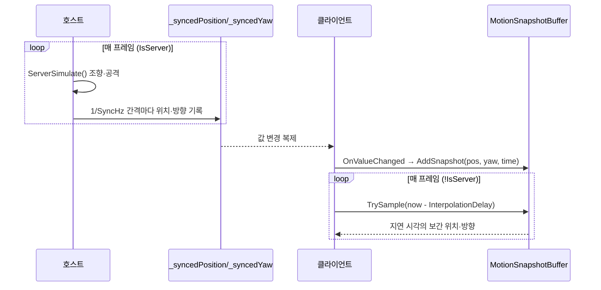

# 몬스터 웨이브·조향 (호스트 조향 AI + 저주기 스냅샷 보간)

> **종류**: 아키텍처 명세 · **상태**: 구현중
> **최종 갱신**: 2026-07-24 · **관련 기획서**: [Train-Survival-기획서](../../design/Train-Survival-기획서.md) · [네트워크 아키텍처 §4.3·§6.2](../../design/Train-Survival-네트워크-아키텍처.md) · [개발 가이드 §5 M2](../../guide/Train-Survival-개발-가이드.md)

## 1. 개요·목적

밤 국면의 위협을 담당한다. **NavMesh를 쓰지 않는 커스텀 조향**(네트워크 §4.3 확정)으로, 호스트가 단독
시뮬레이션하고 클라이언트는 저주기(기본 12Hz) 스냅샷을 보간해 표현한다. 웨이브 규모·동시 존재 상한은
전부 데이터로 분리해, "한 번에 대량"이 아닌 "지속 유입으로 체감 물량"을 밸런싱 없이 조정 가능하게 했다.

## 2. 범위 (Scope)

**포함**: 호스트 조향 시뮬레이션·클라이언트 보간(`MonsterAgent`), 조향 순수 계산(`MonsterSteering`),
호스트 권위 체력·사망(`MonsterHealth`), 밤 웨이브 스폰(`MonsterWaveSpawner`), 웨이브 규모 순수
계산(`WaveMath`), 스냅샷 보간 버퍼(`MotionSnapshotBuffer`), 몬스터·웨이브 밸런스 데이터.

**미포함**: 몬스터 그랩/처형(M5 — [player](../player/network-movement.md)의 `Grabbed`/`Carried` 골격만
존재), 몬스터 종 다양화·보스(M4·M7), 열차 위 웨이포인트 그래프의 정교화(현재는 갑판 직접 조향 수준).

## 3. 요구사항 → 설계 해석

| 요구사항 | 출처 | 설계적 해석 |
|---|---|---|
| NavMesh 불사용·커스텀 조향 | 네트워크 §4.3 | 지상=열차 향 조향 + 국소 회피 + 컨베이어(-Z) 변위 가산, 갑판=목표 추격(컨베이어 미가산) |
| 이동속도 > 스크롤 속도(추격 성립) | 네트워크 §4.3 | `EnforceChaseSpeed`가 `scrollSpeed + ChaseSpeedMargin` 하한을 데이터로 강제 |
| 저주기 동기화 + 보간 | 네트워크 §6.2 | 위치·방향을 12Hz `NetworkVariable`로 복제, 클라이언트는 `InterpolationDelay`만큼 지연 샘플 |
| 지속 유입으로 체감 물량 | 가이드 M2 | `WaveMath`가 총량·간격·동시 상한을 분리 산출, 스포너가 `MaxAlive` 미만일 때만 간격마다 1마리 투입 |
| 스폰/소멸은 풀 경유 | 아키텍처 규칙(풀링) | `PoolManager.Spawn` → `NetworkObject.Spawn`, 회수는 `Despawn(true)`로 풀 반환 |
| 데미지·사망은 호스트 확정 | 권위 분담표 | `ApplyDamage`/사망은 `IsServer` 게이트, 사망만 `NotifyDiedRpc(SendTo.Everyone)`로 전파 |

## 4. 시스템 구조

| 구성요소 | 역할 | 계층 |
|---|---|---|
| `MonsterAgent` | 호스트 조향 시뮬레이션 + 클라이언트 보간, 공격 판정 | `NetworkBehaviour`, `IPoolable` |
| `MonsterSteering` | 조향 속도 벡터 순수 계산 | 순수 C# static |
| `MonsterHealth` | 호스트 권위 체력·데미지·사망 | `NetworkBehaviour`, `IDamageable` |
| `MonsterWaveSpawner` | 밤 웨이브 계획·스폰·회수 (호스트 전용) | `NetworkBehaviour` |
| `WaveMath` / `WavePlan` | Day별 웨이브 규모 순수 계산 + 결과 struct | 순수 C# static / struct |
| `MotionSnapshotBuffer` | 저주기 스냅샷 지연 보간 버퍼 | 순수 C# |
| `MonsterSettings` / `WaveSettings` | 몬스터·웨이브 밸런스 데이터 | `ScriptableObject` |
| `MonsterDiedEvent` | 사망 권위 이벤트 | 순수 C# struct |

## 5. 데이터 구조

### `MonsterSettings`

| 필드 | 기본값 | 의미 |
|---|---|---|
| `MoveSpeed` | 6.5 | 기본 이동 속도 |
| `ChaseSpeedMargin` | 0.7 | 스크롤 속도 대비 추격 하한 여유(이동속도>스크롤 강제) |
| `AvoidProbeDistance` | 3 | 국소 회피 레이캐스트 거리 |
| `LeapHorizontalRange` | 3 | 지상→갑판 도약 수평 사거리 |
| `MaxHealth` | 100 | 최대 체력 |
| `AttackDamage` / `AttackRange` / `AttackInterval` | 15 / 2.2 / 1.4 s | 근접 공격 |
| `SyncHz` | 12 (5~15) | 위치·방향 복제 주파수 |
| `InterpolationDelaySeconds` | 0.18 | 클라이언트 보간 지연 |
| `DespawnBehindMeters` | 60 | 후미 이탈 회수 거리 |

### `WaveSettings`

| 필드 | 기본값 | 의미 |
|---|---|---|
| `BaseCountPerNight` / `CountGrowthPerDay` / `TotalCountCap` | 6 / 3 / 24 | 밤 총 스폰량 (Day 비례 증가·상한) |
| `BaseSpawnInterval` / `IntervalReductionPerDay` / `MinSpawnInterval` | 5 / 0.4 / 1.5 s | 스폰 간격 (Day 비례 단축·하한) |
| `BaseMaxAlive` / `MaxAliveGrowthPerDay` / `MaxAliveCap` | 5 / 1 / 12 | **동시 존재 상한** (미결 — 대역폭 계측 후 확정) |
| `MinLateralOffset` / `MaxLateralOffset` / `SpawnZMin` / `SpawnZMax` | 14 / 24 / −15 / 25 | 스폰 배치 범위 |

### `WavePlan` (파생) — `TotalCount`, `SpawnInterval`, `MaxAlive`

## 6. 상세 로직·상태

### 6.1 조향 (`MonsterSteering`, 순수 함수)

- `EnforceChaseSpeed(moveSpeed, scrollSpeed, margin)` → `max(moveSpeed, scrollSpeed + margin)` — 데이터
  이동속도가 스크롤보다 느려도 추격이 성립하도록 하한을 강제.
- `ComputeGroundVelocity(...)` → `seekDir * chaseSpeed + Vector3.back * scrollSpeed` — 컨베이어 -Z 변위 가산.
- `ComputeDeckVelocity(...)` → 컨베이어 미가산(갑판은 열차 정지 프레임).
- `ComputeSeekDirection`(private) — 목표 향 정규 방향, 장애물 있으면 법선을 더해 재정규화(속도 크기 불변).

호출부(`MonsterAgent.ServerSimulate`): 갑판이면 `ComputeDeckVelocity`, 지상이면 `ProbeObstacle` 레이캐스트
후 `ComputeGroundVelocity`. 지상→갑판은 `TryBeginDeckLeap`가 포물선 초기속도(중력 상수 25)로 도약.

### 6.2 동기화·보간 파이프라인

- **보간만·외삽 없음**: `MotionSnapshotBuffer`는 두 스냅샷 사이는 선형 보간, 범위 밖은 끝 값 고정(외삽
  금지). 방향은 각도 최단 경로 보간. 1초 초과 스냅샷은 자동 정리.
- **위치·방향 동시 스냅샷**: 위치 콜백에서 같은 틱의 yaw를 함께 담아, 위치와 회전이 어긋나지 않는다.

### 6.3 웨이브 수명주기 (`MonsterWaveSpawner`, 호스트 전용)

- 밤 진입: `DayPhaseChangedEvent`(Night) 구독 → `WaveMath.Plan(dayNumber, …)`로 `WavePlan` 산출.
- 스폰 게이트: `_activeMonsters.Count < _plan.MaxAlive`이고 `SpawnInterval` 경과했을 때만 1마리 —
  좌우 랜덤 side × lateral offset, Z 범위 랜덤 위치. 총 `TotalCount` 도달 시 중단.
- 스폰: `PoolManager.Spawn(prefab, …)` → `MonsterHealth.NetworkObject.Spawn()`(NGO 등록).
- 새벽 회수: `ServerRetreatAll`이 살아남은 몬스터를 이벤트 없이 `Despawn(true)`로 풀 반환. 후미 이탈
  (`DespawnBehindMeters`)도 동일하게 조용히 회수(사망 아님).

### 6.4 데미지·사망 (`MonsterHealth`, 호스트 권위)

- `ApplyDamage(amount, instigator)`는 `IsServer && IsAlive`에서만 `_health` 차감.
- `_health <= 0` → `NotifyDiedRpc(killerClientId)`(SendTo.Everyone) 발행 후 `Despawn(true)`. 각 피어가
  RPC 수신 시 `EventBus<MonsterDiedEvent>.Publish` — 환경 사망은 서버 ID를 killer로 사용.
- 몬스터→플레이어 공격: `ServerTryAttack`이 `AttackRange` 내 `IDamageable.ApplyDamage`(쿨다운 `AttackInterval`).

## 7. 인터페이스·의존성 (경계)

- **`IDamageable`** — `MonsterHealth`가 구현. 사격([combat](../combat/weapon-combat.md))은 이 인터페이스로만
  데미지를 넣고, 몬스터 구현을 모른다. 몬스터 공격도 플레이어의 `IDamageable`을 같은 방식으로 호출.
- **`IDayCycleService` / `DayPhaseChangedEvent`** — 밤 진입 신호를 [cycle](../cycle/day-night-cycle.md)에서 소비.
- **`IWorldScrollService`** — 조향에 스크롤 속도가 필요해 world 도메인에서 조회(컨베이어 변위·추격 하한).
- **`PoolManager` / `IPoolable`** — 스폰·회수 전량 풀 경유. `MonsterAgent`가 `IPoolable`로 리셋 훅 제공.
- **권위 이벤트 vs 조용한 회수**: 사망(`MonsterDiedEvent`)만 이벤트로 발행하고, 후퇴·이탈 회수는 이벤트
  없이 처리 — "죽인 것"과 "사라진 것"을 구독자가 혼동하지 않게 분리.

## 8. 설계 포인트 (SOLID)

| 원칙 | 적용 |
|---|---|
| **SRP** | 조향 수식(`MonsterSteering`)·보간(`MotionSnapshotBuffer`)·웨이브 규모(`WaveMath`)를 각각 순수 클래스로 분리, `MonsterAgent`는 조립·네트워크만 |
| **OCP** | 웨이브 곡선·동시 상한을 데이터(`WaveSettings`)로 빼 코드 수정 없이 난이도 조정. Day 비례 성장은 `WaveMath` 파라미터로 표현 |
| **DIP** | 전투·시간·스크롤을 전부 인터페이스/이벤트로만 참조 — 몬스터는 상대 구현을 모른다 |
| **강조 패턴 — 순수 로직의 조기 분리** | 조향·보간·웨이브가 MonoBehaviour 밖에 있어 물리·네트워크 없이 EditMode로 전 경계 검증 |

## 9. Unity 특화

- **풀링**: `PoolManager` 프리웜 + `PooledNetworkPrefabHandler` 경유(회수 시 `Despawn(true)`가 파괴 대신
  풀 반환). `MonsterAgent`는 `IPoolable`로 스폰 시 상태 리셋.
- **생명주기**: `MonsterWaveSpawner`는 Game 씬에 1개(호스트 전용 로직). `MonsterAgent`는 호스트/클라이언트
  분기(`IsServer ? ServerSimulate : ClientInterpolate`).
- **성능 예산**: 지상 회피 레이캐스트 프로브 1회/프레임(지상 상태에서만), 동기화는 1/SyncHz로 게이팅.
- **에디터 툴 필요 여부**: 없음. 밸런스는 `MonsterSettings.asset`·`WaveSettings.asset` 수정.

## 10. 테스트 케이스

| 테스트 파일 | 검증 항목 |
|---|---|
| `WaveMathTests` | Day1 기본 규모, Day 진행 시 총량↑·간격↓·동시상한↑, 상한 고정(Day100), 잘못된 Day(0) 방어 |
| `MonsterSteeringTests` | 추격속도 항상 스크롤 초과, 지상 컨베이어 -Z 가산, 높이차 수평 무영향, 장애물 회피 시 속도 크기 불변, 갑판 컨베이어 미가산, 동일 위치 정지 |
| `MotionSnapshotBufferTests` | 스냅샷 없음 실패, 사이 선형 보간, 범위 밖 끝 값 고정(외삽 금지), 각도 최단 경로, 오래된 스냅샷 정리, Clear 후 비움 |

네트워크 복제·RPC·풀 스폰은 EditMode 대상 밖 — 순수 로직만 검증한다.

## 11. 리스크·미결정 (TBD)

| 항목 | 내용 |
|---|---|
| **동시 존재 몬스터 상한** | `WaveSettings`에 데이터 구조는 있으나 확정값은 **4인/릴레이 대역폭 계측 후** 확정(가이드 §6.2·미결 표). 현재 `MaxAliveCap=12`는 잠정 |
| 열차 위 웨이포인트 그래프 | 현재 갑판 조향은 목표 직접 추격 수준 — 칸 증설(M3)로 경로 복잡도가 오르면 웨이포인트 그래프 정교화 필요(네트워크 §4.3 재검토 조건) |
| 몬스터 그랩/처형 | 플레이어 `Grabbed`/`Carried` 골격만 존재 — 실제 전환은 M5 |
| 몬스터 종 다양화 → **M4에서 변종으로 구현** (2026-08-02) | `MonsterVariantCatalog` + `MonsterVariantPicker`로 Day 해금·가중치 추첨. 변종은 프리팹이 아니라 `MonsterSettings` 차이로 구분하며, `MonsterAgent`가 인덱스를 복제해 각 피어가 같은 설정을 조회한다. 보스는 여전히 M7 |

## 12. 확장 여지

- 몬스터 종·보스는 `MonsterSettings` 파생 + 조향 확장으로 얹힘 — 동기화·풀·전투 경계는 그대로.
- `WaveMath` 파라미터에 지역·날씨 계수를 곱하면 M4 지역별 난이도로 확장 가능.

## 13. 파일 위치

| 구분 | 파일 | 경로 |
|---|---|---|
| 에이전트·체력 | `MonsterAgent.cs`, `MonsterHealth.cs` | `Assets/_Project/Scripts/Gameplay/Monsters/` |
| 스포너 | `MonsterWaveSpawner.cs` | 〃 |
| 순수 로직 | `MonsterSteering.cs`, `WaveMath.cs`, `MotionSnapshotBuffer.cs` | 〃 |
| 이벤트 | `MonsterEvents.cs` | 〃 |
| 데이터 | `MonsterSettings.cs`, `WaveSettings.cs` (+ `.asset`) | 〃 (+ `Assets/_Project/Data/`) |
| 테스트 | `WaveMathTests.cs`, `MonsterSteeringTests.cs`, `MotionSnapshotBufferTests.cs` | `Assets/_Project/Tests/EditMode/` |
