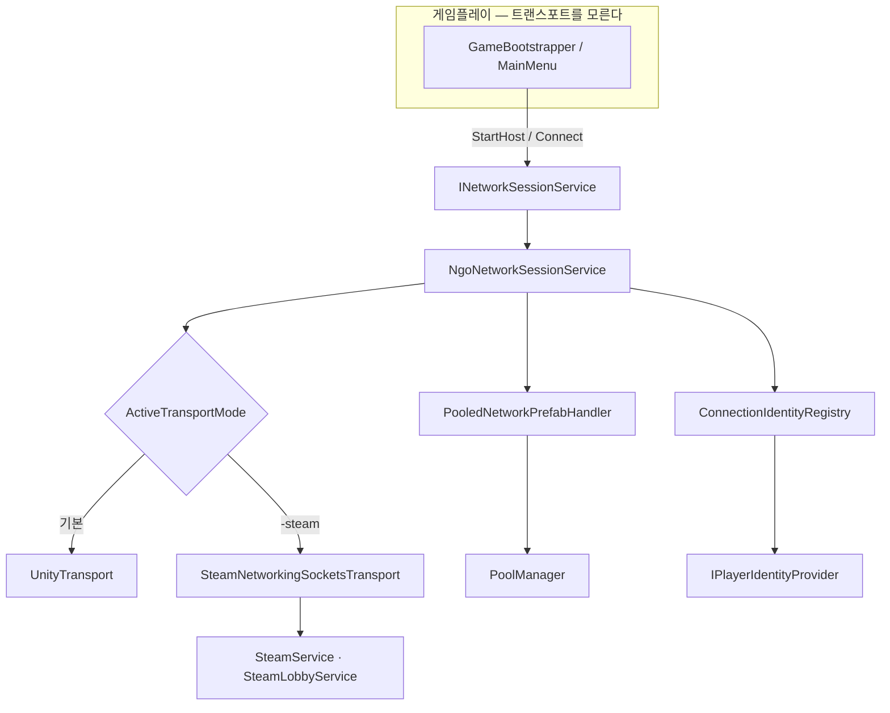

# 트랜스포트·로비·풀링 통합 — 네트워크 기반 계층

> **종류**: 아키텍처 명세 · **상태**: 구현 완료 (기반 = 초기 세팅 · Steam = M6 2차)
> **최종 갱신**: 2026-08-20 · **관련 문서**: [네트워크 아키텍처](../../design/Train-Survival-네트워크-아키텍처.md) ·
> [개발 가이드 §5 M6](../../guide/Train-Survival-개발-가이드.md) ·
> [아키텍처 규칙](../../conventions/architecture-rules.md)

## 1. 개요·목적

`Game.Systems` 어셈블리의 네트워크 기반 계층이다. **게임플레이가 트랜스포트를 모르게** 만드는 것이
목적이며, 세 가지를 담당한다 —

1. **세션 수명** — 호스트 시작 / 클라이언트 접속 / 씬 전환
2. **트랜스포트 전환** — UnityTransport ↔ Steam 릴레이를 **실행 인자·빌드 설정**으로만
3. **풀링 ↔ NGO 스폰 통합** — `PoolManager`와 네트워크 스폰의 수명주기 결합

## 2. 범위 (Scope)

**포함**: 세션 서비스, 트랜스포트 모드 결정, Steam 초기화·로비·오버레이 초대, 신원 제공자,
연결 ↔ 신원 레지스트리, 풀링 프리팹 핸들러, 지연 프로파일 도구.

**미포함**: 재접속 복원 규칙(→ [session/lifecycle.md](../session/lifecycle.md)) ·
업적 저장(→ [meta/](../meta/progress-and-achievements.md)) · 게임플레이 복제 규약(각 도메인 명세).

## 3. 요구사항 → 설계 해석

| 요구사항 | 출처 | 설계적 해석 |
|---|---|---|
| CI는 계속 UnityTransport | 가이드 §5 M6 | 트랜스포트는 **기본값이 UnityTransport**, Steam은 `-steam` 인자/에디터 토글로만 켜진다 |
| 게임플레이가 트랜스포트를 몰라야 한다 | 네트워크 §3 | `INetworkSessionService` 뒤로 숨긴다. 게임플레이는 세션 시작/종료만 안다 |
| 스폰은 풀링 경유 | [아키텍처 규칙 §3](../../conventions/architecture-rules.md) | `INetworkPrefabInstanceHandler` 구현으로 NGO 스폰을 `PoolManager`에 연결 |
| 같은 플레이어를 알아봐야 한다 | 가이드 §5 M6 | `IPlayerIdentityProvider` — Steam이면 SteamID64, 아니면 로컬 GUID |
| 개발 중 AppID | 네트워크 §8 | Spacewar(480) — 자체 업적 정의 불가, 왕복 스모크만 |

## 4. 시스템 구조

| 구성요소 | 역할 | 계층 |
|---|---|---|
| `INetworkSessionService` / `NgoNetworkSessionService` | 호스트 시작·접속·씬 전환 계약/구현 | 인터페이스 / 순수 C# |
| `NetworkTransportMode` / `NetworkTransportModeResolver` | 모드 enum · **인자 → 모드 결정**(순수) | 데이터 / static |
| `ActiveTransportMode` | 현재 모드 전역 조회 (`IsSteam`) | static |
| `IPlayerIdentityProvider` | 신원 제공 계약 | 인터페이스 |
| `LocalGuidIdentityProvider` / `SteamIdentityProvider` | GUID / SteamID64 구현 | 순수 C# |
| `IConnectionIdentityRegistry` / `ConnectionIdentityRegistry` | 연결 ID ↔ 신원 매핑 | 인터페이스 / 순수 C# |
| `PooledNetworkPrefabHandler` | **NGO 스폰 ↔ PoolManager 통합** | `INetworkPrefabInstanceHandler` |
| `NetworkPoolConfig` / `NetworkPrefabPoolRegistrar` | 풀 대상 프리팹 정의 / 등록 | SO / `MonoBehaviour` |
| `SteamService` | Steamworks 초기화·수명 | static |
| `ISteamLobbyService` / `SteamLobbyService` | 친구 전용 로비 · 오버레이 초대 | 인터페이스 / 구현 |
| `SteamNetworkingSocketsTransport` | 커뮤니티 트랜스포트 (벤더링) | `NetworkTransport` |
| `SteamAchievementsMirror` | 업적 → Steam 미러 | `IAchievementService` |
| `GameplaySceneRoute` | 어느 게임플레이 씬으로 갈지 | static |
| `NetworkLatencyProfileDriver` | 지연 프로파일 주입 (QA 도구) | `MonoBehaviour` |



## 5. 데이터 구조

### `NetworkPoolConfig` (SO)

풀링 대상 네트워크 프리팹 목록과 초기 크기. `NetworkPrefabPoolRegistrar`가 이걸 읽어
`PooledNetworkPrefabHandler`를 NGO에 등록한다.

> **규칙 2가지** (어기면 런타임에 조용히 깨진다):
> 1. 풀링되는 `NetworkObject` 프리팹은 **`AutoObjectParentSync`를 끈다** — 풀 반환 시 부모가
>    바뀌는데 동기화가 따라가면 계층이 어긋난다.
> 2. **NetworkPrefabs 목록에 중복 등록하지 않는다** — 핸들러가 두 번 걸린다.

## 6. 상세 로직·상태

### 6.1 트랜스포트 결정

```
NetworkTransportModeResolver.Resolve(args)
  → "-steam" 포함 ? SteamRelay : UnityTransport
```

**순수 함수**라 인자 파싱 규칙을 테스트할 수 있다. 결과는 `ActiveTransportMode`에 들어가고,
세션 서비스가 그에 맞는 트랜스포트를 붙인다.

| 환경 | 모드 | 이유 |
|---|---|---|
| CI · MPPM 가상 플레이어 | UnityTransport | Steam 클라이언트가 없다 |
| 에디터 (토글 off) | UnityTransport | 개발 반복이 빠르다 |
| 릴리스 · Steam 검증 | SteamRelay | 외부 네트워크 친구 접속 |

### 6.2 풀링 ↔ NGO 스폰 통합

NGO는 기본적으로 `Instantiate`/`Destroy`로 네트워크 오브젝트를 만든다.
`INetworkPrefabInstanceHandler`를 구현하면 그 지점을 가로챌 수 있다 —

```
NGO Spawn 요청 → PooledNetworkPrefabHandler.Instantiate → PoolManager.Spawn
NGO Despawn    → PooledNetworkPrefabHandler.Destroy     → PoolManager.Despawn
```

이로써 **아키텍처 규칙의 "스폰은 PoolManager 경유"가 네트워크 오브젝트에도 적용**된다.
자원 노드·몬스터·보따리가 이 경로를 탄다.

### 6.3 신원 ↔ 연결 매핑

```
접속 → 클라이언트가 신원(SteamID64 또는 GUID) 제출
     → ConnectionIdentityRegistry가 연결 ID ↔ 신원 기록
     → 재접속 시 같은 신원을 찾아 상태 스냅샷 적용 (session/lifecycle.md)
     → 동일 신원 중복 접속이면 기존 연결 킥
```

### 6.4 Steam 통합

| 축 | 내용 |
|---|---|
| 초기화 | `SteamService.Initialize()` — 실패해도 게임이 죽지 않고 UnityTransport로 남는다 |
| 로비 | 친구 전용 · 오버레이 초대 |
| 식별 | SteamID64 |
| AppID | 개발 중 Spawewar **480** — 자체 업적 정의 불가 |
| 트랜스포트 | 커뮤니티 구현을 **벤더링**(`TRANSPORT-LICENSE.md` 동봉) |

## 7. 인터페이스·의존성 (경계)

- 게임플레이는 `INetworkSessionService`만 본다 — Steam 타입이 `Game.Gameplay`에 새지 않는다.
- 업적은 `IAchievementService` 추상 뒤 — Steam 미러가 그 구현 중 하나다.
- 어셈블리 방향: `Game.Systems`는 `Game.Core`만 참조하고 `Game.Gameplay`를 모른다
  (단방향 — [아키텍처 규칙](../../conventions/architecture-rules.md)).

## 8. 설계 포인트 (SOLID)

| 원칙 | 적용 |
|---|---|
| **S** | 세션 수명 / 모드 결정 / 신원 / 풀링 통합이 각각 별 타입 |
| **O** | 트랜스포트 추가 = 모드 enum + 구현 추가. 게임플레이 무수정 |
| **D** | 신원·업적·세션이 전부 인터페이스. Steam 없는 환경에서도 성립 |

## 9. Unity 특화

- **`GlobalObjectIdHash` 정규화** — 스크립트가 붙은 프리팹을 편집한 뒤 해시를 정규화하지 않으면
  클라이언트 접속이 거부된다(`ClosedByRemote`). M8 1차 검증에서 실제로 발생했다.
- **MPPM 가상 플레이어**가 기본 검증 수단이다 — 호스트 1 + 클라 1(개발 6원칙).
- 씬 전환은 **호스트 전용 API**로만 (`LoadGameplayScene`).

## 10. 테스트 케이스

- `NetworkTransportModeResolver.Resolve` — 인자 유무·순서·대소문자 (EditMode)
- `ConnectionIdentityRegistry` — 중복 신원·해제 후 재등록 (EditMode)
- 세션 흐름은 PlayMode 11개

## 11. 리스크·미결정 (TBD)

| # | 항목 | 상태 |
|---|---|---|
| 1 | **완료 기준 G8 미검** — 외부 회선 친구와 릴레이 세션 완주 | Steam 2계정·외부 회선 준비 미비 |
| 2 | 자체 AppID 발급·실 업적 정의 | 릴리스 전 별도 |
| 3 | 호스트 마이그레이션 불채택 | 설계 확정 (네트워크 §3) |
| 4 | 지상 원격 플레이어 떨림 | 원인 분석 완료(상시 외력 로컬 적용 vs 스냅샷 보간 위상차), 처방 3안 대기 |

## 12. 확장 여지

- 전용 서버는 **불채택**이지만, `INetworkSessionService`가 이미 추상이라 붙일 자리는 있다.
- 릴레이 대역폭 계측 도구(`NetworkLatencyProfileDriver`)를 확장해 자동 회귀 측정 가능.

## 13. 파일 위치

```
Assets/_Project/Scripts/Systems/Networking/
├─ INetworkSessionService.cs / NgoNetworkSessionService.cs
├─ NetworkTransportMode.cs        enum + Resolver(순수)
├─ ActiveTransportMode.cs         현재 모드 전역 조회
├─ IPlayerIdentityProvider.cs / LocalGuidIdentityProvider.cs
├─ IConnectionIdentityRegistry.cs / ConnectionIdentityRegistry.cs
├─ PooledNetworkPrefabHandler.cs  NGO ↔ PoolManager 통합
├─ NetworkPoolConfig.cs / NetworkPrefabPoolRegistrar.cs
├─ GameplaySceneRoute.cs / NetworkLatencyProfileDriver.cs
└─ Steam/
   ├─ SteamService.cs / ISteamLobbyService.cs / SteamLobbyService.cs
   ├─ SteamIdentityProvider.cs / SteamAchievementsMirror.cs
   ├─ SteamNetworkingSocketsTransport.cs (벤더링)
   └─ TRANSPORT-LICENSE.md
```
