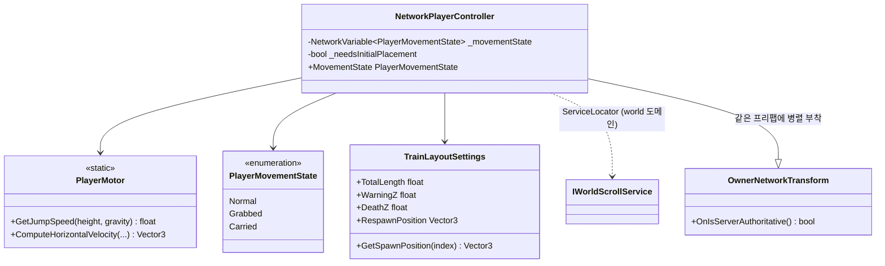
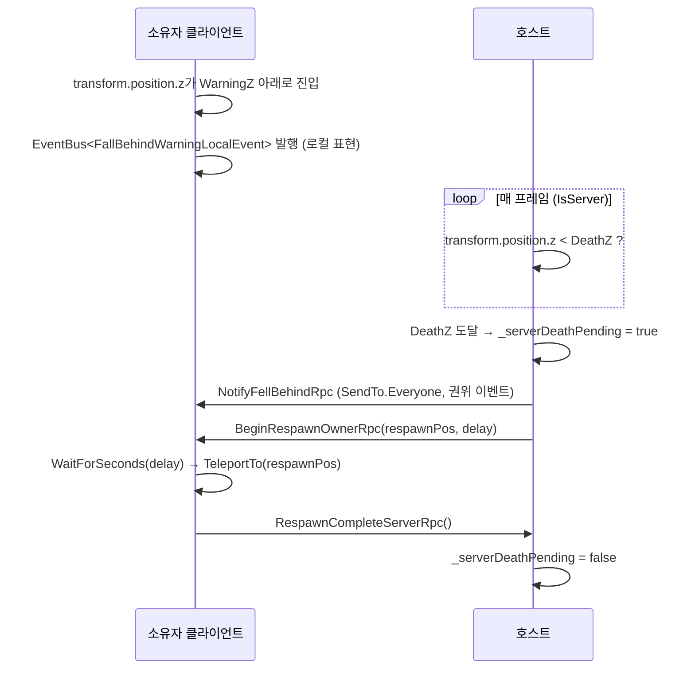

# 플레이어 이동 (소유자 권위 + 개입 상태 머신)

> **종류**: 아키텍처 명세 · **상태**: 구현중
> **최종 갱신**: 2026-07-20 · **관련 기획서**: [Train-Survival-기획서](../../design/Train-Survival-기획서.md) · [수직 슬라이스 스펙 §4](../../design/Train-Survival-수직슬라이스-스펙.md) · [네트워크 아키텍처 §4.2](../../design/Train-Survival-네트워크-아키텍처.md)

## 1. 개요·목적

1인칭 이동을 소유자 권위로 구현하면서, 처음부터 호스트 개입(넉백·구속) 상태 머신 골격을 포함한다 —
"일단 로컬 이동만 만들고 나중에 추가"를 금지하는 개발 원칙 1·6의 직접 적용이다. 열차 규모 데이터
(`TrainLayoutSettings`)에 의존해 스폰·낙하·이탈·부활 지점을 계산한다.

## 2. 범위 (Scope)

**포함**: 이동·시점(`NetworkPlayerController`), 점프·공중 제어 순수 계산(`PlayerMotor`), 소유자 권위
`NetworkTransform`(`OwnerNetworkTransform`), 개입 상태 열거(`PlayerMovementState`), 낙하·이탈·부활,
지상 컨베이어 밀림(상시 외력형), 열차 레벨 디자인 기준 데이터(`TrainLayoutSettings`).

**미포함**: `Grabbed`/`Carried` 상태로의 실제 전환 콘텐츠(몬스터가 없어 슬라이스 범위 밖 — F9 디버그
RPC로 전환 경로만 검증), 체온/허기 등 생존 게이지, 웅크리기, 스태미나.

## 3. 요구사항 → 설계 해석

| 요구사항 | 출처 | 설계적 해석 |
|---|---|---|
| 자기 캐릭터 이동은 소유자 권위, 지연 0 | 권위 분담표 | 이동·시점 계산 전부 `IsOwner` 게이트 안에서 로컬 수행, `OwnerNetworkTransform`이 `OnIsServerAuthoritative() => false` |
| 호스트 개입 상태 머신을 처음부터 포함 | 네트워크 문서 §4.2, 개발 가이드 M1 지침 | `PlayerMovementState`(Normal/Grabbed/Carried) `NetworkVariable` + F9 디버그 RPC로 전환 경로 선배치 |
| 지상 컨베이어 밀림 = 상시 외력형 | 네트워크 문서 §4.2 | 소유자가 `IWorldScrollService.ScrollSpeed`를 매 프레임 읽어 로컬 가산 — RPC 없음, 권위는 소유자 유지 |
| 낙하 = 즉사 아님, 추격 복귀 가능 | 슬라이스 스펙 §4.2 | 달리기(7 m/s) > 기본 열차 속도(6 m/s)로 데이터 설계, 40 m 이상 이탈 시에만 호스트가 사망 확정 |
| 플레이어는 Main 씬(전환 전)에서 스폰될 수 있음 | NGO 구현 중 발견 | `_needsInitialPlacement` 플래그로 실제 배치를 Game 씬 도착 후 첫 Update로 지연 |

## 4. 시스템 구조

| 구성요소 | 역할 | 계층 |
|---|---|---|
| `NetworkPlayerController` | 입력·이동·낙하 판정·부활·상태 전환 RPC | `NetworkBehaviour` |
| `PlayerMotor` | 점프 속도·공중 제어 가속 순수 계산 | 순수 C# static |
| `OwnerNetworkTransform` | 소유자 권위로 오버라이드한 `NetworkTransform` | `NetworkBehaviour` (NGO 확장) |
| `PlayerMovementState` | Normal/Grabbed/Carried 열거 | 순수 C# enum |
| `PlayerEvents` | 이탈 경고·이탈 확정 이벤트 | 순수 C# struct |
| `TrainLayoutSettings` | 칸 규격·스폰·이탈 한계·부활 데이터 | `ScriptableObject` |

## 5. 데이터 구조

### `PlayerMovementSettings`

| 필드 | 기본값 | 의미 |
|---|---|---|
| `WalkSpeed` / `RunSpeed` | 4.5 / 7 m/s | 슬라이스 스펙 §4.1 |
| `JumpHeight` | 1.2 m | 목표 점프 높이 |
| `AirControlRatio` | 0.5 | 공중 이동 입력 유효 비율 |
| `AirAcceleration` | 20 | 공중 목표 속도로의 가속도 |
| `Gravity` | 20 | 낙하 가속도 |
| `LookSensitivity` / `MaxPitch` | 0.12 / 85° | 시점 감도·상하 제한 |

### `TrainLayoutSettings`

| 필드/계산값 | 기본값 | 의미 |
|---|---|---|
| `CarCount` / `CarLength` / `CarWidth` / `DeckHeight` / `CouplingGap` | 3 / 12 / 3 / 3 / 1.5 m | 슬라이스 스펙 §5 열차 규격 |
| `FallBehindWarningMeters` / `FallBehindDeathMeters` | 30 / 40 m | 후미 기준 경고·사망 거리 |
| `RespawnDelaySeconds` | 5 s | 부활 대기 |
| `TotalLength`(계산) | ≈39 m | 기관차+2칸+연결부 |
| `GetSpawnPosition(index)`(계산) | — | 접속 순서별 초기 스폰 지점 |

## 6. 상세 로직·상태

### 6.1 이탈·부활 시퀀스

- **엣지 케이스 — 초기 배치 지연**: NGO는 플레이어 프리팹을 씬 전환 완료 전(Main)에도 스폰할 수 있다. `OnNetworkSpawn`에서 즉시 텔레포트하면 아직 Game 씬의 열차 지오메트리가 없어 허공에 배치된다. `_needsInitialPlacement` 플래그로 실제 배치를 `SceneManager.GetActiveScene().name == "Game"`이 확인된 첫 Update로 미룬다.
- **엣지 케이스 — 컨베이어 밀림은 접지 + WorldFrameSurface 조합에서만**: 열차 지붕은 정지 프레임이므로 밀림이 없다. `IsStandingOnWorldFrame()`이 아래쪽 레이캐스트로 `WorldFrameSurface` 컴포넌트 존재를 확인한 경우에만 스크롤 속도를 가산한다.
- **엣지 케이스 — 구속형 상태에서는 입력 정지**: `_movementState.Value != Normal`이면 `UpdateLook/Move/FallBehindWarning/DebugInput`을 전부 건너뛴다 — 호스트 구동 콘텐츠가 아직 없어도 게이트 자체는 이미 동작한다.

## 7. 인터페이스·의존성 (경계)

- **`IWorldScrollService`** (world 도메인) — `ServiceLocator` 경유로만 스크롤 속도를 읽는다. Player는 World의 구현을 모른다.
- **권위 이벤트 vs 로컬 표현 이벤트**: `PlayerFellBehindEvent`(권위, 호스트 확정 후 `SendTo.Everyone`으로 전파)와 `FallBehindWarningLocalEvent`(로컬 표현, 경고 구간에서 각자 즉시 발행)를 명확히 구분 — UI(`SliceHud`)는 상태를 바꾸지 않으므로 두 종류 모두 구독 가능하지만, 상태를 바꾸는 구독자가 있다면 권위 이벤트만 써야 한다 (아키텍처 규칙 §3).
- **호스트 → 소유자 개입 RPC**: `BeginRespawnOwnerRpc`(`SendTo.Owner`)는 임펄스형에 해당 — 위치를 강제하는 순간만 호스트가 지시하고, 이후 제어권은 소유자가 그대로 유지한다 (네트워크 문서 §4.2 임펄스형).

## 8. 설계 포인트 (SOLID)

| 원칙 | 적용 |
|---|---|
| **SRP** | `PlayerMotor`(순수 이동 수식)와 `NetworkPlayerController`(입력·네트워크·수명주기)를 분리 |
| **OCP** | `PlayerMovementState`에 새 구속 상태를 추가해도 기존 `Normal` 경로의 입력 처리 코드는 조건 분기 하나(이미 존재하는 `if (_movementState.Value != Normal) return;`)로 자동 방어됨 |
| **DIP** | 스크롤 속도를 인터페이스로만 조회 — 월드 스크롤 구현이 바뀌어도(예: 트랙 커브 도입) Player는 무수정 |
| **강조 패턴 — 순수 로직의 조기 분리** | 이동 계산(`PlayerMotor`)을 MonoBehaviour 밖으로 뺀 덕분에 물리 엔진 없이도 점프 높이·공중 가속 공식을 EditMode에서 검증 가능 (`PlayerMotorTests`) |

## 9. Unity 특화

- **생명주기**: `OnNetworkSpawn`에서 소유자면 카메라 리그 활성화 + `_needsInitialPlacement=true` + 커서 잠금. `OnNetworkDespawn`에서 커서 해제. `CharacterController.Move`는 텔레포트 전후 `enabled` 토글로 내부 상태 충돌을 피한다.
- **풀링**: 대상 없음 — 플레이어는 세션 동안 1회 스폰되는 NGO 표준 플레이어 오브젝트.
- **성능 예산**: `IsStandingOnWorldFrame()`의 레이캐스트 1회/프레임(접지 중에만) 외 할당 없는 벡터 연산.
- **씬/프리팹 구조**: `Player.prefab` — `CharacterController` + `NetworkObject`(`AutoObjectParentSync=false`) + `OwnerNetworkTransform` + `NetworkPlayerController` + `HarpoonController`가 한 오브젝트에 병렬 부착. `CameraRig/CameraPivot/PlayerCamera` 하위 구조로 비소유 클라이언트에서는 카메라 리그가 비활성화된다.
- **에디터 툴 필요 여부**: 없음.

## 10. 테스트 케이스

| 테스트 파일 | 검증 항목 |
|---|---|
| `PlayerMotorTests` (3개) | 점프 속도가 목표 높이에 정확히 도달, 접지 시 즉시 목표 속도, 공중에서는 제한된 가속으로만 접근 |

수동 검증: 호스트 Play 스모크에서 플레이어가 기관차 지붕에 정상 착지, 낙하·부활 경로는 F9 디버그 RPC로 상태 전환만 별도 검증(구속 콘텐츠 자체는 슬라이스 범위 밖).

## 11. 리스크·미결정 (TBD)

| 항목 | 내용 |
|---|---|
| `Grabbed`/`Carried` 실제 콘텐츠 없음 | 몬스터가 도입되는 M2~M5까지 상태 머신 골격만 존재 — 실제 전환 트리거·해제 조건은 그때 확정 |
| 부활 대기 시간 n값 (Day 비례 증가) | 기획서 §9.1 미결 — 현재는 고정 5 s |
| 스태미나-달리기 관계 | 생존 게이지 설계 시 복귀 규칙 난이도가 바뀔 수 있음 (슬라이스 스펙 §6) |

## 12. 확장 여지

- `PlayerMovementState`에 새 값을 추가하고 대응 RPC·연출만 붙이면 몬스터 그랩(M5)이 자연스럽게 얹힌다 — 입력 게이트는 이미 범용으로 동작.
- `TrainLayoutSettings`의 칸 규격이 건축 그리드·증설 프리팹(M3)의 기준 단위로 그대로 재사용 가능하도록 설계됨.

## 13. 파일 위치

| 구분 | 파일 | 경로 |
|---|---|---|
| 컨트롤러 | `NetworkPlayerController.cs`, `OwnerNetworkTransform.cs` | `Assets/_Project/Scripts/Gameplay/Player/` |
| 순수 로직 | `PlayerMotor.cs`, `PlayerMovementState.cs` | 〃 |
| 이벤트 | `PlayerEvents.cs` | 〃 |
| 데이터 | `PlayerMovementSettings.cs` (+ `.asset`) | 〃 (+ `Assets/_Project/Data/`) |
| 열차 데이터 | `TrainLayoutSettings.cs` (+ `.asset`) | `Assets/_Project/Scripts/Gameplay/Train/` (+ `Assets/_Project/Data/`) |
| 프리팹 | `Player.prefab` | `Assets/_Project/Prefabs/` |
| 테스트 | `PlayerMotorTests.cs` | `Assets/_Project/Tests/EditMode/` |
