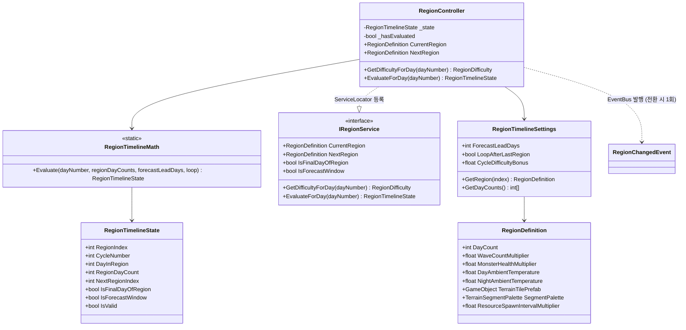
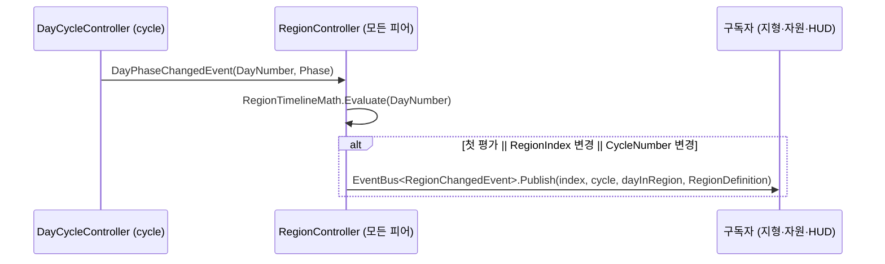

# 지역 타임라인 (Day 번호 → 지역 순수 파생)

> **종류**: 아키텍처 명세 · **상태**: 구현 완료 (M4 → M7 지역 4종 확장)
> **최종 갱신**: 2026-08-20 · **관련 기획서**: [Train-Survival-기획서 §4·§4.5·§5](../../design/Train-Survival-기획서.md) · [개발 가이드 §5 M4](../../guide/Train-Survival-개발-가이드.md) · [cycle/day-night-cycle](../cycle/day-night-cycle.md)

## 1. 개요·목적

M4 지역 전환의 축이다. **숲 5일 → 사막 4일 → (순환)** 진행을, 이미 호스트 권위로 복제된
**Day 번호 하나에서 모든 피어가 순수 파생**하도록 구현했다. 지역 인덱스·지역 내 일차·마지막 날(대형
웨이브)·다음 지역 예고·순환 횟수가 전부 `RegionTimelineMath.Evaluate`의 출력이며, 지역 자체는
**네트워크 상태가 아니다** — `RegionController`는 `NetworkBehaviour`가 아니라 `MonoBehaviour`다.
지역 정의(일수·난이도 배율·환경 온도·지형/자원 프리팹)는 전부 ScriptableObject로 분리해, 주기 축소
밸런싱(기획서 §2)이 에셋 수정만으로 가능하다.

## 2. 범위 (Scope)

**포함**: Day 번호 → 지역 타임라인 순수 파생(`RegionTimelineMath`, `RegionTimelineState`), 파생·발행
컨트롤러(`RegionController`), 조회 계약(`IRegionService`, `RegionDifficulty`), 지역 전환 권위
이벤트(`RegionChangedEvent`), 지역 밸런스 데이터(`RegionDefinition`, `RegionTimelineSettings`).

**미포함**: 날씨(→ [weather-events](weather-events.md)), 웨이브 규모 산식 자체(→
[monsters/wave-and-steering](../monsters/wave-and-steering.md)의 `WaveMath` — 이 도메인은 배율만 공급),
체온 시스템(`TemperatureMath`/`PlayerTemperature` — 이 도메인은 환경 온도 데이터만 공급), 지형 타일
스트리밍 본체(→ [world/scroll-and-streaming](../world/scroll-and-streaming.md)), 트랙 커브·경사 표현(M7
이월), 지역별 자원 **종류** 분화(→ [inventory §6.4](../inventory/hotbar.md) — M5에서 해소).

### 2.1 지역 4종으로 확장 (M7) — **코드 0줄 실증**

M4는 숲·사막 2종으로 착수했고, M7에서 **대초원(1차)·북극(3차)**이 추가됐다.

> **지역 추가가 "에셋 경로"임이 실증됐다.** `Region_Grassland.asset` 신설 +
> `RegionTimelineSettings._regions`에 append만으로 예고 HUD·마지막 밤 대형 웨이브·지형 경계 복제·
> 후발 접속·온도·날씨 훅이 **전부 자동 성립**했다 — 이 문서 §12가 예정했던 확장 경로 그대로다.

M7 1차 검증 A 구역이 이 자동 성립을 항목별로 확인하는 데 쓰였다 —
*"하나라도 코드 수정 없이 성립하지 않으면 그 자체가 발견"*이라는 기준으로.

## 3. 요구사항 → 설계 해석

| 요구사항 | 출처 | 설계적 해석 |
|---|---|---|
| 모든 피어가 같은 지역을 본다 | 가이드 M4 ("Day/지역 진행 = 호스트 단일 타임라인") | 지역을 Day 번호의 **순수 함수**로 정의 — 전용 RPC·`NetworkVariable` 없이 각 피어가 `RegionTimelineMath`로 독립 유도 (낮/밤 국면과 같은 규약) |
| 지역당 3~5일 주기 | 기획서 §4 | `RegionDefinition.DayCount` 데이터 — 기준안 숲 5일 / 사막 4일 (2026-08-01 확정), 에셋 수정으로 조정 |
| 다음 지역 예고는 "마지막 1~2일" | 기획서 §2 | `ForecastLeadDays`(기본 2) 데이터화 → `IsForecastWindow` 파생, HUD가 소비 |
| 지역 마지막 밤 = 대형 웨이브 ("지역 졸업 시험") | 기획서 §5 | `IsFinalDayOfRegion` 파생 → `RegionDifficulty.IsFinalNightOfRegion`으로 웨이브 스포너에 전달 |
| 마지막 지역 뒤 재순환 + 난이도 상승 | 기획서 §4.5 | `LoopAfterLastRegion` + `CycleNumber` 파생, 배율에 `1 + CycleNumber × CycleDifficultyBonus` 가산 |
| 밸런싱은 코드 수정 없이 | 기획서 §2, 가이드 M4 | 일수·배율·온도·프리팹·확률 전부 `RegionDefinition`/`RegionTimelineSettings` ScriptableObject |

## 4. 시스템 구조

| 구성요소 | 역할 | 계층 |
|---|---|---|
| `RegionController` | `DayPhaseChangedEvent` 구독 → 파생·전환 발행, `IRegionService` 구현 | `MonoBehaviour` (네트워크 상태 없음) |
| `RegionTimelineMath` | Day 번호 하나에서 지역 타임라인 전체를 유도하는 순수 평가 | 순수 C# static |
| `RegionTimelineState` | 평가 결과 (지역 인덱스·순환 횟수·일차·마지막 날·예고) | 순수 C# struct |
| `RegionDifficulty` | 지역 × 순환 보너스가 반영된 난이도 배율 묶음 | 순수 C# struct |
| `RegionChangedEvent` | 지역 진입 시 1회 발행되는 권위 이벤트 | 순수 C# struct |
| `IRegionService` | 현재 지역·일차·예고·난이도 조회 계약 (setter 없음) | 인터페이스 |
| `RegionDefinition` | 지역 1종의 밸런스·비주얼 정의 | `ScriptableObject` |
| `RegionTimelineSettings` | 지역 순서·예고 일수·순환 규칙 | `ScriptableObject` |



## 5. 데이터 구조

### `RegionTimelineSettings` (`RegionTimelineSettings.asset`)

| 필드 | 현재값 | 의미 |
|---|---|---|
| `_regions` | [숲, 사막] | 배열 순서 = 전환 순서. 지역 추가는 에셋을 배열에 넣는 것뿐 |
| `_forecastLeadDays` | 2 | 지역 마지막 며칠부터 다음 지역 예고 (`Min(0)`) |
| `_loopAfterLastRegion` | true | 마지막 지역 뒤 첫 지역으로 순환 (기획서 §4.5) |
| `_cycleDifficultyBonus` | 0.5 | 순환 1바퀴마다 난이도 배율 가산 |

### `RegionDefinition` — 숲 / 사막 현재 에셋값

| 필드 | 숲 (`Region_Forest`) | 사막 (`Region_Desert`) | 비고 |
|---|---|---|---|
| `DayCount` | 5 | 4 | 기획서 §4의 3~5일 범위 기준안 |
| `WaveCountMultiplier` | 1 | 1.6 | 기획서 §4 난이도 지수(숲 1/사막 4)를 직역하면 웨이브 4배로 밸런스가 무너져 ×1.6으로 착수 |
| `MonsterHealthMultiplier` | 1 | 1.3 | 〃 |
| `DayAmbientTemperature` | 22 ℃ | 45 ℃ | 체온 시스템의 입력 (기획서 §4.2 — 사막 낮 고온) |
| `NightAmbientTemperature` | 15 ℃ | 2 ℃ | 확정 사망이라 9 ℃로 임시 조정했다가(2026-08-03), 난방 건축물 도입으로 2 ℃ 복원 (2026-08-06, M5 3차) |
| `_weathers` / `WeatherChancePerDay` | [] / 0 | [모래폭풍] / 0.6 | → [weather-events](weather-events.md) |
| `TerrainTilePrefab` | 숲 타일 | 사막 타일 | 비우면 이전 지역 타일 유지 |
| `SegmentPalette` | **`TerrainSegmentPalette_Forest`** (10종) | 미설정 | **팔레트가 우선한다** — 있으면 `SegmentPickLogic`이 인덱스에서 가중 추첨하고, 없으면 위의 단일 프리팹으로 내려간다 (2026-08-23 신설) |
| `ResourceSpawnIntervalMultiplier` | 1 | 2 | 클수록 희소 — 기획서 §4 자원 등급(숲 3/사막 1)의 구현 |

### 5.1 `RegionDefinition` 확장 필드 — 북극이 켠 것 (2026-08-30)

지역 순환은 **숲 5 → 사막 4 → 바다 3 → 대초원 4 → 북극 3** (총 19일 · 북극 = **Day 17~19**)이다.

| 필드 | 값 (북극) | 비고 |
|---|---|---|
| `OverridesFog` / `Day·NightFogColor` / `Density` | ✅ / `#DCE8F0` · `#2A4257` / **0.0017** | 낮·밤 2벌 — [world/distant-scenery §5](../world/distant-scenery.md) |
| `SkyboxMaterial` | `M_Sky_Arctic` | 오로라 대역이 들어 있는 유일한 하늘 |
| `SegmentPalette` | `TerrainSegmentPalette_Arctic` (10종) | **구간 편성(2단 추첨)을 쓰는 유일한 팔레트** — 가이드 §7.5 |
| **`HasWater` / `WaterSurfaceY`** | **✅ / −1.5** | **두 번째 사용처**(첫 번째는 바다 −4). 바다는 사방이 물이지만 **북극은 얼음과 물이 교차**해 이 값이 "물이 있는 자리의 높이"일 뿐이다 — 실제 잠김은 발 높이가 정한다 |
| `UnderwaterColor` | `#0E2F3E` α 0.72 | 기본값이 바다 값이라 배선하지 않은 지역은 화면이 그대로다 |
| `FishingBiteDelayMultiplier` | **4** | 북극에서 물고기가 쉽게 잡히면 대초원에서 비축할 이유가 사라진다(기획서 §4.3) |
| `FishingDoubleCatchMultiplier` | **0** | 북극에서 두 마리는 없다 |

> **`HasWater`가 켜지면 코드 0줄로 열리는 것** — 수영·잠수·물 항력(`NetworkPlayerController`) ·
> 물면 주행(`MonsterAgent`·`BossAgent`) · 물속 화면(`UnderwaterView`) · 낚시(`FishingRodController`).
> **북극이 그 위에 더 필요했던 것**은 "물면이 지역당 하나"라는 전제가 깨지는 자리 셋뿐이다 —
> 몬스터 발밑 보정 · 낚시 지형 차폐 · 잠김(수영이 아닌) 판정.

## 6. 상세 로직·상태

### 6.1 Day 번호 → 지역 파생 (`RegionTimelineMath.Evaluate`)

`Evaluate(dayNumber, regionDayCounts, forecastLeadDays, loopAfterLastRegion)` — 순수 함수, 부작용 없음.

```
day        = max(1, dayNumber)               // 0 이하는 Day 1로 고정
dayIndex   = day - 1
totalDays  = Σ max(1, regionDayCounts[i])    // 일수 0 이하 에셋도 1일로 방어

// 순환 off + 전체 일수 초과 → 마지막 지역에 무기한 체류
//   (졸업 웨이브·예고 플래그는 다시 트리거하지 않음: 둘 다 false)
!loop && dayIndex >= totalDays
  → State(lastIndex, cycle=0, dayInLastRegion, …, next=lastIndex, false, false)

cycleNumber = loop ? dayIndex / totalDays : 0
dayInCycle  = loop ? dayIndex % totalDays : dayIndex
regionIndex = dayInCycle가 속하는 구간을 앞에서부터 스캔
dayInRegion = dayInCycle - (앞 지역들 일수 합) + 1

nextRegionIndex = loop ? (regionIndex+1) % count : min(regionIndex+1, lastIndex)
IsFinalDayOfRegion = dayInRegion >= regionDayCount
IsForecastWindow   = forecastLeadDays > 0 && dayInRegion > regionDayCount - forecastLeadDays
```

지역 목록이 비거나 null이면 `default`(= `IsValid == false`)를 돌려주고, 소비자는 무보정으로 동작한다.

### 6.2 파생·발행 루프 (`RegionController`)



- **`Update`가 없다** — 지역은 Day 단위로만 변하므로 국면 전환 이벤트 때만 평가한다.
  프레임 비용 0, 이벤트당 O(지역 수) 루프뿐이다.
- **전환 판정**: `RegionIndex` 또는 `CycleNumber`가 달라졌을 때만 `RegionChangedEvent` 발행 —
  같은 지역 안에서 날짜만 바뀌면 발행하지 않는다. `CycleNumber`를 함께 보므로 지역이 1종뿐이어도
  순환 재진입이 이벤트로 잡힌다.
- **엣지 케이스 — 첫 평가 강제 발행**: `_hasEvaluated` 플래그로 첫 이벤트에서 무조건 발행 —
  씬 시작·늦은 참여 직후 구독자가 초기 지역을 즉시 받는다.
- **엣지 케이스 — 설정 누락 방어**: `_settings == null` 또는 `!state.IsValid`면 조기 반환.

### 6.3 순서 의존 없는 조회 (`GetDifficultyForDay` / `EvaluateForDay`)

`DayPhaseChangedEvent` 구독자 간 **처리 순서는 보장되지 않는다**. 지역 전환 당일 다른 구독자가
`CurrentRegion`을 읽으면 `RegionController`보다 먼저 실행됐을 때 이전 지역을 얻는다. 그래서 전환
당일 판단이 필요한 소비자는 이벤트가 준 Day 번호를 **직접 넘겨 즉시 평가**한다 — 지역이 Day의 순수
함수이기에 가능한 경로다.

- `GetDifficultyForDay(day)`: 지역 배율 × 순환 보너스(`1 + CycleNumber × CycleDifficultyBonus`)를
  묶은 `RegionDifficulty` 반환. 설정·지역이 없으면 `Neutral`(×1, ×1, false).
- `EvaluateForDay(day)`: 타임라인 상태 자체를 반환 — 날씨의 "지역 첫날 스킵" 판정이 소비자다
  (1차 플레이 검증 결함 ③에서 `CurrentRegion` 조회의 순서 의존이 실측돼 신설했다, 2026-08-03).

## 7. 인터페이스·의존성 (경계)

- **`IRegionService`** — `OnEnable`에서 미등록일 때만 `ServiceLocator.Register`, `OnDisable`에서 자기
  자신일 때만 `Unregister` (프로젝트 공통 규약).
- **입력**: [cycle](../cycle/day-night-cycle.md)의 `DayPhaseChangedEvent`뿐. 이 도메인이 유일하게
  참조하는 타 도메인이다.
- **소비자** (모두 이 도메인을 단방향 참조):
  - `TerrainTileStreamer` / `GroundResourceSpawner` (world) — `RegionChangedEvent`로 지형 타일·자원
    프리팹과 스폰 간격 배율 교체. 이미 깔린 타일은 그대로 두고 **이후 생성분부터** 바꿔 "지역 경계를
    지나는" 전환을 만든다. 늦게 켜지면 `IRegionService.CurrentRegion`으로 한 번 맞춘다.
  - `MonsterWaveSpawner` (monsters) — 밤 시작 시 `GetDifficultyForDay(evt.DayNumber)` → `WaveMath.Plan`에
    물량·체력 배율과 마지막 밤 여부를 전달.
  - `WeatherController` (region) — `EvaluateForDay`로 날씨 발생 지역 판정.
  - `PlayerTemperature` (player) — `CurrentRegion`의 낮/밤 환경 온도를 체온 표류 목표로 사용.
  - `CoreLoopHud` (UI) — 지역명·일차·다음 지역 예고·마지막 밤 경고·진입 배너.
- **이벤트 vs 조회**: 지역 진입(이산)은 `RegionChangedEvent`, 상시 표시·전환 당일 판단(연속)은
  `IRegionService` 조회 — cycle과 같은 분리 규약.

## 8. 설계 포인트 (SOLID)

| 원칙 | 적용 |
|---|---|
| **SRP** | 파생 수식(`RegionTimelineMath`)과 구독·발행·서비스 노출(`RegionController`) 분리 |
| **OCP** | 지역 추가·순서 변경·일수 조정이 전부 에셋 편집 — 코드 무수정 (대초원·북극이 이 경로로 예정) |
| **DIP** | 소비자는 `IRegionService`/`RegionChangedEvent`만 알고 컨트롤러 구현을 모른다 |
| **강조 패턴 — 복제 상태 최소화** | 지역을 Day의 순수 함수로 정의해 네트워크 상태·RPC를 0으로 유지 — cycle의 "누적 시간 하나만 복제" 원칙을 한 단계 더 재사용 |

## 9. Unity 특화

- **생명주기**: `Game` 씬 `GameSystems` 아래 1개 배치. `MonoBehaviour`라 네트워크 스폰과 무관하게
  `OnEnable`/`OnDisable`에서 구독·서비스 등록을 관리한다.
- **풀링**: 대상 없음. 지형·자원 프리팹 스폰은 소비자(world)가 `PoolManager` 경유로 수행.
- **성능 예산**: 매 프레임 작업 없음. `RegionTimelineSettings.GetDayCounts()`는 배열을 캐시해
  평가 경로에서 할당이 없다 (`OnValidate`에서 무효화).
- **에디터 툴**: 별도 툴 없음. 검증용으로 `DayCycleController`의 디버그 키(numpad 3 = 다음 Day 아침
  점프)를 지역 전환 확인에 사용한다 — 릴리스에서는 끈다.

## 10. 테스트 케이스

| 테스트 파일 | 검증 항목 |
|---|---|
| `RegionTimelineMathTests` (10개) | ① Day1 = 첫 지역 1일차 ② 마지막 이틀 예고 구간 ③ 마지막 날에만 졸업 플래그 ④ 일수 초과 시 다음 지역 전환 ⑤ 순환 시 첫 지역 복귀 + 주기 증가 ⑥ 순환 off 시 마지막 지역 체류(졸업 재트리거 없음) ⑦ 0·음수 Day 고정 ⑧ 빈 목록 무효 상태 ⑨ 예고 0일이면 예고 없음(마지막 날 판정과 독립) ⑩ 다중 바퀴 후 지역·일차 정확성 |
| `WaveMathTests` (일부) | 지역 배율이 물량·체력에 반영, 지역 마지막 밤 대형 웨이브, 배율 0 방어 — 배율 소비 측 검증 |

컨트롤러의 구독·발행 배선은 EditMode 대상 밖 — 1차 플레이 검증 A(지역 전환)·G(멀티 정합) 항목으로
확인했다 ([M4 플레이 검증 항목](../../plans/M4/M4-플레이-검증-항목.md)).

## 11. 리스크·미결정 (TBD)

| 항목 | 내용 |
|---|---|
| 지역 3·4종(대초원·북극) | 기획서 §4의 후반 지역 — 에셋 추가만으로 확장되도록 설계했으나 미구현 (M7 예정 축) |
| 트랙 커브·경사 표현 | M4는 직선 스크롤 유지 — 스크롤 벡터 회전은 위치 유도·조향·이탈 시뮬 재검증이 필요해 M7로 이월 (2026-08-01) |
| 지역별 자원 종류 분화 | M5 이월 (2026-08-02) — 종류가 의미를 가지려면 제작·요리 쓰임새가 먼저 필요 |
| ~~사막 밤 온도 9 ℃~~ | **해소 (2026-08-06, M5 3차)** — 난방 건축물 도입으로 급랭 값 2 ℃ 복원. 난방 칸 위 실효 온도 ≈ 17.2 ℃(쾌적대) |

## 12. 확장 여지

- 지역 추가 = `RegionDefinition` 에셋 1개 + `_regions` 배열 등록. 파생·이벤트·소비자 경계는 무수정.
- `CycleNumber`가 이미 파생되므로 "n바퀴째 전용 변형"(색채·몬스터 조합)을 데이터로 얹을 수 있다.
- `RegionDifficulty`에 축을 추가하면(예: 이동속도 배율) 웨이브 외 시스템도 같은 조회 경로를 재사용한다.

## 13. 파일 위치

| 구분 | 파일 | 경로 |
|---|---|---|
| 컨트롤러 | `RegionController.cs` | `Assets/_Project/Scripts/Gameplay/Region/` |
| 순수 로직 | `RegionTimelineMath.cs` | 〃 |
| 이벤트 | `RegionEvents.cs` | 〃 |
| 인터페이스 | `IRegionService.cs` | 〃 |
| 데이터 | `RegionDefinition.cs`, `RegionTimelineSettings.cs` | 〃 |
| 에셋 | `Region_Forest.asset`, `Region_Desert.asset`, `RegionTimelineSettings.asset` | `Assets/_Project/Data/` |
| 테스트 | `RegionTimelineMathTests.cs` | `Assets/_Project/Tests/EditMode/` |
