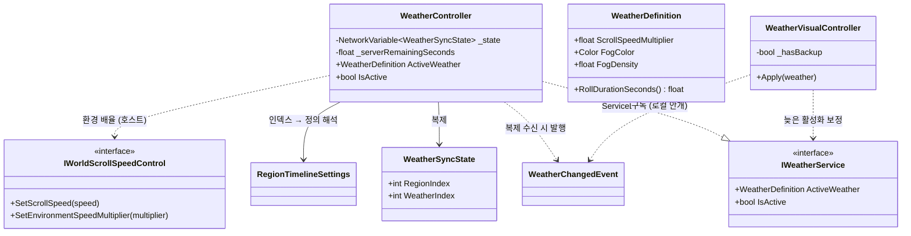
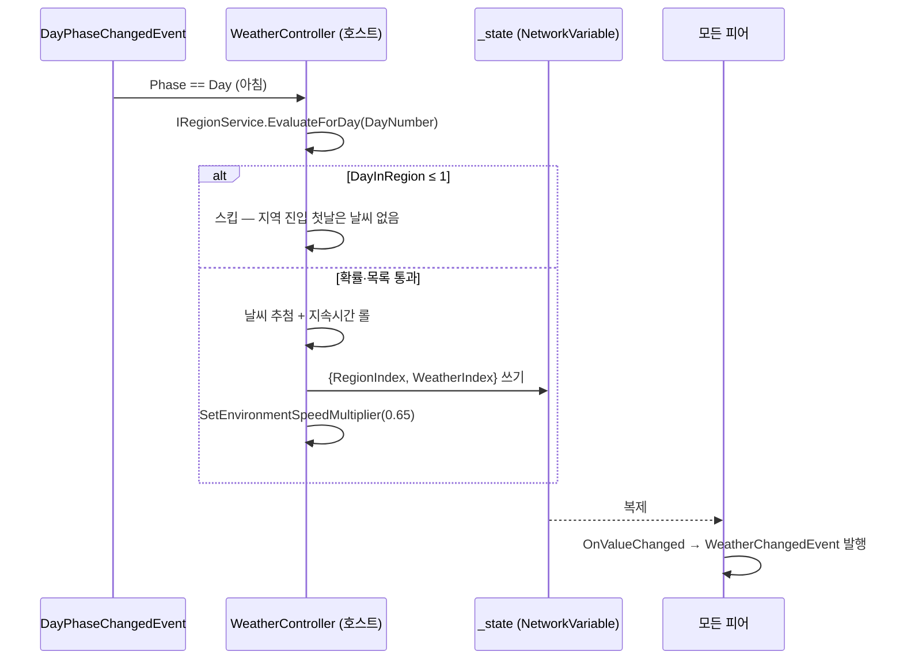

# 날씨 이벤트 (호스트 권위 무작위 상태 + 로컬 연출)

> **종류**: 아키텍처 명세 · **상태**: 구현중
> **최종 갱신**: 2026-08-03 · **관련 기획서**: [Train-Survival-기획서 §7.4](../../design/Train-Survival-기획서.md) · [개발 가이드 §5 M4](../../Train-Survival-개발-가이드.md) · [region/region-timeline](region-timeline.md) · [world/fuel-loop](../world/fuel-loop.md)

## 1. 개요·목적

지역 정체성을 강화하는 확률 이벤트다. M4 범위는 **모래폭풍 1종** — 낮 국면에 확률로 발생해 일정
시간 **월드 스크롤 감속(= 체감 열차 속도 저하)** 과 **시야 차단 안개**를 일으키고, 밤 진입·지역
전환 시 갠다. 지역과 달리 날씨는 **무작위라 Day 번호의 함수로 유도할 수 없으므로**, 이 도메인에서
유일하게 네트워크 상태를 갖는다 — 호스트가 발생·종료를 확정하고 `NetworkVariable`로 전파하며, 각
피어는 복제 수신 시점에 `WeatherChangedEvent`를 발행한다. 권위(감속·상태)와 표현(안개)을 분리해
안개는 각 피어가 로컬로만 적용한다.

## 2. 범위 (Scope)

**포함**: 호스트 권위 발생·종료(`WeatherController`), 복제 상태(`WeatherSyncState`), 날씨 밸런스
데이터(`WeatherDefinition`), 전환 권위 이벤트(`WeatherChangedEvent`), 조회 계약(`IWeatherService`),
로컬 안개 연출(`WeatherVisualController`), 스크롤 속도의 **환경 배율 레이어**(`IWorldScrollSpeedControl.
SetEnvironmentSpeedMultiplier` — M4에서 신설한 계약 확장).

**미포함**: 지역 타임라인·날씨 발생 확률 데이터의 소유(→ [region-timeline](region-timeline.md)의
`RegionDefinition`), 스크롤 속도 산출·복제 본체(→ [world/scroll-and-streaming](../world/scroll-and-streaming.md)의
`WorldScrollController`), 연료 감속(→ [world/fuel-loop](../world/fuel-loop.md) — 별개 레이어), 폭설·뇌우·혹한파
등 추가 날씨(데이터 확장 예정), 날씨의 체온 영향(M4 모래폭풍은 온도 무관).

## 3. 요구사항 → 설계 해석

| 요구사항 | 출처 | 설계적 해석 |
|---|---|---|
| 모래폭풍 = 시야 차단 + 이동 저하 | 기획서 §7.4 | 시야는 로컬 안개(`RenderSettings.fog`), 이동 저하는 열차 세계관에 맞춰 **월드 스크롤 감속**으로 번역 (`ScrollSpeedMultiplier` 0.65) |
| 무작위 사건도 전 피어 동일 | 네트워크 아키텍처(호스트 권위) | 추첨·지속시간 롤은 호스트만 수행, 결과만 `NetworkVariable<WeatherSyncState>`로 복제 |
| 밤 방어전과 겹치지 않게 | M4 결정 (가이드 M4 2차) | 낮 국면 한정 — 밤 진입 시 강제로 갠다 |
| 지역마다 다른 날씨 | 기획서 §7.4 (지역 정체성) | 날씨 목록·발생 확률을 `RegionDefinition`에 배선 — 숲 0 %, 사막 60 %/일 |
| 밸런싱은 코드 수정 없이 | 기획서 §2 | 지속시간 범위·감속 배율·안개 색/밀도 전부 `WeatherDefinition` ScriptableObject |

## 4. 시스템 구조

| 구성요소 | 역할 | 계층 |
|---|---|---|
| `WeatherController` | 호스트 발생·종료 확정 + 상태 복제 + 감속 적용, `IWeatherService` 구현 | `NetworkBehaviour` |
| `WeatherSyncState` | 지역 인덱스 + 날씨 인덱스 복제 묶음 (−1 = 맑음) | `INetworkSerializable` struct (컨트롤러 내부) |
| `WeatherDefinition` | 날씨 1종의 지속시간·감속·안개 정의 | `ScriptableObject` |
| `WeatherChangedEvent` | 시작(정의 포함)/갬(null) 전환 이벤트 | 순수 C# struct |
| `IWeatherService` | 진행 중 날씨 조회 계약 | 인터페이스 |
| `WeatherVisualController` | 안개 적용·복원 — 네트워크 상태 없는 로컬 표현 | `MonoBehaviour` |

## 5. 데이터 구조

### `WeatherDefinition` (`Weather_Sandstorm.asset`)

| 필드 | 현재값 | 의미 |
|---|---|---|
| `_displayName` | 모래폭풍 | HUD 배너·상태 표시 |
| `_minDurationSeconds` / `_maxDurationSeconds` | 45 / 90 s | 발생 시 이 범위에서 무작위 롤 (`Min(5)`, min>max 입력은 스왑 방어) |
| `_scrollSpeedMultiplier` | 0.65 | 스크롤 속도 환경 배율 (`Range(0.1, 2)` — 1 초과면 부스트도 표현 가능) |
| `_fogColor` / `_fogDensity` | 모래색 / 0.035 | 로컬 안개 (ExponentialSquared) |

### 발생 배선 (`RegionDefinition` 소유 — [region-timeline §5](region-timeline.md) 참조)

숲: 날씨 없음 · 사막: `[모래폭풍]`, `WeatherChancePerDay` 0.6.

### `WeatherSyncState` (복제 단위)

`RegionIndex` + `WeatherIndex`를 **한 struct로 묶어** 복제한다 — 따로 복제하면 도착 순서에 따라
"다른 지역의 날씨"로 해석되는 중간 상태가 생긴다. `WeatherIndex == −1`이 맑음이며, 수신 측은
`RegionTimelineSettings`에서 직접 인덱싱해 정의로 해석한다(`Resolve`). **남은 시간은 복제하지 않는다**
— 종료는 호스트가 확정하고 상태 변경만 전파하면 충분하다.

## 6. 상세 로직·상태

### 6.1 발생 판정 (호스트, 낮 시작마다)

판정 순서: ① `EvaluateForDay(day)`로 지역 확정 (Day 기준 — `CurrentRegion` 조회는 지역 전환 당일
이벤트 처리 순서에 결과가 갈려서 쓰지 않는다) ② **지역 첫날 스킵** — 지형조차 아직 교체 중인 시점이라
전환 연출과 폭풍이 겹쳐 읽힌다 (1차 플레이 검증 결함 ③ 수정, 2026-08-03) ③ `WeatherChancePerDay`
확률 롤 ④ 지역 날씨 목록에서 균등 추첨 ⑤ `RollDurationSeconds()`로 지속시간 확정.

### 6.2 종료 경로 (전부 호스트 확정)

| 경로 | 트리거 |
|---|---|
| 자연 종료 | `Update`에서 `_serverRemainingSeconds` 카운트다운 → 0 이하 |
| 밤 진입 | `DayPhaseChangedEvent(Night)` — 낮 한정 이벤트 규칙 |
| 지역 전환 | `RegionChangedEvent` — 이전 지역의 날씨는 그 자리에서 끝 |
| 씬 이탈 | `OnNetworkDespawn` — 감속 배율만 1로 복원 (다음 세션에 감속을 남기지 않음) |

모든 경로가 `ServerClearWeather()`로 수렴: 상태를 `Clear`(−1)로 쓰고 환경 배율을 1로 복원한다.
이미 맑으면 복제 쓰기를 생략한다.

### 6.3 전파·소비 (모든 피어)

- `_state.OnValueChanged` → `WeatherChangedEvent` 발행. 호스트도 같은 경로로 받으므로 발행 코드가
  한 곳이다.
- **늦은 참여/활성화 보정**: `NetworkVariable` 초기 동기화는 `OnValueChanged`를 부르지 않으므로,
  현재 상태는 `IWeatherService`로 노출한다. `WeatherVisualController`는 `OnEnable`에서 서비스를
  조회해 진행 중인 날씨를 즉시 반영한다.
- **안개 적용·복원**: 최초 적용 전 `RenderSettings`(fog on/off·색·밀도·모드)를 백업하고, 갬/비활성화
  시 원상 복구 — 씬이 원래 쓰던 안개 설정을 파괴하지 않는다.

### 6.4 스크롤 감속 — 환경 배율 레이어

연료 상태는 매 프레임 `SetScrollSpeed`로 **절대값을 수렴**시키므로, 날씨 감속이 같은 경로로 들어가면
다음 프레임에 즉시 덮어써진다. M4에서 `IWorldScrollSpeedControl`에 `SetEnvironmentSpeedMultiplier`를
추가해 **기본 속도 × 환경 배율**의 두 레이어로 분리했다 — 최종 속도는 `WorldScrollController`가
곱으로 산출하고, 연료 감속과 날씨 감속이 서로를 덮어쓰지 않는다. 부스트 아이템 등 다른 일시 개입원도
이 레이어를 쓰는 것이 규약이다.

## 7. 인터페이스·의존성 (경계)

- **`IWeatherService`** — `OnNetworkSpawn`에서 미등록일 때만 등록, `OnNetworkDespawn`에서 자기 자신일
  때만 해제 (공통 규약). 소비자: `WeatherVisualController`, `CoreLoopHud`(발생 배너 + 진행 중 표시).
- **같은 도메인 내부**: `RegionTimelineSettings`(인덱스 해석)와 `IRegionService.EvaluateForDay`(발생
  지역 판정)를 소비 — region-timeline이 상류다.
- **입력**: [cycle](../cycle/day-night-cycle.md)의 `DayPhaseChangedEvent`(낮 시작 = 판정, 밤 = 갬),
  `RegionChangedEvent`(전환 시 갬).
- **출력**: [world](../world/scroll-and-streaming.md)의 `IWorldScrollSpeedControl` 환경 배율 —
  날씨는 스크롤 구현을 모르고 계약만 안다 (호스트 전용, 클라이언트 호출은 수신 측이 무시).
- **권위 vs 표현**: 감속은 호스트 경로에서만 적용되고 결과 속도가 복제된다. 안개는 완전 로컬 —
  네트워크 상태·RPC 없이 이벤트 구독만으로 각 피어가 스스로 그린다.

## 8. 설계 포인트 (SOLID)

| 원칙 | 적용 |
|---|---|
| **SRP** | 권위 상태(`WeatherController`)와 시각 표현(`WeatherVisualController`)을 별 컴포넌트로 분리 |
| **OCP** | 날씨 추가 = `WeatherDefinition` 에셋 + 지역 날씨 목록 등록 — 판정·복제·연출 코드 무수정 |
| **ISP** | 속도 개입은 `IWorldScrollSpeedControl`의 환경 배율 메서드에만 의존 — 조회면(`IWorldScrollService`)과 분리 유지 |
| **강조 패턴 — 최소 복제** | 무작위 결과(인덱스 2개)만 복제하고 남은 시간·안개는 비복제 — 지역(복제 0)과 대칭으로 "복제는 유도 불가능한 것만" 원칙을 지킨다 |

## 9. Unity 특화

- **생명주기**: `Game` 씬에 `WeatherController`(씬 `NetworkObject`)·`WeatherVisualController` 각 1개
  배치. 호스트는 `OnNetworkSpawn`에서 상태를 `Clear`로 초기화한다.
- **풀링**: 대상 없음. 파티클 등 연출 오브젝트가 생기면 `PoolManager` 경유 예정.
- **성능 예산**: 서버 `Update`에서 float 감산 1회(진행 중일 때만). 복제는 상태 전환 시에만 발생.
  안개는 `RenderSettings` 전역 값 대입뿐.
- **에디터 툴**: 없음. numpad 3(다음 Day 아침 점프)으로 발생 확률 검증을 반복한다.

## 10. 테스트 케이스

순수 로직이 얇아(추첨·카운트다운이 전부 무작위·시간·네트워크 경계) EditMode 테스트가 없다 —
지속시간 롤의 min/max 스왑 방어 정도가 전부라 분리 비용 대비 이득이 없다고 판단했다. 검증은
1차 플레이 검증 E 항목(발생 배너·안개·감속·갬·양 피어 동일)과 결함 ③ 수정 후 재확인으로 수행했다
([M4 플레이 검증 항목](../../plans/M4-플레이-검증-항목.md)). 배율 소비 측은 `WorldScrollMathTests`·
`FuelMathTests`가 기존 경로를 고정한다.

## 11. 리스크·미결정 (TBD)

| 항목 | 내용 |
|---|---|
| 추가 날씨 3종 | 기획서 §7.4의 폭설·뇌우·혹한파 — 후반 지역(M7)과 함께. 온도형 날씨(혹한파)는 체온 시스템과의 연동 축이 새로 필요하다 |
| 환경 배율 다중 개입원 | 현재 단일 소유자(날씨) 전제의 마지막 쓰기 승리 — 부스트 아이템(M5+)이 들어오면 조합 규칙(곱/우선순위) 결정 필요 |
| 밤 날씨 | M4는 낮 한정 — 밤 방어전과의 중첩 허용 여부는 웨이브 밸런스가 안정된 뒤 재검토 |
| EditMode 공백 | 판정 순서(첫날 스킵→확률→추첨)가 커지면 난수 주입형 순수 함수로 분리해 테스트를 붙인다 (`MonsterVariantPicker` 방식) |

## 12. 확장 여지

- `WeatherDefinition`에 영향 필드를 추가하면(예: 환경 온도 오프셋, 시야 거리) 판정·복제 경로는
  그대로 두고 소비자만 늘어난다.
- `WeatherSyncState`가 인덱스 기반이라, 날씨 목록이 지역마다 달라도 복제 포맷은 불변이다.
- 발생 판정을 순수 함수로 추출하면 (난수 주입) 결정론 테스트와 리플레이가 가능해진다.

## 13. 파일 위치

| 구분 | 파일 | 경로 |
|---|---|---|
| 컨트롤러 | `WeatherController.cs` | `Assets/_Project/Scripts/Gameplay/Region/` |
| 연출 | `WeatherVisualController.cs` | 〃 |
| 이벤트 | `WeatherEvents.cs` | 〃 |
| 인터페이스 | `IWeatherService.cs` | 〃 |
| 데이터 | `WeatherDefinition.cs` | 〃 |
| 속도 제어 계약 | `IWorldScrollSpeedControl.cs` (환경 배율 확장) | `Assets/_Project/Scripts/Gameplay/World/` |
| 에셋 | `Weather_Sandstorm.asset` | `Assets/_Project/Data/` |
