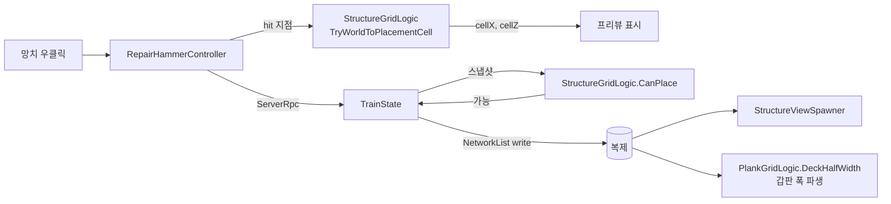

# 건축 시스템 — 갑판 셀 그리드·건축물·판자 증축

> **종류**: 아키텍처 명세 · **상태**: 구현 완료 (건축 개편 1~3차 · 플레이 검증 통과)
> **최종 갱신**: 2026-08-20 · **관련 문서**: [건축 시스템 개편 계획](../../plans/features/건축-시스템-개편-계획.md) ·
> [개발 가이드 §5 M3](../../guide/Train-Survival-개발-가이드.md)
> **짝 문서**: [열차 상태 모델](train-state-model.md) — 편성·파괴·이탈은 그쪽이 다룬다

## 1. 개요·목적

**칸의 개성은 칸 종류가 아니라 그 위에 짓는 것이 만든다.** 원안의 "온실칸·무기고칸" 같은 칸 종류
분화를 폐기하고(2026-08-01 확정), 기관차 외 모든 칸을 동일한 `Standard`로 통일한 뒤
**갑판을 셀 그리드로 만들어 건축물을 배치**하는 방향으로 바꿨다.

건축 개편(1~3차)은 그 위에서 세 가지를 더 세웠다 —

1. **칸당 1개 전제 폐기** → 셀 그리드 + 발자국(footprint) + 90° 회전
2. **판자 증축** → 갑판 폭이 상수가 아니라 **데이터에서 파생**된다
3. **파괴 = 소실이 아니라 회수 가능** → 보따리로 배출

## 2. 범위 (Scope)

**포함**: 갑판 셀 좌표계, 건축물 배치·회전·점유 판정, 철거·환불, 건축물 피해·수리,
판자 증축과 갑판 폭 파생, 창고 블록 슬롯 매핑, 설치 프리뷰.

**미포함**: 편성·파괴·이탈(→ [train-state-model.md](train-state-model.md)) · 수리 망치의
입력 처리(같은 문서 §7 경계 참조) · 창고 내용물·보따리 아이템(→ [inventory/hotbar.md](../inventory/hotbar.md)) ·
건축물 효과의 소비처(체온·연료·제작).

## 3. 요구사항 → 설계 해석

| 요구사항 | 출처 | 설계적 해석 |
|---|---|---|
| 한 칸에 여러 건축물 | 건축 개편 1차 | 갑판을 **셀 그리드**로 나누고 각 건축물이 발자국만큼 점유. 식별은 리스트 인덱스가 아니라 **서버 발급 `Id`** |
| 건축물마다 크기가 다르다 | 〃 | `FootprintWidth`/`Length` + `Rotation`(90° 단위) — 회전 시 가로·세로 스왑 |
| 갑판을 넓히고 싶다 | 건축 개편 3차 | **판자 열 증축** — 칸 양옆에 셀 열을 추가. 갑판 반폭이 판자 수에서 파생된다 |
| 파괴된 창고 내용물이 사라지면 안 된다 | M5 8차 | 건축물 파괴 = 그 칸 갑판에 **보따리 스폰**, 칸 파괴 = 지상 포물선 투척 |
| 몬스터가 건축물을 통과하면 안 된다 | 건축 개편 1차 | `IsStructureBlockingAt` — **그리드 점유 조회**라 물리 쿼리 비용이 0 |
| 배치 규칙을 테스트할 수 있어야 한다 | [SOLID §S](../../conventions/solid-principles.md) | 좌표 변환·점유·회전을 `StructureGridLogic`(순수 static 19개)로 분리 |

## 4. 시스템 구조

| 구성요소 | 역할 | 계층 |
|---|---|---|
| `StructureGridLogic` | 셀 좌표 변환 · 점유 · 회전 · 배치 가능 · 피해·수리 (static 19) | 순수 C# static |
| `PlankGridLogic` | 판자 열 증축 가능 여부 · **갑판 반폭 파생** (static 6) | 순수 C# static |
| `StorageBlockLogic` | 창고 블록 ↔ 슬롯 인덱스 매핑 · 제거 시 스왑 계획 | 순수 C# static |
| `StructureEntry` | 복제 단위 struct | 데이터 |
| `StructureCatalog` | 종류별 정의 (SO) | ScriptableObject |
| `TrainState` | `_structures` `NetworkList` 소유 · 변이 확정 | `NetworkBehaviour` |
| `RepairHammerController` | 조준·입력·`ServerRpc` 송신 | `NetworkBehaviour` |
| `StructureViewSpawner` / `StructureView` | 복제 상태 → 표현 생성·갱신 | `MonoBehaviour` |
| `PlankViewSpawner` / `PlankView` | 판자 표현 | `MonoBehaviour` |
| `StructurePlacementGhostView` / `CarBuildGhostView` | 설치 프리뷰(바닥 사각형) | `MonoBehaviour` |



## 5. 데이터 구조

### 5.1 `StructureEntry` (복제 단위)

| 필드 | 타입 | 의미 |
|---|---|---|
| `Id` | `ushort` | **서버 발급 안정 식별자** — 철거·피해·수리·HUD가 이걸로 참조 |
| `CarIndex` | `byte` | 어느 칸 |
| `CellX` / `CellZ` | `byte` | 갑판 셀 좌표 |
| `Rotation` | `byte` | 90° 단위 회전 |
| `Kind` | `StructureKind` | 종류 |
| `FootprintWidth` / `FootprintLength` | `byte` | 점유 크기 (회전 전 기준) |
| `Health` / `MaxHealth` | `float` | 내구 |

> **리스트 인덱스를 보관하면 안 된다.** 제거 시 재배열되므로 식별은 반드시 `Id`로 한다 —
> `ITrainState`가 `TryGetStructureAt(listIndex)`와 `TryGetStructureById(id)`를 나눠 제공하는 이유다.

### 5.2 `StructureKind` — 7종

`Dome(0)` · `Heater(1)` · `Storage(2)` · `Workbench(3)` · `Campfire(4)` · `Purifier(5)` · `Furnace(6)`

### 5.3 `StructureCatalog.Entry` — 종류가 데이터로 정의된다

| 필드 | 의미 |
|---|---|
| `_maxHealth` · `_buildCost` · `_refundResource` | 내구·비용·환불 자원 |
| `_providesShade` | 체온 차폐 (지붕) |
| `_providesHeat` · `_heaterFuelPerSecond` | 난방 · 연료 소모 |
| `_providesStorageBlock` | 창고 슬롯 블록 제공 |
| `_footprintWidth` · `_footprintLength` | 점유 크기 |
| `_placeable` | 설치 가능 목록에 넣을지 |
| `_viewPrefab` | 표현 프리팹 |

> **OCP가 성립하는 지점**: 새 건축물 종류를 추가할 때 코드가 아니라 **카탈로그 항목**을 늘린다.
> 효과 축(차폐·난방·창고)은 이미 불린 필드로 열려 있다.

## 6. 상세 로직·상태

### 6.1 셀 좌표계

```
본체 열 수  = BodyColumns(carWidth, cellSize)        = 3 m / 1 m = 3열
행 수       = Rows(carLength, cellSize)              = 12 m / 1 m = 12행
열 중심 X   = ColumnCenterWorldX(cellX, bodyColumns, cellSize)
월드 X → 열 = WorldXToColumn(worldX, bodyColumns, cellSize)
```

판자 열은 본체 열 바깥에 **좌우로 확장**된다 — `PlankColumn(side, ordinal, bodyColumns)`가
본체 좌표계와 이어지는 인덱스를 준다.

### 6.2 배치 판정 (`CanPlace`)

회전을 적용한 발자국(`RotatedFootprint`)이 —

1. 칸 갑판 범위 안인가 (판자 증축분 포함)
2. 다른 건축물과 겹치지 않는가
3. 칸이 살아 있는가

셋을 모두 만족해야 한다. 판정은 **복제된 그리드 데이터만** 보므로 전 피어가 같은 결과를 낸다.

### 6.3 판자 증축 — 갑판 폭이 파생된다

건축 개편 3차의 핵심은 **갑판 반폭을 상수에서 파생값으로 바꾼 것**이다.

```
갑판 반폭 = PlankGridLogic.DeckHalfWidth(carWidth, cellSize, plankColumns)
```

`ITrainState.GetDeckHalfWidthAt(position)`가 위치의 Z가 속한 칸의 **그 쪽(X 부호) 판자 열**을 보고
반폭을 돌려준다. 어느 칸에도 속하지 않으면 칸 실물 반폭을 쓴다.

**낙하 판정·몬스터 승차 판정이 이 값을 쓴다** — 칸 폭 상수를 직접 참조하던 코드가 전부 여기로 모였다.

| 제약 | 값 |
|---|---|
| 최대 판자 열 | 1 (`_maxPlankColumns`) |
| 증축 비용 | 3 |
| 제거 조건 | 그 열에 건축물이 없어야 한다 (`ColumnHasStructure`) |

### 6.4 철거·파괴와 배출

| 경로 | 결과 |
|---|---|
| **철거** (망치 홀드) | 환불 = `RefundAmount(buildCost, 0.5)` — 절반 |
| **건축물 파괴** (체력 0) | 그 칸 갑판에 **보따리 스폰**(갑판 휴지 — 열차가 달려도 제자리, 이탈 칸 추종) |
| **칸 파괴** | 그 칸 위 건축물 전부 제거 + 지상 포물선 투척 |
| **슬롯 재건** | 소실 유지 — 이중 생성 방지 |

### 6.5 창고 블록 슬롯 매핑

창고 건축물 하나가 슬롯 **블록** 하나를 제공한다. `StorageBlockLogic`이 블록 인덱스 ↔ 슬롯 오프셋을
매핑하고, 창고가 제거될 때 **뒤 블록을 앞으로 당기는 스왑 계획**(`TryPlanSwapRemove`)을 세운다.

> 스왑이 필요한 이유: 블록을 그냥 지우면 뒤 창고들의 슬롯 인덱스가 전부 밀려 내용물이 어긋난다.

### 6.6 몬스터 관통 차단

`ITrainState.IsStructureBlockingAt(position, padding)` — 월드 지점이 살아 있는 건축물의 점유 영역
안인가. **그리드 점유 조회(복제 데이터)라 물리 쿼리 비용이 없다.**

## 7. 인터페이스·의존성 (경계)

- 건축 확정 API는 `ITrainExpansion`(칸·건축물·판자 건설/철거)에 모여 있고, 수리 망치만 소비한다.
- 건축물 위치 계산은 **상태 쪽에 모았다** — `TryGetStructureCenter(id)`·`TryGetNearestStructure(kind, from)`.
  프리뷰·사거리 검증·보따리 배출이 같은 지점을 쓰게 하고, **호출부가 레이아웃 에셋을 들 필요가 없다.**
- 연료 축은 `CountStructures(kind)`로 난방 건축물 수만 조회한다 — 목록을 직접 훑지 않는다.

## 8. 설계 포인트 (SOLID)

| 원칙 | 적용 |
|---|---|
| **S** | 좌표·점유 = `StructureGridLogic` / 판자 = `PlankGridLogic` / 슬롯 매핑 = `StorageBlockLogic`. 셋 다 순수 |
| **O** | 새 건축물 = 카탈로그 항목 추가. 효과 축이 불린 필드로 열려 있다 |
| **D** | 소비자는 `ITrainState`·`ITrainExpansion`만 본다 |

**남은 문제**: `RepairHammerController`(1,115줄)가 수리·건축물·판자·칸 건설·재결합 **4개 상호작용
모드**를 한 클래스에서 배선한다 → [리팩터링 조사 보고서 §3.3](../../plans/features/리팩터링-조사-보고서.md).

## 9. Unity 특화

- 건축물 표현은 `StructureViewSpawner`가 복제 상태 변화를 구독해 생성·갱신한다. 스폰은 `PoolManager` 경유.
- **비균등 스케일 칸 아래 스폰 주의** — 칸이 비균등 스케일(4.6, 3.4, 15)이라 자식 좌표가 왜곡된다.
  칸 밑에 무언가를 스폰할 때는 `StructureAnchor` 같은 정규화 홀더를 거쳐야 한다.
- 설치 프리뷰는 **바닥 사각형**이다(건축 개편 3차 변경) — 입체 고스트는 어디에 놓이는지 읽기 어려웠다.

## 10. 테스트 케이스 (EditMode)

`StructureGridLogic`·`PlankGridLogic`·`StorageBlockLogic`이 순수 static이라 전 경계를 고정한다 —
회전 발자국 스왑 · 겹침 판정 · 갑판 경계 · 판자 열 인덱스 변환 · 갑판 반폭 파생 ·
창고 블록 제거 스왑 계획 · 환불 계산 · `Id` 조회.

## 11. 리스크·미결정 (TBD)

| # | 항목 | 상태 |
|---|---|---|
| 1 | 최대 판자 열 1 — 확장 시 갑판 폭 파생·낙하 판정 재검증 필요 | 데이터 상한 |
| 2 | 돔이 프리미티브로 잔존 (모델 미보유) | M8 이월 |
| 3 | 건축물 효과 축이 불린 3개(차폐·난방·창고) — 4번째 축이 생기면 필드 추가 | 확장 시 판단 |

## 12. 확장 여지

- **거치 무기**를 건축물 종류로 넣는 방향 — 조작권 점유 모델만 추가하면 그리드·배치·파괴가 재사용된다.
- **다층 건축** — 현재 셀당 1개. 높이 축을 넣으면 `CellY`가 필요하다.

## 13. 파일 위치

```
Assets/_Project/Scripts/Gameplay/Train/
├─ StructureGridLogic.cs      순수 — 좌표·점유·회전·배치·피해·수리 (static 19)
├─ PlankGridLogic.cs          순수 — 판자 증축·갑판 반폭 파생 (static 6)
├─ StorageBlockLogic.cs       순수 — 창고 블록 ↔ 슬롯 매핑
├─ StructureEntry.cs / StructureKind.cs / PlankSide.cs
├─ StructureCatalog.cs        SO — 종류별 정의
├─ RepairHammerController.cs  입력·조준·ServerRpc
├─ RepairHammerSettings.cs / RepairHammerView.cs
├─ StructureViewSpawner.cs / StructureView.cs
├─ PlankViewSpawner.cs / PlankView.cs
├─ StructurePlacementGhostView.cs / CarBuildGhostView.cs
├─ CarBuildAimLogic.cs / CarRecoupleAimLogic.cs / PlankAimLogic.cs   순수 조준 기하
└─ TrainStorage.cs / ITrainStorage.cs   창고 내용물
```
