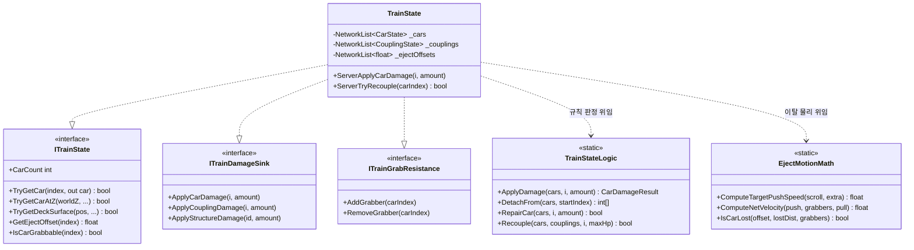

# 열차 상태 모델 — 편성·파괴·연쇄 이탈·수리

> **종류**: 아키텍처 명세 · **상태**: 구현 완료 (M3 · 이후 M5~M8에서 확장)
> **최종 갱신**: 2026-08-20 · **관련 문서**: [개발 가이드 §6.3](../../guide/Train-Survival-개발-가이드.md) ·
> [손잡이·이탈저항 스펙](../../design/Train-Survival-손잡이-이탈저항-스펙.md) ·
> [네트워크 아키텍처 §4.2](../../design/Train-Survival-네트워크-아키텍처.md)
> **짝 문서**: [건축 시스템](construction.md) — 갑판 위 그리드·건축물·판자는 그쪽이 다룬다

## 1. 개요·목적

열차는 **호스트가 소유하는 단일 상태 모델**이다(가이드 §6.3). 칸 배열·연결부·건축물·이탈 오프셋이
하나의 `NetworkBehaviour`에 모여 있고, 변화는 **원자적으로 확정한 뒤 전파**되므로 클라이언트에
부분 적용된 중간 상태가 보이지 않는다.

이 모델이 중요한 이유는 두 가지다 —

1. **재접속 복원의 원천**이다. M6 재접속은 이 상태를 후발 동기화해 복귀 플레이어의 화면을 만든다.
2. **게임의 방어 대상**이다. 밤 웨이브의 공격 목표·수리 대상·건축 기반이 전부 이 상태를 본다.

## 2. 범위 (Scope)

**포함**: 편성 구조(칸·연결부)와 복제, 파괴 판정과 후방 연쇄 이탈, 이탈 칸의 물리(밀림·저항·소실),
클라이언트 표시 보간, 수리, 재결합, 칸 증설, 손잡이 잡기 인원 집계.

**미포함**: 갑판 그리드·건축물·판자(→ [construction.md](construction.md)) · 수리 망치의 입력·조준
(→ 같은 문서) · 연료 소모(→ [world/fuel-loop.md](../world/fuel-loop.md)) · 열차 외형 배치
(→ [world/train-art-layout.md](../world/train-art-layout.md)).

## 3. 요구사항 → 설계 해석

| 요구사항 | 출처 | 설계적 해석 |
|---|---|---|
| 중간 상태가 클라이언트에 보이면 안 된다 | 가이드 §5 M3 | 변이는 **스냅샷 → 순수 로직 판정 → 일괄 write-back** 순서. `NetworkList` 개별 write가 아니라 배열 단위로 확정 |
| 기관차는 파괴 불가 | 가이드 §6.3 (불변식) | `TrainStateLogic.IsDestructible(CarType)`가 강제 — 호출부가 아니라 **순수 로직이 불변식의 소유자** |
| 연결부 파괴 = 후방 연쇄 이탈 | 기획서 · M3 범위 | `DetachFrom(startIndex)`가 그 뒤 전체를 한 번에 분리. 연결부는 **열차 끝에서부터 순차 파괴**만 가능 |
| 이탈 칸은 회수 가능해야 한다 | 기획서 §9.1 확정 | 손잡이 잡기 인원 × 견인력이 밀림 속도를 상쇄 — 순 속도가 음수면 슬롯으로 당겨진다 |
| 재접속 시 열차 상태 복원 | 가이드 §5 M3 완료 기준 | 상태를 쪼개지 않고 `NetworkList` 5개에 모아 후발 동기화만으로 복원 |
| 규칙을 테스트할 수 있어야 한다 | [SOLID §S](../../conventions/solid-principles.md) | 판정은 전부 `TrainStateLogic`(순수 static) — `NetworkBehaviour`는 복제·발행만 |

## 4. 시스템 구조

| 구성요소 | 역할 | 계층 |
|---|---|---|
| `TrainState` | `NetworkList` 5개 소유 · 변이 확정 · 권위 이벤트 발행 | `NetworkBehaviour` |
| `TrainStateLogic` | 편성 규칙 순수 계산 (`public static` 18개) | 순수 C# static |
| `EjectMotionMath` | 이탈 물리 순수 계산 (밀림·저항·소실·표시 보간) | 순수 C# static |
| `TrainLayoutMath` | 좌표 ↔ 칸 인덱스 역산 | 순수 C# static |
| `CarState` / `CouplingState` | 복제 단위 struct (`INetworkSerializable`) | 데이터 |
| `TrainLayoutSettings` / `TrainDurabilitySettings` / `TrainExpansionSettings` | 치수·내구·증설 데이터 | ScriptableObject |
| `CarView` / `CouplingPart` / `HandrailAnchor` | 표현·충돌·잡기 앵커 | `MonoBehaviour` |

### 4.1 인터페이스 분리 — 이 도메인의 핵심 설계

`TrainState`는 **6개의 좁은 인터페이스**를 구현하고, 소비자는 자기가 쓰는 면만 참조한다.

| 인터페이스 | 멤버 | 소비자 |
|---|---|---|
| `ITrainState` | 조회 16 | HUD · `CarView` · 몬스터 · 플레이어(갑판 판정) |
| `ITrainDamageSink` | 3 (칸·연결부·건축물 피해) | 몬스터 공격 |
| `ITrainRepairSink` | 1 (`ServerApplyRepair`) | 수리 망치 |
| `ITrainExpansion` | 증설·건축 확정 | 수리 망치 |
| `ITrainRecouple` | 3 (재결합) | 수리 망치 |
| `ITrainGrabResistance` | 3 (잡기 인원 증감·조회) | 집게 앵커 모드 |

> **왜 이렇게 나눴는가**: 몬스터는 피해만 주면 되는데 건축 API까지 보이면 잘못 쓸 수 있다.
> 구현체가 하나여도 **계약을 나누면 오용 경로가 사라진다** — [SOLID §I](../../conventions/solid-principles.md).
> 변이는 인터페이스 밖의 `ServerXxx` 메서드로도 노출되지만, 조회 계약(`ITrainState`)에는 없다.



## 5. 데이터 구조

### 5.1 복제 상태 — `NetworkList` 5개

| 리스트 | 원소 | 의미 |
|---|---|---|
| `_cars` | `CarState` | 칸 배열 — **인덱스 0 = 기관차(선두)**, 값이 클수록 후방 |
| `_couplings` | `CouplingState` | 연결부 (= 칸 수 − 1) |
| `_structures` | `StructureEntry` | 갑판 위 건축물 (→ [construction.md](construction.md)) |
| `_ejectOffsets` | `float` | 칸별 이탈 오프셋(m) — 슬롯 기준 뒤로 밀려난 거리 |
| `_grabberCountsSync` | `int` | 칸별 손잡이 잡은 인원 |

**상태를 쪼개지 않는 이유**: 복제 단위가 늘면 재접속 후발 동기화의 순서 의존이 생긴다.
칸이 있는데 연결부가 아직 안 온 중간 상태를 소비자가 보게 된다.

### 5.2 `CarState`

| 필드 | 타입 | 의미 |
|---|---|---|
| `Type` | `CarType` | `Locomotive = 0`(파괴 불가) / `Standard = 1` |
| `Health` / `MaxHealth` | `float` | 내구 |
| `Attached` | `bool` | 편성에 붙어 있는가 — false면 이탈 중 |
| `LeftPlanks` / `RightPlanks` | `byte` | 판자 증축 열 수 (→ [construction.md](construction.md)) |

> **칸 종류가 2개뿐인 이유**: 원안의 "온실칸·무기고칸" 등 칸 종류 분화를 폐기하고
> **칸의 개성은 위에 설치하는 건축물이 만든다**로 바꿨다 (2026-08-01 확정). 칸은 전부 같은 갑판이고,
> 차이는 `StructureEntry`가 만든다.

### 5.3 데이터 에셋 (현재 값)

| 에셋 | 주요 값 |
|---|---|
| `TrainLayoutSettings` | 칸 3량 시작 · 길이 12 m · 폭 3 m · 갑판 높이 3 m · 연결부 간격 1.5 m · 셀 1 m · 바퀴 즉사 높이 1.2 m · 낙오 경고 30 m / 사망 40 m |
| `TrainDurabilitySettings` | 칸 100 · 연결부 60 · 추가 후퇴 2 m/s · 감속 4 m/s² · **1인 견인력 6 m/s** · 소실 거리 45 m · 표시 보정률 3 (한시 1.2 s × 5배) |
| `TrainExpansionSettings` | 최대 5량 · 칸 건설 5 · 건축물 3 · 재결합 2 · 판자 3 · 철거 환불 50 % |

## 6. 상세 로직·상태

### 6.1 변이 파이프라인 — 원자성을 만드는 순서

모든 서버 변이가 같은 4단계를 따른다.

```
① SnapshotCars() / SnapshotCouplings()   — NetworkList → 배열 복사
② TrainStateLogic.Xxx(배열, ...)          — 순수 판정, 배열을 제자리 수정
③ WriteBackCars(배열)                     — 배열 → NetworkList 일괄 반영
④ 권위 이벤트 발행 / Broadcast RPC        — 소비자에게 알림
```

**②가 순수 함수인 것이 이 설계의 핵심**이다 — 규칙이 `NetworkList` API에 묶여 있지 않아
EditMode에서 전 경계를 검증할 수 있고, 부분 적용 상태가 복제될 여지가 없다.

### 6.2 파괴와 연쇄 이탈

| 대상 | 규칙 |
|---|---|
| **칸** | 체력 0 → `DestroyAndDetach(index)` — 그 칸부터 **후방 전체가 이탈**. 기관차는 `IsDestructible`이 막는다 |
| **연결부** | 체력 0 → `DetachFrom(index + 1)` — 그 뒤 칸부터 이탈. **살아 있는 연결부 중 가장 후미만 타격 가능**(`IsCouplingTargetable`) |

> 연결부 타격 순서를 강제하는 이유: 중간 연결부를 먼저 끊으면 편성 배열에 구멍이 생겨
> 슬롯 재건·재결합 규칙이 복잡해진다. **끝에서부터**라는 제약이 상태 공간을 좁힌다.

### 6.3 이탈 칸 물리 (`EjectMotionMath`)

```
목표 밀림 속도 = max(0, 스크롤 속도) + 추가 후퇴(2 m/s)
현재 밀림 속도 → 목표로 감속도(4 m/s²)만큼 MoveTowards   ← 분리 직후 관성 램프
순 속도 = 밀림 속도 − (잡은 인원 × 견인력 6 m/s)
오프셋 = max(0, 오프셋 + 순 속도 × dt)                   ← 슬롯(0) 앞으로는 못 간다
소실 = 잡은 인원 0  AND  오프셋 ≥ 45 m
```

**분리 직후 관성 램프**가 있는 이유 — 분리 순간 속도가 0(열차와 같은 속도)에서 시작해 서서히
올라간다. 없으면 칸이 끊기는 즉시 순간적으로 뒤로 튄다.

> **1인 회수가 가능한 국면이 있다**: 견인력이 절대값(6 m/s)이라 밀림이 느린 국면(분리 직후
> 관성 램프 · 연료 고갈 3.8 m/s · 모래폭풍 5.9 m/s)에서는 1인 순 속도가 음수가 된다.
> 검증 중 "이탈칸 단독 견인" 보고가 있었으나 **조사 결과 버그가 아니라 수식상 성립**이며,
> 호스트·클라 비대칭도 없어 사용자 결정으로 현행 유지했다 (M5 8차).

### 6.4 서버 시뮬 vs 클라이언트 표시 — 실행 주체가 다르다

| | 서버 | 클라이언트 |
|---|---|---|
| 메서드 | `ServerSimulateEjection()` | `ClientSmoothEjectionDisplay()` |
| 하는 일 | 권위 오프셋을 물리로 전진 | 복제 목표를 향해 **표시 오프셋**을 보간 |
| 필요 이유 | 상태의 진실 | 네트워크 틱 계단을 숨긴다 |

클라이언트는 **호스트와 같은 수식으로 재시뮬**한 순 속도로 연속 이동을 유지하고, 복제 목표와의
드리프트는 지수 감쇠로 수렴시킨다. 오차가 스냅 거리 이상이면(후발 접속) 즉시 붙는다.

`ITrainState.GetEjectOffset`은 **서버에선 권위 값, 클라이언트에선 표시 보간 값**을 돌려준다 —
표현·잡기 게이트 용도이며, 잡기 확정 같은 권위 판정은 서버에서 다시 검증된다.

### 6.5 실행 순서 제약

```csharp
[DefaultExecutionOrder(-150)]   // TrainState
```

오프셋 소비자(`CarView` −100, `HandrailAnchor` 등)보다 **먼저** 갱신해, 칸과 손잡이가 같은 프레임의
동일한 오프셋을 읽게 한다. 어긋나면 **손잡이가 칸에서 떠 보인다.**

### 6.6 수리·재결합·증설

| 동작 | 규칙 | 비용 |
|---|---|---|
| 수리 | `ServerApplyRepair(kind, index, amount)` — 부위 종류별 분기 | 무료 (미결: 자원 소모 여부) |
| 재결합 | 이탈 칸을 슬롯(오프셋 0) 근처까지 끌어온 뒤 확정 | 2 |
| 칸 증설 | `FindBuildSlot` — 빈 슬롯 또는 후미. 최대 5량 | 5 |

## 7. 인터페이스·의존성 (경계)

- **등록**: `ServiceLocator`에 위 6개 인터페이스 + `IFuelLoadProvider`로 등록된다.
- **소비 방향**: 몬스터·플레이어·UI·집게가 `TrainState`를 참조하지만 **역방향 참조는 없다** —
  알림은 전부 `EventBus<T>` 발행이다(`CarDestroyedEvent`·`CouplingBrokenEvent`·`CarsDetachedEvent` 등 22종).
- **연료 연동**: `IFuelLoadProvider`로 **칸 수를 노출**해 연료 소모율이 편성 크기에 비례한다 —
  연료 축이 칸 배열을 직접 훑지 않게 하는 경계다.

## 8. 설계 포인트 (SOLID)

| 원칙 | 적용 |
|---|---|
| **S** | 규칙 판정 = `TrainStateLogic` / 물리 = `EjectMotionMath` / 복제·발행 = `TrainState`. **단, 현재 `TrainState`는 1,530줄로 배선이 집중돼 있다** → [리팩터링 조사 보고서 §3.1](../../plans/features/리팩터링-조사-보고서.md) |
| **O** | 내구·치수·비용이 전부 SO — 밸런싱에 코드 수정이 없다 |
| **I** | 인터페이스 6분할 (§4.1) — 소비자가 쓰지 않는 멤버에 의존하지 않는다 |
| **D** | 소비자는 전부 인터페이스 참조. `ServiceLocator` 조회 |

## 9. Unity 특화

- **`NetworkList<T>` 원소는 `INetworkSerializable` + `IEquatable<T>`** — `Equals` 없이는 변경 감지가
  매 프레임 dirty로 잡힌다.
- **`[DefaultExecutionOrder(-150)]`** — §6.5의 프레임 정합.
- **씬 `NetworkObject`** — 열차는 프리팹이 아니라 `Game.unity`에 직접 배치돼 있다. 따라서 모델 교체는
  **씬 YAML 직접 편집** 경로를 쓴다(에디터 저장은 수천 줄 재정렬 diff를 만든다).

## 10. 테스트 케이스 (EditMode)

`TrainStateLogic`·`EjectMotionMath`·`TrainLayoutMath`가 순수 static이라 전 경계를 고정한다 —
기관차 파괴 시도 · 연쇄 이탈 범위 · 연결부 타격 순서 · 재결합 가능 조건 · 슬롯 재건 ·
밀림/견인 순 속도 부호 · 소실 판정 경계 · **이탈 오프셋을 반영한 칸 인덱스 역산**(M4 D7 회귀 고정).

## 11. 리스크·미결정 (TBD)

| # | 항목 | 상태 |
|---|---|---|
| 1 | **수리 시 자원 소모 여부** | 미결 — 현재 무료 (가이드 §7 추적표) |
| 2 | **칸 건설(망치 통합) 플레이 검증 4항목** | 미실시 — 코드·EditMode만 통과 ([M3 검증 기록 요약 §3](../../plans/M3/M3-검증-기록-요약.md)) |
| 3 | 손잡이 회수 모션 램프 · 전원 해제 속도 점프 | 미개선 |
| 4 | 열차 위 원격 플레이어 표시 떨림 | 미해결 — 플레이어 복제 경로 |
| 5 | `TrainState` 1,530줄 분해 | 설계안만 확정, 미실행 |

## 12. 확장 여지

- **칸 종류 추가** — `CarType` enum 확장 지점은 있으나, 설계 방향은 **건축물로 개성을 만드는 것**이다.
- **연결부 다중 타격** — 현재 후미 순차만. 상태 공간이 넓어지므로 신중히.
- **거치 무기(M5 미구현)** — 열차 소유 + 조작권 점유 모델이 달라 보류 중. 이 상태 모델에 조작권
  필드가 붙을 자리다.

## 13. 파일 위치

```
Assets/_Project/Scripts/Gameplay/Train/
├─ TrainState.cs              NetworkBehaviour — 상태 소유·변이 확정·이벤트 발행
├─ TrainStateLogic.cs         순수 규칙 (static 18)
├─ EjectMotionMath.cs         순수 이탈 물리
├─ TrainLayoutMath.cs         좌표 ↔ 칸 역산
├─ CarState.cs / CouplingState.cs / CarType.cs / TrainPartKind.cs
├─ ITrainState.cs / ITrainDamageSink.cs / ITrainRepairSink.cs
├─ ITrainExpansion.cs / ITrainRecouple.cs / ITrainGrabResistance.cs
├─ TrainLayoutSettings.cs / TrainDurabilitySettings.cs / TrainExpansionSettings.cs
├─ TrainEvents.cs             이벤트 22종
├─ CarView.cs / CouplingPart.cs / HandrailAnchor.cs / TrainWheelSpin.cs
└─ (건축 관련은 construction.md 참조)
```
