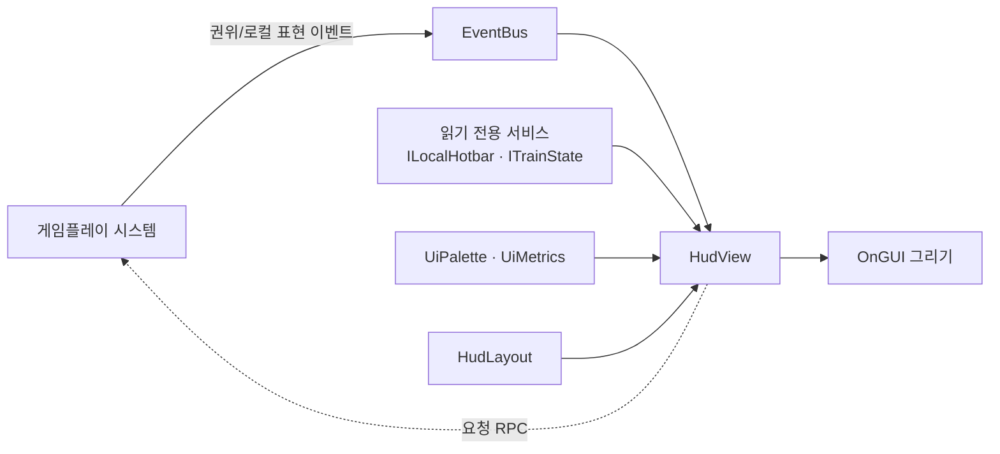

# HUD 아키텍처 — 계층·이벤트 구독·디자인 토큰

> **종류**: 아키텍처 명세 · **상태**: 구현 완료 (M1~M8 누적 · 디자인 토큰 = 2026-08-19~20)
> **최종 갱신**: 2026-08-20 · **관련 문서**: [비주얼·UI/UX 가이드](../../design/Train-Survival-비주얼-UIUX-가이드.md) ·
> [아키텍처 규칙](../../conventions/architecture-rules.md)
> **짝 문서**: [리팩터링 조사 보고서 §3.2·§4.3](../../plans/features/리팩터링-조사-보고서.md) — 현재 구조의 문제와 개선안

## 1. 개요·목적

`Game.UI` 어셈블리(15파일 3,042줄)의 구조 기록이다. 의존 그래프의 **최상단**이라
누구도 UI를 참조하지 않고, UI만 아래를 본다.

관통하는 규약 하나가 모든 파일에 적혀 있다 —

> **UI는 상태를 소유하지 않는다.** 읽기 전용 조회(`ILocalHotbar`·`ITrainState`·`ICraftingStation`)와
> 이벤트 구독으로만 그린다.

## 2. 범위 (Scope)

**포함**: HUD 파일 구성과 각자의 관심사, 이벤트 구독 패턴, 디자인 토큰(색·타이포), 배너 큐,
임계 표시 페이드, 창 배치 공유 치수.

**미포함**: 각 시스템의 상태·규칙(해당 도메인 명세) · 비주얼 규격의 근거(→ 비주얼 가이드) ·
입력 바인딩.

## 3. 요구사항 → 설계 해석

| 요구사항 | 출처 | 설계적 해석 |
|---|---|---|
| UI가 게임 상태를 바꾸면 안 된다 | [아키텍처 규칙](../../conventions/architecture-rules.md) | 조회는 읽기 전용 인터페이스, 변경은 **요청 RPC**만. 확정은 호스트 |
| 로컬 표현 이벤트로 상태를 바꾸지 않는다 | 〃 §이벤트 | HUD는 로컬 표현 이벤트를 **그리기에만** 쓴다 |
| 같은 색이 어디서나 같은 뜻 | [비주얼 가이드 §7.2](../../design/Train-Survival-비주얼-UIUX-가이드.md) | 상태 4단계를 `UiPalette` 상수로 — 하드코딩 색 금지 |
| 해상도가 달라도 읽힌다 | 비주얼 가이드 §13.2 | 타이포 배율을 `UiMetrics`로 파생 |
| 창 2개가 나란히 떠야 한다 | M7 3차 검증 W3-b | 치수를 `HudLayout`에서 공유 — 각자 상수를 들면 한쪽만 바뀔 때 겹친다 |
| 사건이 겹쳐도 화면이 무너지지 않는다 | 비주얼 가이드 §9.2 D계층 | `HudBannerQueue` — 동시에 2개를 넘기지 않는다 |

## 4. 시스템 구조

### 4.1 파일 구성 — 관심사별

| 파일 | 줄수 | 관심사 |
|---|---|---|
| `InventoryHud` | 1,169 | 핫바 · 인벤토리 · 창고 · 보따리 · 엔진/건축/망치 프롬프트 (**7개**) |
| `CoreLoopHud` | 455 | Day/국면 · 연료 · 체력 · 무기/탄약 · 처치 수 |
| `CraftingHud` | 222 | 제작 근접 안내 · 제작 창 |
| `SessionExitHud` | 197 | Esc 세션 메뉴 · 세션 나가기 |
| `FrostbiteHudView` | 187 | 동상 — 화면 결빙 오버레이 + 부위별 단계 |
| `UiPalette` | 185 | **디자인 토큰 — 색** |
| `SliceHud` | 151 | 팀 자원 카운터 · 후미 이탈 경고 |
| `BossHudView` | 147 | 보스 체력바 (마지막 밤 한정) |
| `MainMenuController` | 102 | 호스트 시작 / 클라이언트 접속 |
| `UiMetrics` | 92 | **디자인 토큰 — 타이포·배율** |
| `GameOverHud` | 81 | 전멸 결과 오버레이 |
| `HudLayout` | 50 | 창 배치 공유 치수 |
| `HudBannerQueue` | — | 배너 우선순위·동시 표시 제한 |
| `HudTransientFade` | — | 임계 시에만 등장하는 줄의 등장·퇴장 |

### 4.2 표준 패턴 — `BossHudView`가 기준형

```
OnEnable  → EventBus<T>.Subscribe (자기 관심사만)
콜백      → 로컬 필드에 미러링
OnGUI     → 미러링된 필드로 그리기
OnDisable → Unsubscribe
```

**147줄로 완결된다.** 이 패턴은 상태를 소유하지 않고, 계산하지 않으며, 자기 영역만 그린다.



## 5. 데이터 구조 — 디자인 토큰

### `UiPalette` (비주얼 가이드 §7.2)

| 그룹 | 토큰 |
|---|---|
| 지면·선·글자 | `PanelSoot` #1F1B1A · `PanelLine` #4A423C · `TextSteam` #F2EAE0 · `TextMuted` #9A9089 |
| 강조 | `FocusBrass` #C89B4A · `IronGray` #6B6660 |
| 배경 | `PanelBackdrop`(soot 88%) · `SettingsOverlay`(soot 72%) |
| **상태 4단계** | `SafeFill` #7FA653 → `CautionFill` #E3B23C → `AlertFill` #DD7A2E → `CriticalFill` #B23A2E |

> **이 순서는 게임 전체에서 뒤집히지 않는다.** 같은 색이 어디서나 같은 뜻이어야 한다.
> 리치 텍스트용 `Hex*` 상수도 함께 제공해 문자열 조립 시에도 같은 값을 쓴다.

### `UiMetrics`

타이포 크기와 해상도 배율. 화면 크기에서 배율을 파생해 각 뷰가 같은 기준을 쓴다.

### `HudLayout`

슬롯 크기·간격 등 **창 배치 공유 치수**. 인벤토리 창과 제작 창이 나란히 떠야 하므로
두 뷰가 같은 계산을 본다.

## 6. 상세 로직·상태

### 6.1 HUD 계층 (비주얼 가이드 §9.2)

| 계층 | 성격 | 구현 |
|---|---|---|
| **A — 상시** | 항상 보이는 것 (Day·연료·체력) | `CoreLoopHud` |
| **B — 임계** | 위험할 때만 등장하는 줄 | `HudTransientFade`가 등장·퇴장 계산 |
| **C — 맥락** | 조준·근접 시에만 (건축 프롬프트·제작 안내) | `InventoryHud` · `CraftingHud` |
| **D — 사건** | 배너 (지역 전환·보스 등장) | `HudBannerQueue` — **동시에 2개를 넘기지 않는다** |

### 6.2 이벤트 구독 규약

- **권위 이벤트** — 상태 확정 알림. HUD가 구독해 표시를 갱신한다.
- **로컬 표현 이벤트** — 각 피어가 즉시 발행. HUD 갱신·연출용.
- **HUD는 어느 쪽이든 그리기에만 쓴다.** 게임 상태를 바꾸지 않으므로 로컬 표현 이벤트를
  구독해도 [아키텍처 규칙](../../conventions/architecture-rules.md)의 "미확정 상태를 진실처럼
  소비하는" 문제가 생기지 않는다.

### 6.3 입력을 UI가 처리하는 범위

I키(인벤토리 토글) · 드래그 재배치 · Esc(세션 메뉴)는 **UI 계층에서 처리한다** —
창 표시와 재배치 *요청*일 뿐이고, 확정은 호스트다.

## 7. 인터페이스·의존성 (경계)

```
Game.Utilities ← Game.Core ← Game.Systems ← Game.Gameplay ← Game.UI
```

`Game.UI`는 **최상단**이라 누구도 참조하지 않는다. 따라서 UI 변경이 게임플레이를 깨뜨릴 수 없다.
UI가 참조하는 것: `Game.Core.Events`(8) · `Game.Core.Services`(6) · `Game.Gameplay.*`(각 도메인의
읽기 인터페이스) · `Game.Systems.Networking`(3) · `Unity.InputSystem`(토글 입력).

## 8. 설계 포인트 (SOLID)

| 원칙 | 적용 | 현재 상태 |
|---|---|---|
| **S** | 뷰 하나 = 관심사 하나 | ✅ `BossHudView`·`GameOverHud`·`FrostbiteHudView` / ⚠ `InventoryHud`는 **7개** |
| **O** | 새 표시 = 새 뷰 추가 + 이벤트 구독. 기존 뷰 무수정 | ✅ 성립 |
| **D** | 읽기 전용 인터페이스·이벤트에만 의존 | ✅ 규약으로 명문화 |

### 8.1 알려진 문제 2건

| 문제 | 내용 |
|---|---|
| **`InventoryHud` 미분할** | 잘못된 패턴이 아니라 **같은 패턴을 7개 관심사로 나누지 않은 것**. `BossHudView` 형태로 5~6개 뷰로 쪼개면 해소된다 |
| **SSOT 위반** | `BuildSpendPreview`가 `HotbarLogic.TryRemoveAnyResource`를 호출해 **서버의 자원 차감 순서를 UI에서 재현**한다. 규칙이 바뀌면 두 곳을 고쳐야 하고, 한 곳만 고치면 미리보기와 실제가 어긋난다 |

설계안과 비용은 [리팩터링 조사 보고서 §4.3](../../plans/features/리팩터링-조사-보고서.md)에 있다.

## 9. Unity 특화

- **전부 `OnGUI`(즉시 모드)**다. 매 프레임 상태를 읽어 그리므로 별도 갱신 신호가 필요 없고,
  프로토타이핑이 빠르다. 대신 레이아웃을 코드로 계산해야 해서 파일이 길어진다.
- **UI Toolkit 이행은 하지 않았다** — 10개 파일 전면 교체 비용(3~4일) 대비 지금 얻는 것이 없고,
  M8 아트 패스와 충돌한다. Presenter 계층 도입도 이 이행과 함께 판단한다.
- `GUIStyle`은 첫 사용 시 생성해 캐시한다 — `OnGUI`에서 매 프레임 new 하면 GC가 튄다.

## 10. 테스트 케이스 (EditMode)

`OnGUI` 자체는 테스트하지 않는다. 대신 순수 계산을 분리해 고정한다 —
`HudTransientFade`(등장·퇴장 진행도 경계) · `HudBannerQueue`(우선순위·동시 표시 제한) ·
`UiMetrics`(해상도별 배율).

## 11. 리스크·미결정 (TBD)

| # | 항목 | 상태 |
|---|---|---|
| 1 | `InventoryHud` 1,169줄 분할 | 설계안 확정, 미실행 (1.5일 · 프리팹 재배선 있음) |
| 2 | `BuildSpendPreview` SSOT 위반 | **최우선 권고** (0.5일 · 재배선 없음) |
| 3 | UI Toolkit 이행 시점 | M8 아트 패스 이후 판단 |
| 4 | 버리기 기능 게이트 off | 코드 경로는 유지, `DropEnabled` 플래그만 열면 재개 (M5 8차 사용자 방침) |

## 12. 확장 여지

- 뷰 추가는 이벤트 구독만으로 성립하므로 **확장 비용이 낮다.**
- 디자인 토큰이 들어와 색·타이포 변경이 한 곳에서 끝난다 — 테마 전환의 기반이 이미 있다.

## 13. 파일 위치

```
Assets/_Project/Scripts/UI/
├─ UiPalette.cs          디자인 토큰 — 색 (상태 4단계)
├─ UiMetrics.cs          디자인 토큰 — 타이포·배율
├─ HudLayout.cs          창 배치 공유 치수
├─ HudBannerQueue.cs     배너 우선순위·동시 표시 제한 (D계층)
├─ HudTransientFade.cs   임계 표시 등장·퇴장 (B계층)
├─ CoreLoopHud.cs        A계층 — Day·연료·체력·탄약
├─ InventoryHud.cs       핫바·인벤토리·창고·보따리·프롬프트 (분할 대상)
├─ CraftingHud.cs / BossHudView.cs / FrostbiteHudView.cs
├─ GameOverHud.cs / SessionExitHud.cs / SliceHud.cs
└─ MainMenuController.cs
```
