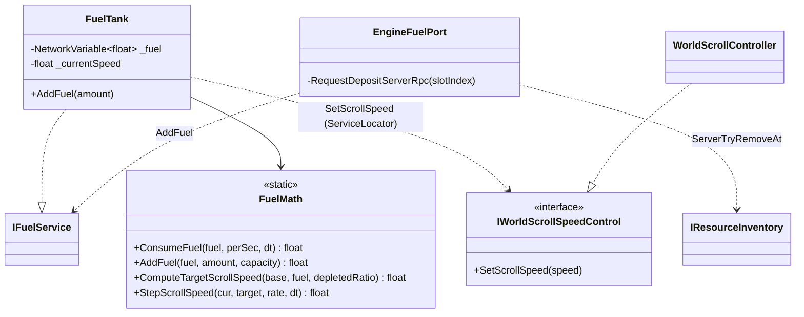
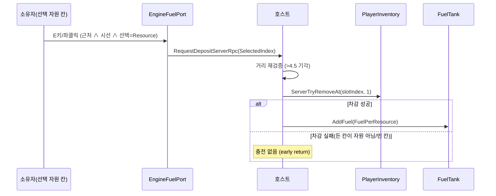

# 연료 루프 (엔진 투입 → 충전 → 소모 → 감속)

> **종류**: 아키텍처 명세 · **상태**: 구현 완료 (M2 골격 → M3 칸 비례 → M5 발열량 → M7 건축물 소모)
> **최종 갱신**: 2026-08-28 · **관련 기획서**: [Train-Survival-기획서 §3.4](../../design/Train-Survival-기획서.md) · [네트워크 아키텍처 §4](../../design/Train-Survival-네트워크-아키텍처.md) · [개발 가이드 §5 M2](../../guide/Train-Survival-개발-가이드.md) · [world/scroll-and-streaming](scroll-and-streaming.md)
> **짝 문서**: [상호작용 중재](../player/interaction-arbitration.md) — 화구는 기관차 고정 제작 지점과
> **거의 같은 자리**라 늘 함께 성립한다. 둘 중 어느 것이 E키를 받는가는 그쪽이 정한다

## 1. 개요·목적

운반 루프의 종착점이다. **채집 → 개인 인벤토리 → 엔진 투입 → 연료 충전**을 완성하고, 연료가 상시
소모되며 **고갈 시 월드 스크롤 속도가 감속**된다(= 열차가 느려짐). 연료·속도 모두 호스트 권위이며,
연료 잔량이 속도 제어면(`IWorldScrollSpeedControl`)을 통해 스크롤 속도로 이어지는 도메인 경계가 핵심이다.

## 2. 범위 (Scope)

**포함**: 공유 연료 탱크·상시 소모·감속 수렴(`FuelTank`, `IFuelService`), 연료 순수 계산(`FuelMath`),
엔진 투입구 상호작용(`EngineFuelPort`), 밸런스 데이터(`FuelSettings`), 연료·안내 이벤트(`FuelEvents`,
`TrainEvents`), 스크롤 속도 제어 계약(`IWorldScrollSpeedControl`, 수신 측 `WorldScrollController`).

**M3~M7에서 추가된 포함 범위**: 칸 수 비례 소모(M3 트레이드오프 — `ConsumptionPerCar`),
자원 종류별 **발열량 차등**(M5 1차), 연료를 태우는 건축물의 소모 가산(M7 3차 강화 난방로).

**미포함**: 든 칸 차감 자체(→ [inventory](../inventory/hotbar.md)의 `ServerTryRemoveAt`), 월드 스크롤·타일
스트리밍 본체(→ [scroll-and-streaming](scroll-and-streaming.md)), 환경 배율 감속(날씨 — →
[region/weather-events](../region/weather-events.md)), 건축물 배치(→ [train/construction](../train/construction.md)).

## 3. 요구사항 → 설계 해석

| 요구사항 | 출처 | 설계적 해석 |
|---|---|---|
| 투입은 요청→호스트가 (차감+충전) 원자적 확정 | 네트워크 §4, 가이드 M2 | `RequestDepositServerRpc`에서 `ServerTryRemoveAt` 성공 시에만 `AddFuel` — 차감 실패면 충전 없음 |
| 연료 잔량 동기화 | 네트워크 §4 | `NetworkVariable<float> _fuel`, 서버만 쓰기 |
| E키 1회 = 1개 투입 | 기획서 §3.4 | E키/좌클릭 `wasPressedThisFrame` 1회 = RPC 1건 |
| 근처+시선일 때만 안내·투입 | 커밋 1f69dac | 범위(`_interactRadius`) ∧ 시선(`_lookDotThreshold`) 결합 |
| 든 칸만 소모 | 커밋 1f69dac | 선택 슬롯이 `Resource`일 때만, `SelectedIndex`를 서버에 전달해 그 칸 차감 |
| 연료 소모 → 감속 | 기획서 §3.4 | 연료 유무로 목표 속도를 정하고 `IWorldScrollSpeedControl`로 수렴 |

## 4. 시스템 구조

| 구성요소 | 역할 | 계층 |
|---|---|---|
| `FuelTank` | 호스트 권위 연료 소모 + 목표 스크롤 속도 수렴, `IFuelService` 구현 | `NetworkBehaviour` |
| `FuelMath` | 소모·충전·목표속도·수렴 순수 계산 | 순수 C# static |
| `EngineFuelPort` | 엔진 투입구 상호작용(근처+시선, E/좌클릭) | `NetworkBehaviour` |
| `FuelSettings` | 연료 밸런스 데이터 | `ScriptableObject` |
| `FuelEvents` / `TrainEvents` | 연료 변경 / 투입 안내 이벤트 | 순수 C# struct |
| `IFuelService` | 연료 상태 계약(`Fuel`/`Capacity`/`AddFuel`) | 인터페이스 |
| `IWorldScrollSpeedControl` | 스크롤 속도 제어면(조회와 분리) | 인터페이스 |
| `WorldScrollController` | 스크롤 속도 권위 소유자(속도 수신) | `NetworkBehaviour` |



## 5. 데이터 구조

### `FuelSettings`

| 필드 | 현재값 | 의미 |
|---|---|---|
| `Capacity` | 100 | 최대 저장량 |
| `InitialFuel` | 60 | 초기 연료 |
| `ConsumptionPerSecond` | **0.5** | 기본 초당 소모율 |
| `ConsumptionPerCar` | **0.15** | **칸 1량당 추가 소모** (M3 증설 트레이드오프) |
| `FuelPerResource` | 6 | 기본 충전량 — **자원 종류별 발열량이 이를 대체**한다 (§6.4) |
| `DepletedSpeedRatio` | 0.3 | 고갈 시 기본 속도 대비 유지 비율 |
| `SpeedChangeRate` | 1.5 | 가감속률 (m/s²) |

### 발열량 차등 (M5 1차 — `ResourceCatalog`)

| 자원 | 발열량 |
|---|---|
| 목재 | **6** |
| 고철 | 3 |
| 돌 | 2 |
| 화약 원료·탄약 | **투입 불가** |

> 이 표가 **지역 연료 차별화를 데이터만으로** 만든다 — 숲(목재)에서는 연료가 넉넉하고,
> 사막(고철·화약 원료)에서는 같은 개수를 모아도 절반만 탄다.

### `EngineFuelPort` 판정 상수

| 필드 | 기본값 | 의미 |
|---|---|---|
| `_interactRadius` | 3 | 상호작용 반경(서버 재검증은 +1.5 = 4.5) |
| `_lookDotThreshold` | 0.8 | 시선 내적 임계(카메라 없으면 true 폴백) |

## 6. 상세 로직·상태

### 6.1 투입 (원자적 차감+충전)



- **왜 원자적인가**: 차감과 충전이 같은 서버 RPC 본문에서 순서대로 일어나고, 차감 실패 시 조기 반환해
  "자원은 사라졌는데 연료가 안 찬" 중간 상태가 없다.
- **든 칸만 소모**: 선택 슬롯이 `Resource`가 아니거나 I 패널이 열려 있으면 클라이언트에서 아예 요청하지
  않고, 서버도 `ServerTryRemoveAt`가 그 칸이 자원일 때만 성공한다(이중 방어).
- **근처+시선**: `inRange ∧ IsLookingAtPort`일 때만 안내·투입 — 지나가기만 해도 안내가 뜨던 문제 해소.

### 6.2 소모 → 감속 (`FuelTank.Update`, 서버 전용)

```
rate  = FuelMath.ComputeConsumptionPerSecond(base, perCar, 붙어있는 칸 수)   ← M3
rate  = FuelMath.AddStructureConsumption(rate, ...)                          ← M7 3차
_fuel = FuelMath.ConsumeFuel(_fuel, rate, dt)
target = FuelMath.ComputeTargetScrollSpeed(BaseScrollSpeed, _fuel, DepletedSpeedRatio)
next   = FuelMath.StepScrollSpeed(_currentSpeed, target, SpeedChangeRate, dt)
변화 있으면 → ServiceLocator.TryGet<IWorldScrollSpeedControl>().SetScrollSpeed(next)
```

**소모율의 3요소** (M2 → M3 → M7로 누적):

| 요소 | 출처 | 의미 |
|---|---|---|
| 기본 0.5/s | M2 | 상시 |
| **+ 칸 수 × 0.15/s** | M3 | 편성이 길수록 연료를 먹는다 — **증설 트레이드오프** |
| **+ 연료 건축물** | M7 3차 | 강화 난방로가 태우는 몫. 칸 수는 `IFuelLoadProvider`(= `TrainState`), 건축물 수는 `ITrainState.CountStructures(kind)`로 조회 |

> **소모와 HUD 표시가 같은 계산을 공유한다** — "표시된 소모율"과 "실제 소모"가 갈리지 않게
> `FuelTank`가 하나의 값을 산출해 둘 다에 쓴다.

- **감속은 이진 목표 + 수렴**: 연료가 있으면 목표=기본 속도, 고갈이면 목표=기본×`DepletedSpeedRatio`.
  현재 속도를 `MoveTowards`로 `SpeedChangeRate`만큼 목표에 수렴시켜 급변하지 않는다. (연속 배율 곡선은
  아직 없음 — 있음/고갈 이진.)
- **도메인 경계**: `FuelTank`(연료 권위)가 `WorldScrollController`(속도 권위)를 직접 참조하지 않고
  `IWorldScrollSpeedControl` 서비스로만 속도를 지시. 실제 스크롤 속도는 `_scrollSpeed` NetworkVariable로
  전 피어에 복제된다.

### 6.3 이벤트

- `FuelChangedEvent(Fuel, Capacity)` — `_fuel.OnValueChanged` 콜백에서 각 피어 발행(HUD 게이지).
- `EnginePromptLocalEvent(InRange)` — 범위 상태 변화 시 발행(HUD "E — 연료 투입" 안내).

## 7. 인터페이스·의존성 (경계)

- **`IFuelService`** — `AddFuel`은 서버 전용(클라 호출 무시). 투입구가 이 계약으로만 연료를 채운다.
- **`IWorldScrollSpeedControl`** — 조회(`IWorldScrollService`)와 **분리된** 제어면(ISP). 속도를 낮출 권한은
  호스트 로직만 갖고, 조회자는 속도를 바꿀 수 없다.
- **`IResourceInventory`** — 든 칸 차감을 [inventory](../inventory/hotbar.md)의 `ServerTryRemoveAt`로 위임.
- **권위 이벤트 vs 로컬 안내**: 연료 잔량(`FuelChangedEvent`)은 복제 값 기반 권위 표현, 투입구
  안내(`EnginePromptLocalEvent`)는 각자 로컬 표현.

## 8. 설계 포인트 (SOLID)

| 원칙 | 적용 |
|---|---|
| **SRP** | 연료 수식(`FuelMath`)·연료 권위(`FuelTank`)·상호작용(`EngineFuelPort`)을 분리 |
| **ISP** | 스크롤 속도를 조회면과 제어면으로 분리 — 감속 권한 최소화 |
| **DIP** | 연료↔속도, 연료↔인벤토리를 전부 인터페이스로 연결 — 서로의 구현을 모른다 |
| **강조 패턴 — 원자적 서버 확정** | 차감+충전을 한 RPC에서 순서 처리해 부분 적용 상태를 원천 차단 |

## 9. Unity 특화

- **생명주기**: `FuelTank`는 Game 씬에 1개(호스트 소모 루프). `EngineFuelPort`는 기관차에 배치, 소유자
  로컬 플레이어와의 거리·시선으로 판정.
- **풀링**: 대상 없음(상시 오브젝트).
- **성능 예산**: `FuelTank.Update`는 서버에서 순수 산술 3회 + 속도 변화 시에만 서비스 호출. 투입구는
  거리 제곱·내적 비교뿐.
- **에디터 툴 필요 여부**: 없음. 밸런스는 `FuelSettings.asset`.

## 10. 테스트 케이스

| 테스트 파일 | 검증 항목 |
|---|---|
| `FuelMathTests` (6개) | 소모는 시간 비례·0 하한, 충전은 용량 상한·음수 무시, 연료 유무로 목표 속도(기본/최저), 가감속률 수렴, 한 스텝 변화가 가감속률 초과 안 함 |

`FuelTank`/RPC/`EngineFuelPort` 상호작용은 EditMode 대상 밖 — 순수 `FuelMath`만 검증.

## 11. 리스크·미결정 (TBD)

| 항목 | 상태 |
|---|---|
| 이진 감속 vs 연속 곡선 | **미해소** — 현재 있음/고갈 이진 목표. 연료량 비례 연속 감속이 필요하면 `ComputeTargetScrollSpeed`만 곡선화 |
| ~~칸 증설 소모 증가~~ | **해소 (M3)** — `ConsumptionPerCar` 0.15/량 |
| 밸런스 수치 | 전부 SO — 반복 밸런싱에서 조정 |
| 연료 고갈 속도가 이탈 칸 회수를 쉽게 만든다 | 고갈 시 3.8 m/s로 느려져 **1인 견인이 수식상 성립**한다. 조사 결과 버그 아님 — 사용자 결정으로 현행 유지 (M5 8차, → [train/train-state-model §6.3](../train/train-state-model.md)) |

## 12. 확장 여지

- `IWorldScrollSpeedControl`의 **환경 배율 레이어**가 M4에서 추가돼 날씨 감속이 연료 감속과 충돌하지
  않는다 — 기본 속도와 환경 배율을 분리하고 곱으로 최종 속도를 산출한다. 부스트 아이템 등 다른
  개입원도 같은 레이어를 쓴다.
- 발열량이 `ResourceCatalog` 필드라 **새 연료 자원 추가에 코드 수정이 없다.**
- 칸별 소모 가중치(M3)는 `ConsumptionPerSecond`를 열차 상태 모델에서 산출하도록 확장하면 얹힌다.

## 13. 파일 위치

| 구분 | 파일 | 경로 |
|---|---|---|
| 연료 권위 | `FuelTank.cs` | `Assets/_Project/Scripts/Gameplay/World/` |
| 순수 로직 | `FuelMath.cs` | 〃 |
| 계약 | `IFuelService.cs`, `IWorldScrollSpeedControl.cs` | 〃 |
| 이벤트 | `FuelEvents.cs` | 〃 |
| 데이터 | `FuelSettings.cs` (+ `.asset`) | 〃 (+ `Assets/_Project/Data/`) |
| 투입구 | `EngineFuelPort.cs`, `TrainEvents.cs` | `Assets/_Project/Scripts/Gameplay/Train/` |
| 속도 수신 | `WorldScrollController.cs` | `Assets/_Project/Scripts/Gameplay/World/` |
| 테스트 | `FuelMathTests.cs` | `Assets/_Project/Tests/EditMode/` |
