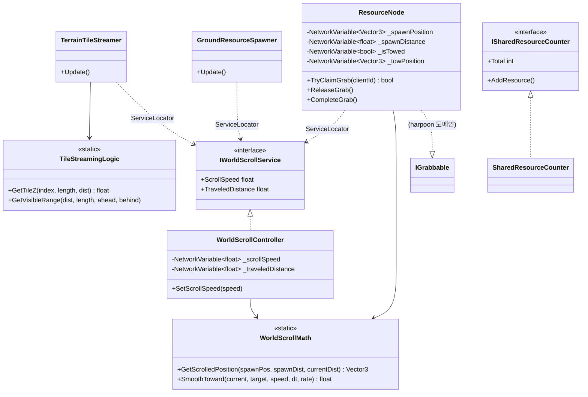

# 월드 스크롤·지형 스트리밍·지상 자원

> **종류**: 아키텍처 명세 · **상태**: 구현중
> **최종 갱신**: 2026-07-20 · **관련 기획서**: [Train-Survival-기획서](../../design/Train-Survival-기획서.md) · [네트워크 아키텍처 §4.1·§8](../../design/Train-Survival-네트워크-아키텍처.md)

## 1. 개요·목적

"열차 원점 고정 + 월드 스크롤" 기준 좌표계(네트워크 문서 §4.1)의 실제 구현체다. 열차는 절대 움직이지 않고,
지형·자원 등 "월드 소속" 오브젝트가 호스트 권위 스크롤 속도만큼 뒤로 흘러간다. 누적 스크롤 오프셋과
지상 자원 위치 동기화 방식(네트워크 문서 §8 미결 2건)이 여기서 확정·구현됐다.

## 2. 범위 (Scope)

**포함**: 스크롤 속도·누적 거리의 호스트 권위 소유(`WorldScrollController`), 클라이언트 외삽·스무딩,
지형 타일 전방 생성/후방 회수(`TerrainTileStreamer`), 지상 자원 스폰·회수(`GroundResourceSpawner`)와
그랩 대상 엔티티(`ResourceNode`), 팀 공유 자원 카운터(`SharedResourceCounter`).

**미포함**: 트랙 커브·경사 표현(미결, M4 이전 결정 예정), 지역·날씨 전환(M4), 다중 자원 등급(2·3단계 집게),
지형 비주얼 에셋(현재는 더미 프리팹).

## 3. 요구사항 → 설계 해석

| 요구사항 | 출처 | 설계적 해석 |
|---|---|---|
| 열차는 월드 좌표를 이동하지 않는다 | 네트워크 문서 §4.1 | 모든 "월드 소속" 오브젝트가 호스트 권위 속도값만큼 반대 방향(−Z)으로 이동 — 열차는 정지 프레임 |
| 누적 거리 표류 방지 | 네트워크 문서 §8 (해소 항목 ①) | 호스트가 속도·누적 거리 둘 다 `NetworkVariable`로 소유, 클라이언트는 속도로 외삽 + 지수 감쇠 스무딩으로 오차 수렴 |
| 자원 위치는 지형 기준과 일치해야 함 | 네트워크 문서 §8 (해소 항목 ①) | 자원은 스폰 시점 (월드 위치, 누적 거리) 바인딩만 동기화 — 이후 위치는 각 피어가 공통 누적 거리로 로컬 유도 (상시 재전송 없음) |
| 그랩 확정 시 컨베이어 제외 | 슬라이스 스펙 §2.4 | `ResourceNode.TryClaimGrab`이 `_isTowed=true`로 전환하며 `ApplyScrolledPosition` 호출을 멈추고 견인 전용 `NetworkVariable` 위치로 전환 |
| 지형·자원 풀링 | 아키텍처 규칙 §3 | 전부 `PoolManager.Spawn/Despawn` 경유, `ResourceNode`는 NGO 스폰까지 `PooledNetworkPrefabHandler`로 통합 |

## 4. 시스템 구조

| 구성요소 | 역할 | 계층 |
|---|---|---|
| `IWorldScrollService` | 스크롤 속도·누적 거리 조회 계약 | 인터페이스 (Gameplay) |
| `WorldScrollController` | 호스트 권위 소유 + 클라이언트 외삽·스무딩 | `NetworkBehaviour` |
| `WorldScrollMath` | 스크롤 좌표 유도·스무딩 순수 함수 | 순수 C# static |
| `TileStreamingLogic` | 타일 가시 구간·Z 좌표 계산 순수 함수 | 순수 C# static |
| `TerrainTileStreamer` | 타일 전방 생성/후방 회수 구동 | `MonoBehaviour` |
| `WorldFrameSurface` | "이 위에 서면 컨베이어 밀림 적용" 마커 | `MonoBehaviour` |
| `ResourceNode` | 그랩 가능 지상 자원 엔티티 (`IGrabbable` 구현) | `NetworkBehaviour` + `IPoolable` |
| `GroundResourceSpawner` | 호스트 전용 자원 주기 스폰·회수 | `NetworkBehaviour` |
| `ISharedResourceCounter` / `SharedResourceCounter` | 팀 공유 획득 카운터 | 인터페이스 / `NetworkBehaviour` |

## 5. 데이터 구조

### `WorldScrollSettings`

| 필드 | 기본값 | 의미 |
|---|---|---|
| `BaseScrollSpeed` | 6 m/s | 기본 열차 속도 (슬라이스 스펙 §5 — 달리기 7 m/s보다 낮게, 복귀 규칙 성립 조건) |
| `CorrectionRate` | 5 | 클라이언트 표시 거리의 오차 수렴 속도 (지수 감쇠 계수) |
| `TileLength` | 40 m | 타일 1개 길이 |
| `TilesAhead` / `TilesBehind` | 5 / 3 | 열차 기준 유지할 타일 구간 |

### `ResourceSpawnSettings`

| 필드 | 기본값 | 의미 |
|---|---|---|
| `SpawnIntervalMeters` | 12 m | 이 주행 거리마다 자원 1개 스폰 |
| `SpawnAheadMeters` | 60 m | 전방 몇 m까지 미리 심어두는가 |
| `DespawnBehindMeters` | 80 m | 스폰 지점 기준 이 거리 이상 밀려나면 회수 |
| `MinLateralOffset` / `MaxLateralOffset` | 4 m / 16 m | 선로변 좌우 배치 범위 |

## 6. 상세 로직·상태

### 6.1 자원 위치 유도 (컨베이어)

- **엣지 케이스 — 그랩 취소 후 재바인딩**: `ReleaseGrab()`은 낙하 지점을 새 (위치, 현재 누적 거리)로 재바인딩해 월드 소속으로 복귀시킨다. 재바인딩 없이 견인 좌표만 유지하면 이후 컨베이어 유도 공식이 잘못된 기준점으로 계산돼 순간 이동처럼 보인다.
- **엣지 케이스 — 클라이언트 표시 거리 스무딩**: `WorldScrollMath.SmoothToward`는 속도 적분으로 기본 진행을 유지하고 오차만 지수 감쇠로 흡수한다 — 오차가 0이면 순수 적분과 동일한 값을 내어 정상 주행 중에는 보정이 사실상 개입하지 않는다 (`WorldScrollMathTests`로 검증).

### 6.2 타일 스트리밍

`TileStreamingLogic.GetVisibleRange`가 순수하게 구간을 계산하고, `TerrainTileStreamer`는 그 구간과 현재 활성 타일 딕셔너리를 비교해 벗어난 타일만 `PoolManager.Despawn`, 새로 들어온 인덱스만 `PoolManager.Spawn`한다 — 매 프레임 전체 재생성이 아니라 차집합만 갱신.

## 7. 인터페이스·의존성 (경계)

- **`IWorldScrollService`** — World가 제공하고 Harpoon·Player·UI가 `ServiceLocator.TryGet`으로 소비하는 유일한 스크롤 진입점. 소비자는 `WorldScrollController`의 존재를 몰라도 된다.
- **`IGrabbable`** (harpoon 도메인 소유) — `ResourceNode`가 구현. World → Harpoon 방향으로 인터페이스만 참조하며 역방향 참조는 없다 (아키텍처 규칙 §2의 단방향 원칙).
- **`ISharedResourceCounter`** — Harpoon의 견인 완료 로직이 조회해 호출한다. World가 카운터의 "무엇이 자원인지"를 몰라도 되게 만든 경계.

## 8. 설계 포인트 (SOLID)

| 원칙 | 적용 |
|---|---|
| **SRP** | `WorldScrollMath`/`TileStreamingLogic`(순수 좌표 계산)과 `TerrainTileStreamer`/`WorldScrollController`(MonoBehaviour 구동)를 분리 |
| **OCP** | `IWorldScrollService` 뒤에 실제 구현을 숨겨, 추후 트랙 커브(벡터 회전) 도입 시 인터페이스 확장 없이 구현체 교체만으로 대응 가능 |
| **DIP** | `ResourceNode`·`TerrainTileStreamer`·`GroundResourceSpawner` 전부 `IWorldScrollService`를 서비스로 조회 — 구체 클래스 직접 참조 없음 |
| **강조 패턴 — 결정론적 위치 유도** | 자원 위치가 "(스폰 위치, 스폰 거리, 현재 거리)"만의 함수이므로 스폰 시점 정보만 동기화하면 상시 위치 재전송이 불필요해짐 (`WorldScrollMathTests`의 "같은 누적 거리면 스폰 시점과 무관하게 같은 위치" 테스트가 이 불변식을 보증) |

## 9. Unity 특화

- **생명주기**: `WorldScrollController.OnNetworkSpawn`이 `IWorldScrollService`를 `ServiceLocator`에 등록, `OnNetworkDespawn`에서 해제. `ResourceNode.OnNetworkSpawn`은 서버가 예약해둔 스폰 바인딩(`ServerSetSpawnBinding`)을 실제 `NetworkVariable`에 커밋.
- **풀링**: `TerrainTileStreamer`는 순수 `PoolManager` 경유(네트워크 무관). `ResourceNode`는 `GroundResourceSpawner`가 `PoolManager.Spawn` 후 `NetworkObject.Spawn()`으로 NGO 스폰 — 회수는 `NetworkObject.Despawn(true)`로 `PooledNetworkPrefabHandler`를 거쳐 풀로 반환된다 (`destroy: false`면 풀에 안 돌아오는 함정 — 네트워크 아키텍처 문서 §5.2 주석 참고).
- **성능 예산**: 타일 스트리밍은 프레임당 딕셔너리 순회 1회(차집합 계산)로 O(활성 타일 수), 자원 스폰/회수도 동일 패턴. 정지 자원의 상시 위치 동기화가 없어 자원 수가 늘어도 대역폭이 거의 증가하지 않는다.
- **에디터 툴 필요 여부**: 없음.

## 10. 테스트 케이스

| 테스트 파일 | 검증 항목 |
|---|---|
| `WorldScrollMathTests` (4개) | 스폰 바인딩 위치 유도, 결정론적 위치 불변식, 스무딩 수렴, 오차 0일 때 순수 적분과 일치 |
| `TileStreamingLogicTests` (4개) | 초기 구간, 주행 후 구간 이동, 타일 Z 좌표 계산, 음수 거리 안전성 |

수동 검증: 호스트 Play 스모크에서 스크롤 진행 중 타일 9개(전방5+후방3+현재1) 순환, 자원 11개 활성 확인.

## 11. 리스크·미결정 (TBD)

| 항목 | 내용 |
|---|---|
| 트랙 커브·경사 표현 미결 | 네트워크 문서 §8 — 배경 연출만 vs 스크롤 벡터 회전. M4 지역 비주얼 설계 전 결정 |
| 동시 존재 자원/타일 상한 미계측 | 4인 세션 기준 대역폭 실측 전 — 밤 웨이브 몬스터와 별개로 자원 스폰량도 M2 이후 함께 점검 필요 |
| 지형 지오메트리가 더미 | 현재 `TerrainTile.prefab`은 평면 큐브 — 실제 아트 리소스 교체 시 콜라이더·`WorldFrameSurface` 배치 재확인 필요 |

## 12. 확장 여지

- `IWorldScrollService` 구현을 교체하면 트랙 커브(벡터 회전) 도입도 소비자(Harpoon·Player) 무수정으로 흡수 가능.
- `ResourceSpawnSettings`에 자원 등급(무게별 릴 속도 연동) 필드를 추가해도 스폰 로직 골격은 그대로 재사용된다.

## 13. 파일 위치

| 구분 | 파일 | 경로 |
|---|---|---|
| 스크롤 계약·구현 | `IWorldScrollService.cs`, `WorldScrollController.cs`, `WorldScrollMath.cs` | `Assets/_Project/Scripts/Gameplay/World/` |
| 타일 스트리밍 | `TileStreamingLogic.cs`, `TerrainTileStreamer.cs`, `WorldFrameSurface.cs` | 〃 |
| 자원 | `ResourceNode.cs`, `GroundResourceSpawner.cs`, `ResourceEvents.cs` | 〃 |
| 공유 카운터 | `ISharedResourceCounter.cs`, `SharedResourceCounter.cs` | 〃 |
| 데이터 | `WorldScrollSettings.cs`, `ResourceSpawnSettings.cs` (+ 대응 `.asset`) | 〃 (+ `Assets/_Project/Data/`) |
| 프리팹 | `TerrainTile.prefab`, `ResourceNode.prefab` | `Assets/_Project/Prefabs/` |
| 테스트 | `WorldScrollMathTests.cs`, `TileStreamingLogicTests.cs` | `Assets/_Project/Tests/EditMode/` |
